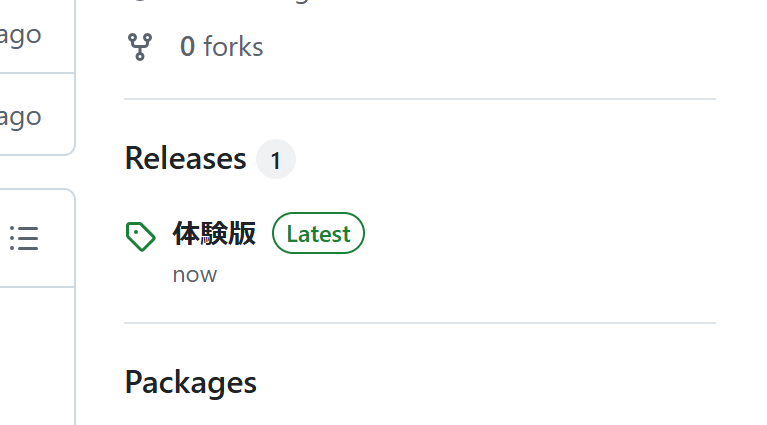
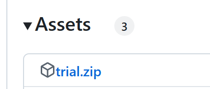

# 仮想CPU

卒業研究用の仮想CPU関係を纏めたものです。  

## 体験版テスターの方へ

この GitHub 右側に、Release という欄があります。



そこから、「体験版」をクリック、`trial.zip` をダウンロード、展開してください。



実行ファイルを作るツールの関係で、もしかしたら `main.exe`, `main2.exe` がウイルスと認識されてしまうかも。
その時は、お手数ですがセキュリティソフトの設定を行ってください。
また、「WindowsによってPCが保護されました」と青い物が出た場合は、「詳細情報」をクリックして、「実行」してください。

体験版終わったら、アンケートにご協力ください。

## gui

学習システムのGUIアプリケーションが入っています。  
開発言語は Python3.9 です。  

`main.exe`、`main2.exe` は、pyinstallerによりexe化を行ったものです。  
その関係で、信じられないくらい起動に時間がかかります。20秒くらいは辛抱強く耐えてください。  
可能な限り、Python (>= version 3.9) を環境構築した方がいいと思います。
「煩わしい pip をしなくて済むように、標準モジュールだけで作る」をモットーにしたので、python入れるだけで動くはずです。

ふぁいるつりー  

```cmd
C:.
│  main.py
│  main2.py
│
└─files
    │  diagram.py
    │  gui.py
    │  gui2.py
    │  superGUI.py
    │
    ├─cpu
    │      abstractCPU.py
    │      casl2.py
    │      exceptions.py
    │      macros.py
    │      svc.py
    │
    └─util
            globalValues.py
            utils.py
```

使用modules  

- abc
- enum
- random
- re
- Tkinter
- typing
- typing_extensions

## Text

学習システムの教科書が入っています。  
markdown で記述し、markdown PDF (https://marketplace.visualstudio.com/items?itemName=yzane.markdown-pdf) でPDF化しています。  

`n_photo/` ディレクトリには、教科書内に挿入されている画像ファイルが入っています。  
PowerPointで作成しました。  
`programs/` ディレクトリには、教科書内のアセンブリ言語プログラムをまとめています。 　

## VTL

Very Tiny Language 関係が入っています（未完成）。  

`compiler.py` および `interpreter.py` は python で作成したVTLコンパイラ・インタプリタです。  

`compiler.as` は、仮想CPU用のアセンブリ言語で VTLのコンパイラを記述したものです。`interpreter.as` はインタプリタです。  
`コンパイラ.vtl` は、VTLで自身のコンパイラを記述しようとしているものです。未完成。  

`テスト.txt` には、簡単なプログラム例が入っています。コンパイルが正しくできているかのテストコード的な何か。  
`文法.txt` には、VTLの文法が定義されています。  
