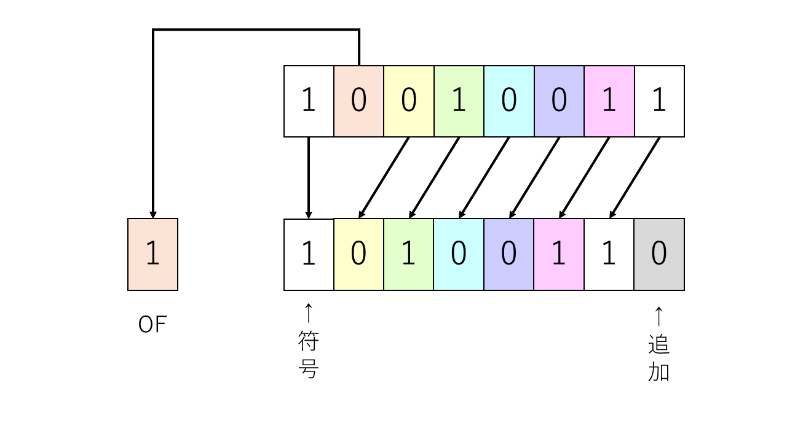
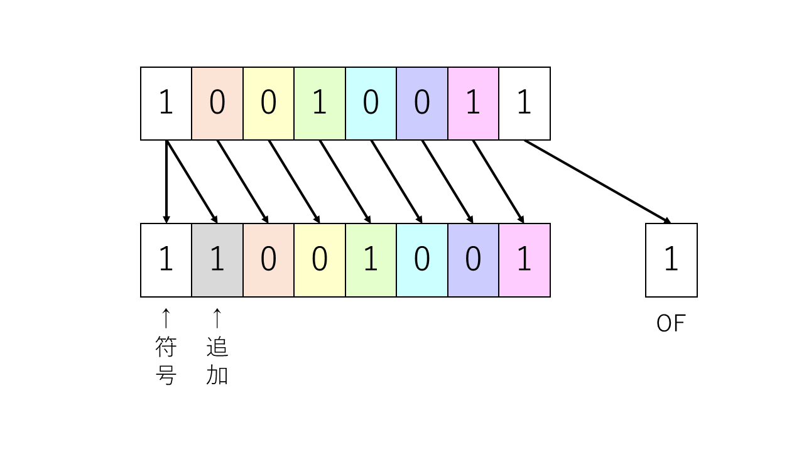
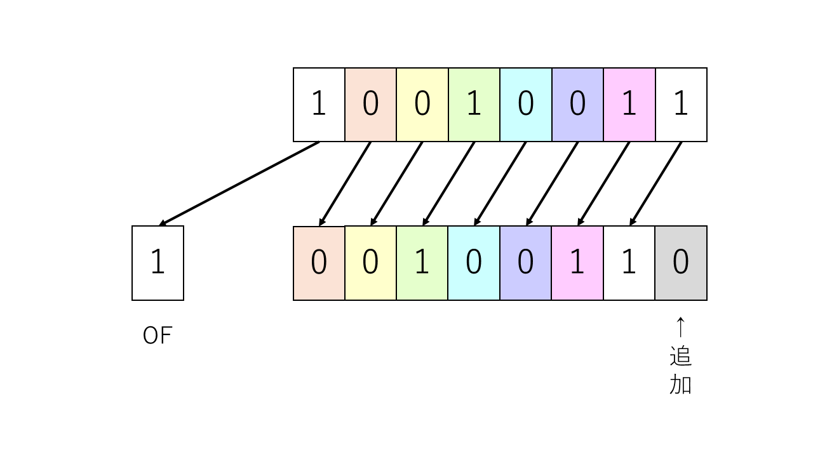
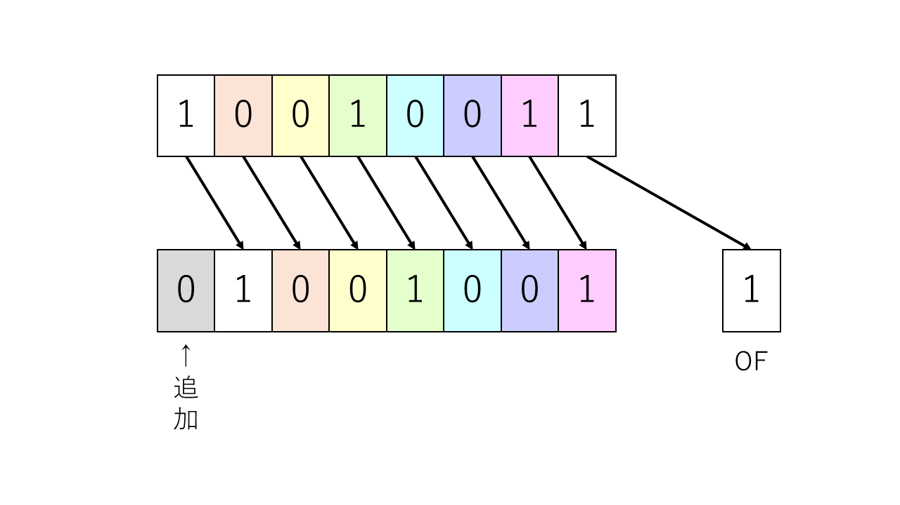
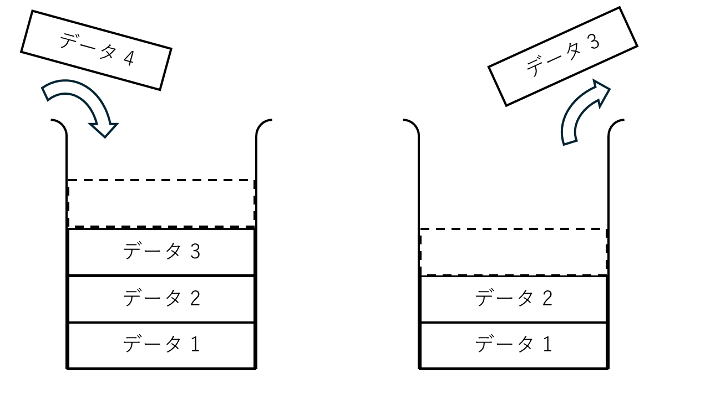

# 2章 基本的な命令を使ってみよう

本章では、本仮想CPUで使用することのできる命令を、実際に触って確認していく。  
基本的には CASLⅡ に準ずる命令群であるため、既に理解している者は読み飛ばしていただいても良い。
なお、一部の命令は 情報処理技術者センター発表の「アセンブラ言語の仕様」と機械語が異なる。

- [2章 基本的な命令を使ってみよう](#2章-基本的な命令を使ってみよう)
  - [2.1 基本事項](#21-基本事項)
    - [2.1.1 ラベル](#211-ラベル)
    - [2.1.2 命令の書き方](#212-命令の書き方)
    - [2.1.3 機械語](#213-機械語)
    - [2.1.4 語数](#214-語数)
  - [2.2 機械語命令](#22-機械語命令)
    - [2.2.1 メモリとレジスタのやり取り命令](#221-メモリとレジスタのやり取り命令)
      - [2.2.1.0 LD ロード（load）](#2210-ld-ロードload)
      - [2.2.1.1 ST ストア（store）](#2211-st-ストアstore)
      - [2.2.1.2 LAD ロードアドレス（load address）](#2212-lad-ロードアドレスload-address)
    - [2.2.2 算術・論理演算命令](#222-算術論理演算命令)
      - [2.2.2.0 ADDA 算術加算（add arithmetic）](#2220-adda-算術加算add-arithmetic)
      - [2.2.2.1 SUBA 算術減算（subtract arithmetic）](#2221-suba-算術減算subtract-arithmetic)
      - [2.2.2.2 ADDL 論理加算（add logical）](#2222-addl-論理加算add-logical)
      - [2.2.2.3 SUBL 論理減算（subtract logical）](#2223-subl-論理減算subtract-logical)
    - [2.2.3 論理演算命令](#223-論理演算命令)
      - [2.2.3.0 AND 論理積](#2230-and-論理積)
      - [2.2.3.1 OR 論理和](#2231-or-論理和)
      - [2.2.3.2 XOR 排他的論理和（exclusive OR）](#2232-xor-排他的論理和exclusive-or)
    - [2.2.4 比較演算命令](#224-比較演算命令)
      - [2.2.4.0 CPA 算術比較（compare arithmetic）](#2240-cpa-算術比較compare-arithmetic)
      - [2.2.4.1 CPL 論理比較（compare logical）](#2241-cpl-論理比較compare-logical)
    - [2.2.5 シフト演算命令](#225-シフト演算命令)
      - [2.2.5.0 SLA 算術左シフト（shift left arithmetic）](#2250-sla-算術左シフトshift-left-arithmetic)
      - [2.2.5.1 SRA 算術右シフト（shift right arithmetic）](#2251-sra-算術右シフトshift-right-arithmetic)
      - [2.2.5.2 SLL 論理左シフト（shift left logical）](#2252-sll-論理左シフトshift-left-logical)
      - [2.2.5.3 SRL 論理右シフト（shift right logical）](#2253-srl-論理右シフトshift-right-logical)
    - [2.2.6 分岐命令](#226-分岐命令)
      - [2.2.6.0 JUMP 無条件分岐（unconditional jump）](#2260-jump-無条件分岐unconditional-jump)
      - [2.2.6.1 JPL 正分岐（jump on plus）](#2261-jpl-正分岐jump-on-plus)
      - [2.2.6.2 JMI 負分岐（jump on minus）](#2262-jmi-負分岐jump-on-minus)
      - [2.2.6.3 JNZ 非零分岐（jump on non zero）](#2263-jnz-非零分岐jump-on-non-zero)
      - [2.2.6.4 JZE 零分岐（jump on zero）](#2264-jze-零分岐jump-on-zero)
      - [2.2.6.5 JOV オーバーフロー分岐（jump on overflow）](#2265-jov-オーバーフロー分岐jump-on-overflow)
    - [2.2.7 スタック操作命令](#227-スタック操作命令)
      - [2.2.7.0 PUSH プッシュ](#2270-push-プッシュ)
      - [2.2.7.1 POP ポップ](#2271-pop-ポップ)
    - [2.2.8 サブルーチン関係の命令](#228-サブルーチン関係の命令)
      - [2.2.8.0 CALL コール（call subroutine）](#2280-call-コールcall-subroutine)
      - [2.2.8.1 RET リターン（return from subroutine）](#2281-ret-リターンreturn-from-subroutine)
    - [2.2.9 その他](#229-その他)
      - [2.2.9.1 SVC スーパーバイザーコール（supervisor call）](#2291-svc-スーパーバイザーコールsupervisor-call)
      - [2.2.9.2 NOP ノーオペレーション（no operation）](#2292-nop-ノーオペレーションno-operation)
  - [2.3 アセンブラ命令](#23-アセンブラ命令)
    - [2.3.1 START命令](#231-start命令)
    - [2.3.2 END命令](#232-end命令)
    - [2.3.3 DS命令](#233-ds命令)
    - [2.3.4 DC命令](#234-dc命令)
  - [2.4 マクロ命令](#24-マクロ命令)
    - [2.4.1 IN命令](#241-in命令)
    - [2.4.2 OUT命令](#242-out命令)
    - [2.4.3 RPUSH命令](#243-rpush命令)
    - [2.4.4 RPOP命令](#244-rpop命令)
    - [2.4.5 RANDINT命令](#245-randint命令)

<div style="page-break-before:always"></div>

## 2.1 基本事項

### 2.1.1 ラベル

アセンブリ言語では、アドレス・番地に名前を付けることが可能である。「32番地を A と呼ぶ」「この命令が書かれたアドレスを PRG と名づける」といったように、アドレスを番地の数字ではなく、名前で呼ぶことが出来るようになる。これを **ラベル** という。  

ラベルの利点として、「実際の番地を考えなくていい」ことが挙げられる。（プログラムの場所を指定する方法も無くはないが）「このデータが格納される場所は何番地か」を知ることは難しい。それでも所定の位置に確実にデータを保存できるように、場所に名前を付けて、実際の番地との対応は機械に任せるといった方法を取る。  
また、処理はテキスト領域に、上から順番に書かれていく。これを利用すると、「30番地から40番地で掛け算をする処理。KAKEZANと名付けよう」「ここからここまででデータを特定の形に加工する」といった処理をまとめておいて、必要になったら「次はKAKEZANを実行して！」といったように **呼び出す** ようなことが出来る。何回も煩雑な処理を書かなくても、汎用的な命令群をまとめて呼び出すことが可能となるのだ。メモリ削減にも、可読性の向上にもつながる。  
この、「特定の処理が出来る、命令のまとまり」を **サブルーチン** と呼ぶ。なお、高級なプログラミング言語で 戻り値 という概念を追加した場合 **関数** と呼ばれ、関数を組み合わせてプログラムを作成することを、**関数型プログラミング** と呼ぶ。

### 2.1.2 命令の書き方

本アセンブリ言語（参考元のCASLⅡも同様）における、命令の基本的な書き方をまとめる。  
命令は「ラベル」 「命令の種類（ニーモニック）」 「オペランド」の順番で記述する。
それぞれの要素には1つ以上の空白、あるいはTABにより区切りを入れる。
おすすめは、「ラベル」TAB「ニーモニック」TAB「オペランド」であるが、空白でも構わない。  

オペランドは `,` (カンマ) 区切りで記述する。オペランドには次のものが書ける。

- レジスタ
- アドレス
  - 10進数の数値
  - 16進数の数値 (先頭に `#` を付ける。 `#12AF` など)
  - ラベル
  - リテラル (先頭に `=` を付ける。数値、文字定数を使うことができる。「(定数)番地のデータ」ではなく、「定数」そのものをデータと見る)
  
アドレスの場合には、「このアドレスから〇個先を指定する」といったことを実現するために、指定したレジスタ ( **指標レジスタ** ) に入っている値を加算することが出来る。  
「文字列の先頭をラベルで置いたけど、3文字目から出力したい」みたいな場合に使える。  
指標レジスタには GR1 ~ GR7 が使用でき、GR0 は指定できない。
内部の処理の関係で、GR0は「加算する量が0」として扱われてしまうので使えないです。
また、指標レジスタの値を足したりして算出した「実際に命令が参照するアドレス」を **実効アドレス** と呼ぶ。

また、プログラムには影響しないが、人間が処理を理解しやすくするため、注釈を書き込むことが出来る。**コメント** と呼び、 `;` セミコロン を書く。

```CASL
LABEL   MNEMONIC    operand

operand:    レジスタ1, レジスタ2
            レジスタ, アドレス, 指標レジスタ
            レジスタ, アドレス  <- アドレスをそのまま使う (0 を加算する) 場合、指標レジスタを省略可能
            など。

        MNEMONIC    GR0, =130, GR1 (指標レジスタ)
        リテラルでは、アドレスと同様に、このような書き方が出来る。
        メモリの130番地ではなく、 130 という数値そのものが参照される。

; これはコメント。一行の中で ";" 以降は、全てコメントとして解釈される。
ここは命令。  ; ここ以降はコメントになる。
```

### 2.1.3 機械語

アセンブリ言語は、人間が読みやすいように、機械語と一対一対応した言語である。そのため、コンピュータに入れるときには、機械語に変換する必要がある。この作業を **アセンブル** と呼ぶ。  
本仮想CPUでは、機械語が次のルールに従って作成される。

> 「命令の種類（オペコード） 8ビット」「レジスタ 4ビット」「第2レジスタor指標レジスタ 4ビット」「アドレス 16ビット」
>
> 例えば、 `11110000111100001111111111111111` の場合
> > 命令の種類（オペコード）: 11110000
> > レジスタ: 1111
> > 指標レジスタ: 0000
> > アドレス: 1111111111111111

この、合計32ビットによって1つの機械語となる。なお、機械語の命令の種類はオペコードと呼ぶ。
レジスタには、レジスタの番号が2進数として格納される。  
ここで、4ビットで表現できる数字は 0000 から 1111 まで、16種類存在する。そのため、汎用レジスタは標準では8個あるが、やろうとおもえば GR0からGR15 まで16個に増設することが可能である。

### 2.1.4 語数

CASLⅡにおいては、命令やデータが「メモリを何番地ぶん使用するか」を **語数** と呼ぶ。他の言語や分野では聞いたことが無いので、多分CASLⅡ独自の呼び方です。似たものに **ワード数** がありますが、メモリをどれくらい使用するかを表す一般的な指標は **バイト数** が多いですかね。

本CPUでは、メモリは標準で 16 \[bit/番地\] × 65536 \[番地\] あるため、CASLⅡで言い換えるなら 65536語 まで使用できるということになる。
CASLⅡの命令は、アドレスを使用する命令は 2語、レジスタのみで完結する命令は 1語 を占有する。
値は 数値なら1語、文字列は1文字当たり1語（内部で文字毎にasciiコード、つまり数値に代わるため）になる。

IR は 32bit の領域を持つため、機械語として常に 2語 を読み取ろうとする。
そこで、レジスタしか使わない 1語の命令 は、アドレス部である下位16ビットを 0 で埋めることにする。

<div style="page-break-before:always"></div>

## 2.2 機械語命令

実際に機械語になる命令たちを、例となるサンプルのプログラムとともに確認しよう。  
なお、番号はオペコードの16進数に対応している。最初が 2.2.x.1 ではなく、2.2.x.0番 から始まるのは違和感があるかもしれないが、容赦してほしい。

簡単な一覧表は以下の通り

r: 汎用レジスタ。GR0 ~ GR7
x: 指標レジスタ。GR1 ~ GR7
adr: アドレス。10進数・16進数、ラベル、リテラル
val: 即値。10進数・16進数、ラベル\*、リテラル\*

\* : 中身ではなく、そのアドレス値が対応する。

|オペコード|ニーモニック|オペランド|語数|FRの設定|
|:--:|:---:|:----|:--:|:----|
|0x00|NOP| |1| |
|0x10<br>0x14|LD|r, adr [, x]<br>r1, r2|2<br>1|SF, ZF|
|0x11|ST|r, adr [, x]|2| |
|0x12|LAD|r, val [, x]|2| |
|0x20<br>0x24|ADDA|r, adr [, x]<br>r1, r2|2<br>1|OF, SF, ZF|
|0x21<br>0x25|SUBA|r, adr [, x]<br>r1, r2|2<br>1|OF, SF, ZF|
|0x22<br>0x26|ADDL|r, adr [, x]<br>r1, r2|2<br>1|OF, SF, ZF|
|0x23<br>0x27|SUBL|r, adr [, x]<br>r1, r2|2<br>1|OF, SF, ZF|
|0x30<br>0x34|AND|r, adr [, x]<br>r1, r2|2<br>1|SF, ZF|
|0x31<br>0x35|OR|r, adr [, x]<br>r1, r2|2<br>1|SF, ZF|
|0x32<br>0x36|XOR|r, adr [, x]<br>r1, r2|2<br>1|SF, ZF|
|0x40<br>0x44|CPA|r, adr [, x]<br>r1, r2|2<br>1|SF, ZF|
|0x41<br>0x45|CPL|r, adr [, x]<br>r1, r2|2<br>1|SF, ZF|
|0x50|SLA|r, val [, x]|2|OF, SF, ZF|
|0x51|SRA|r, val [, x]|2|OF, SF, ZF|
|0x52|SLL|r, val [, x]|2|OF, SF, ZF|
|0x53|SRL|r, val [, x]|2|OF, SF, ZF|
|0x60|JUMP|adr [, x]|2| |
|0x61|JPL|adr [, x]|2| |
|0x62|JMI|adr [, x]|2| |
|0x63|JNZ|adr [, x]|2| |
|0x64|JZE|adr [, x]|2| |
|0x65|JOV|adr [, x]|2| |
|0x70|PUSH|val [, x]|2| |
|0x71|POP|r|1| |
|0x80|CALL|adr [, x]|2| |
|0x81|RET| |1| |

<div style="page-break-before:always"></div>

### 2.2.1 メモリとレジスタのやり取り命令

本節では、メモリからレジスタへデータを持ってくる、レジスタのデータをメモリへ渡す方法を確認する。

#### 2.2.1.0 LD ロード（load）

`LD` 命令は、メモリに書かれているデータを、番地を指定することで、任意のレジスタに持ってくることが出来る。  
また、レジスタに保存されているデータを、別のレジスタにコピーすることも可能である。
この時、持ってきた値に応じて、<u>SF, ZF の値が変更される。</u>  
本仮想CPUにおける機械語では、 `00010000 (0x10)` に変換される。

書き方としては、次のようになる。

```CASL
LD  保存先レジスタ名, アドレス, 指標レジスタ

LD  保存先レジスタ名, コピー元レジスタ名
```

これを使用した例として、次のようなサンプルプログラムを与える。

```CASL
MAIN  START
      LD      GR0, A  ; GR0に A と名付けられたアドレスの中身を持ってくる
      RET
A     DC      100     ; Aラベルの宣言。中身に 100 を格納する。
      END
```

なお、指標レジスタは書いても書かなくてもよく、アドレスをそのまま使う場合には省略することが出来る。

さて、上のプログラムでは、メモリの「A」という地点（実際のアドレスはアセンブルするまで不明）に 100 を格納する。そして、Aのアドレスを参照して、100というデータを GR0 にコピーする。  
ほかにも `START` とか `RET` とか色々書いてあるけど、今は動かすためのおまじないだと思ってください。

このプログラムを実行環境に書き込んで Assemble してみると、メモリの先頭 0x0000 に `0001000000000000` が書き込まれていることが確認できると思う。そこが、この命令を機械語変換した結果である。  
次の 0x0001 番地には、Aラベルのアドレスが書かれている。そのアドレス (おそらく0x0003) を確認してみると、`0000000001100100` と書かれている。これを10進数に直すと、100 になる（変換方法は 1章2節3項 を確認）。  

<div style="page-break-before:always"></div>

また、レジスタ間でコピーをする場合、次のように書く。

```CASL
MAIN  START
      LD      GR0, A    ; GR0に A と名付けられたアドレスの中身を持ってくる
      LD      GR1, GR0  ; GR1に GR0の値 をコピーする
      RET
A     DC  100     ; Aラベルの宣言。中身に 100 を格納する。
      END
```

前のサンプルプログラムに、3行目が追加された。  
ここでは、GR0の値 100 を参照して、それを GR1 にコピーしている。よって、プログラム終了時にはGR0, GR1の両方に 100 が入っている状態となる。

なお、3行目に対応する機械語は 0x0002番地の `0001010000010000` である。  
オペコードが 00010100、レジスタが 0001、第2レジスタが 0000 である。  
「おいおいオペコードが 00010000 じゃないじゃあないか」と思った方は鋭いですね。レジスタ間で完結し、アドレスを使用しない場合は、それを区別するために 左から6番目 を 1 にします。このCPUだけのルールなので覚えなくても大丈夫です。

**問題**
GR5 に値 120 を格納する。

<div style="page-break-before:always"></div>

#### 2.2.1.1 ST ストア（store）

`ST` 命令は、レジスタのデータをメモリに書き出すことが出来る。
本仮想CPUにおける機械語では、 `00010001 (0x11)` に変換される。

```CASL
ST  保存先レジスタ名, アドレス, 指標レジスタ
```

これを使用した例として、次のサンプルプログラムを与える。

```CASL
MAIN  START
      LD      GR0, A  ; GR0に A と名付けられたアドレスの中身を持ってくる
      ST      GR0, B  ; GR0の中身を B と名付けられたアドレスに格納する。
      RET
A     DC      100     ; Aラベルの宣言。中身に 100 を格納する。
B     DS      1       ; Bラベルの宣言。メモリ1個分のデータの受け皿を用意する。
      END
```

このプログラムでは、前目で習った LD命令 を使用して、GR0に 100 を格納する。
そして、ラベルで B と名付けられたアドレスに、GR0の内容 (100) をコピーする。

**問題**
アドレス 0x0015 に `ST` 命令を使用して値 500 を格納する。

**ヒント**
アドレスを使う記法では、ラベルを使わず 直接番地を指定できるぞ！

答えが出来たら実行して、メモリ欄をスクロールして 0x0015 を確認しよう。

<div style="page-break-before:always"></div>

#### 2.2.1.2 LAD ロードアドレス（load address）

`LAD` 命令では、メモリアドレスをレジスタに格納する。  
`LD` 命令とは異なり、メモリの中身データ ではなく、 **メモリの番地そのもの** を保存する。
この、「メモリアドレスを操作する」タイプはわかりやすいように「値」「val」として区別して表記しておこう。
いわば、「`LD`命令を使用したときに、リテラルを使って、直接数字を格納したい場合」の省メモリ版である。
本仮想CPUにおける機械語では、 `00010010 (0x12)` に変換される。

```CASL
LAD   保存先レジスタ名, 値, 指標レジスタ
```

サンプルプログラムは以下。

```CASL
MAIN  START
      LAD     GR0, 130  ; GR0に直接　130 を格納する。130番地の値を持ってくるわけではない。
      RET
      END
```

これは、次の命令と同じように働く。
しかし、メモリを1個節約できる (数値を保存するための領域を作成する必要が無いため)。

```CASL
MAIN  START                    |    MAIN  START
      LD      GR0, =130        |          LD      GR0, A
      RET                      |          RET
      END                      |    A     DC      130
                               |          END
```

さて、アドレス関係をオペランドに指定する場合、次のような構文で指標レジスタの値を加算できた。

```CASL
MNEMONIC    アドレス関係, 指標レジスタ
```

`LAD` 命令についても例外ではなく、これを使用すると「レジスタに値を足して再格納」のように操作が出来る。
これは覚えておくと `LAD` の他に `PUSH` 命令などでも活用できる。

```CASL
LAD   GR0, 0, GR1       ; GR0 に GR1 の値をコピー
LAD   GR0, 13, GR2      ; GR0 に GR2の値 + 13 の結果をコピー
LAD   GR1, 1, GR1       ; GR1 に GR1の値 + 1  の結果を再格納。つまり GR1 + 1 を行う
```

**問題**
ラベル `VALUE` を作成し、値 1 を格納する。  
次に、その一行下に `DC  3` を行う。  
最後に、指標レジスタを上手く使い `VALUE` のアドレスの1つ後を指定し、入っているデータを GR0 に入れる。

**ヒント**

```CASL
MAIN    START
; ここを実装する。
; VALUE のアドレスの 1つ後 のアドレスに入っているデータを GR0 に入れる
; 必要なら、 別のラベルを作って、DCを増やしても良い。
        RET
VALUE   DC      1
        DC      3
        END
```

実行結果が正しいと、GR1 に 3 が格納される。  
このように、連続したデータを用意しておき、アドレスに *+いくつか* をすることでデータを参照する方法がある。プログラミング言語における **配列** はこのように実現されている。  
このとき、「先頭アドレスからどれくらい動かすか」の量を **インデックス**（index）と呼び、指標レジスタを使ってアドレスをずらす手法を **インデックス修飾** という。

<div style="page-break-before:always"></div>

### 2.2.2 算術・論理演算命令

記述方法は統一して、次の形式である。

```CASL
MNEMONIC    レジスタ, アドレス, 指標レジスタ

MNEMONIC    レジスタ1, レジスタ2
```

#### 2.2.2.0 ADDA 算術加算（add arithmetic）

`ADDA` 命令では、符号付きで足し算をする。足し算の結果を、第一オペランドのレジスタに返す。  
足し算の結果に応じて、<u>FRの値が変わる。</u>  

符号付き、算術 とは例えば、 -3 + 5 や、 -10 + (-2) など、負の数があっても計算が出来るよってこと。  
16bitでは、表現できる値の範囲は $-32768 \leqq n \leqq 32767$ である。この値を超えると <u>OF が 1 になる。</u>  
<u>計算した結果が 負の数 なら SF が、結果が 0 なら ZF が、それぞれ 1 になる。</u>

本仮想CPUにおける機械語では、 `00100000 (0x20)` に変換される。

```CASL
; -100 + 120 を行う。結果はGR0に格納される。
MAIN  START
      LD      GR0, A
      LD      GR1, B
      ADDA    GR0, GR1  ; GR1, GR0 と書くと、結果は GR1 に格納される。
      RET
A     DC      -100
B     DC      120
      END
```

#### 2.2.2.1 SUBA 算術減算（subtract arithmetic）

`SUBA` 命令では、符号付きで引き算をする。引き算の結果を、第一オペランドのレジスタに返す。  
引き算の結果に応じて、<u>FRの値が変わる。</u>  

CPUの中にある演算装置ALUには、「加算器」と呼ばれる 足し算する回路 が入っているが、引き算をする回路は無い。  そのため、$a - b$ をするには、$a + (-b)$ と見て足し算に変える。  

本仮想CPUにおける機械語では、 `00100001 (0x21)` に変換される。

```CASL
; -100 - 120 を行う。結果はGR0に格納される。
MAIN  START
      LD      GR0, =-100  ; せっかくなのでリテラルを。決して行数を減らしたいわけでは……
      LAD     GR1, 120    : LADで直接入れることもできるよ！
      SUBA    GR0, GR1    ; 処理を見ると、 -100 + (-120) が行われている。
      RET
      END
```

#### 2.2.2.2 ADDL 論理加算（add logical）

`ADDL` 命令では、符号なしで足し算をする。足し算の結果を、第一オペランドのレジスタに返す。  
足し算の結果に応じて、<u>FRの値が変わる。</u>  

符号なしということで、ADDAでは負の数として考えてた値は、全く別の値として解釈される。（最上位ビットが符号ではなく、$2^n$ の数値で考えられるため）  
よって、表現できる値の範囲は $0 \leqq n \leqq 65535$ である。

本仮想CPUにおける機械語では、 `00100010 (0x22)` に変換される。

```CASL
; -100 + 120 が行えない。結果はGR0に格納される。
MAIN  START
      LD      GR0, A
      LD      GR1, B
      ADDL    GR0, GR1
      RET
A     DC      -100      ; -100 は 1111111110011100 であるから、符号なしでは 65436 になる。
B     DC      120
      END
```

この計算では、65436 + 120 が行われることとなり、値は 65556 となる。これは 16ビットで表現できる値の範囲 を超えているため、OF が 1 になる。

#### 2.2.2.3 SUBL 論理減算（subtract logical）

`SUBL` 命令では、符号なしで引き算をする。引き算の結果を、第一オペランドのレジスタに返す。  
引き算の結果に応じて、<u>FRの値が変わる。</u>  

本仮想CPUにおける機械語では、 `00100011 (0x23)` に変換される。

```CASL
; 65436 - 120 を行う。結果はGR0に格納される。
MAIN  START
      LD      GR0, A
      LD      GR1, B
      ADDL    GR0, GR1
      RET
A     DC      -100      ; -100 は 1111111110011100 であるから、符号なしでは 65436 になる。
B     DC      120
      END
```

**問題**（難しめ）

1. `ADDA` 命令では 0 となり、`ADDL` 命令ではオーバーフローする足し算
2. 引き算は、符号を変えた足し算として行われる。$100 + (-2)$（`0000000001100100` + `1111111111111110`）など、単に桁が溢れる計算ではオーバーフローは起きない。では、桁あふれ と オーバーフロー の違いは何か

<div style="page-break-before:always"></div>

### 2.2.3 論理演算命令

#### 2.2.3.0 AND 論理積

`AND` 命令では、与えられた値について「各位の数字が両方とも 1 か」を返す。  
例えば、`1010` と `0110` の場合、それぞれの桁について「両方とも 1 なら 1 にする」と、`0010` となる。  
計算結果の値に応じて、<u>SF, ZF の値が変更される。</u>

本仮想CPUにおける機械語では、 `00110000 (0x30)` に変換される。

AND は 1章2節1項 でも紹介されていた。入力と出力の関係を表（**真理値表**）にすると、次のようになる。

|入力1|入力2|出力|
|:--:|:--:|:--:|
|0|0|0|
|0|1|0|
|1|0|0|
|1|1|1|

このように、入力がどっちも 1 の時だけ 1 になる。

```CASL
; -100 (1111111110011100) と 120 (0000000001111000) の論理積をとる
MAIN  START
      LAD     GR0, -100
      LAD     GR1, 120
      AND     GR0, GR1
      RET
      END
```

#### 2.2.3.1 OR 論理和

`OR` 命令では、与えられた値について「各位の数字が両方とも 0じゃない か」を返す。  
例えば、`1010` と `0110` の場合、それぞれの桁について「少なくともどっちかが 1 なら 1 にする」と、`1110` となる。  
計算結果の値に応じて、<u>SF, ZF の値が変更される。</u>

本仮想CPUにおける機械語では、 `00110001 (0x31)` に変換される。

OR は 1章2節1項 でも紹介されていた。真理値表は次のようになる。

|入力1|入力2|出力|
|:--:|:--:|:--:|
|0|0|0|
|0|1|1|
|1|0|1|
|1|1|1|

このように、入力がどれか一つでも 1 なら、1 になる。

```CASL
; -100 (1111111110011100) と 120 (0000000001111000) の論理和をとる
MAIN  START
      LD      GR0, A
      LD      GR1, B
      OR      GR0, GR1
      RET
A     DC      -100
B     DC      120
      END
```

#### 2.2.3.2 XOR 排他的論理和（exclusive OR）

`XOR` 命令では、与えられた値について「各位の数字がどっちかだけ 1 か」を返す。  
例えば、`1010` と `0110` の場合、それぞれの桁について「どっちか片方だけが 1 なら 1 にする」と、`0010` となる。  
計算結果の値に応じて、<u>SF, ZF の値が変更される。</u>

本仮想CPUにおける機械語では、 `00110010 (0x32)` に変換される。

真理値表は次のようになる。

|入力1|入力2|出力|
|:--:|:--:|:--:|
|0|0|0|
|0|1|1|
|1|0|1|
|1|1|0|

このように、入力のどっちか *片方だけ* が 1 なら、1 になる。(1,1)入力で0になる点に注意。

```CASL
; -100 (1111111110011100) と 120 (0000000001111000) の排他的論理和をとる
MAIN  START
      LD      GR0, A
      LD      GR1, B
      XOR     GR0, GR1
      RET
A     DC      -100
B     DC      120
      END
```

<div style="page-break-before:always"></div>

### 2.2.4 比較演算命令

比較演算では、加算・減算命令の「結果が 負の数 あるいは 0 になるか」をフラグレジスタだけに保存する。具体的に計算した結果の値は、レジスタに保存されない。  
「これとこれ、どっちが大きいの？」といったときに、レジスタに入っている値を書き換えずに結果を得られる。

|比較結果|||FRの値||
|--:|:--:|:--|:--:|:--:|
| | | |SF|ZF|
|レジスタ1 |>| レジスタ2    |0|0|
|レジスタ  |>| アドレスの中身|0|0|
|レジスタ1 |=| レジスタ2    |0|1|
|レジスタ  |=| アドレスの中身|0|1|
|レジスタ1 |<| レジスタ2    |1|0|
|レジスタ  |<| アドレスの中身|1|0|

記述方法は統一して、次の形式である。

```CASL
MNEMONIC    レジスタ, アドレス, 指標レジスタ

MNEMONIC    レジスタ1, レジスタ2
```

<div style="page-break-before:always"></div>

#### 2.2.4.0 CPA 算術比較（compare arithmetic）

`CPA` 命令は、与えられた二つの数値を 符号付きで 比較する。結果に応じて、<u>SF, ZF の値が変更される。</u>  

本仮想CPUにおける機械語では、 `01000000 (0x40)` に変換される。

なお、内部処理は「 一つ目の値 - 二つ目の値 」が行われており、この結果が FR に影響する。  
後述する「分岐命令」と一緒に使われることが多い。


```CASL
; -100 と 120 を比較する。-100 - 120 は 負の数 になるので、SF が 1 になる
MAIN  START
      LD      GR0, A
      LD      GR1, B
      CPA     GR0, GR1  ; GR1, GR0 とすると、120 と -100 を比較するので SF は 0
      RET
A     DC      100
B     DC      120
      END
```

これを実行すると、`SUBA` 命令と異なり、GR0 の値は変更されず、FR の値だけ変わっていることが確認できると思う。

#### 2.2.4.1 CPL 論理比較（compare logical）

`CPL` 命令は、与えられた二つの数値を 符号なしで 比較する。結果に応じて、<u>SF, ZF の値が変更される。</u>  

本仮想CPUにおける機械語では、 `01000001 (0x41)` に変換される。

```CASL
; -100 と 120 を比較出来ない。結果を確認しよう
MAIN  START
      LD      GR0, A
      LD      GR1, B
      CPL     GR0, GR1
      RET
A     DC      -100
B     DC      120
      END
```

**問題** （難しめ）

`CPA` と `CPL` では、FR の値が異なる結果になることがある。  
では、`CPA` では FR = 000となり、`CPL` では FR = 010（SFが1）となる計算を考えてみよう。

<div style="page-break-before:always"></div>

### 2.2.5 シフト演算命令

シフト演算命令では、「桁を左右にずらす」ことが出来る。これにより、$2^n$ 倍、$\div 2^n$ を実現することが可能である。

というのも、2進数と10進数の対応を思い出してほしい。
10進数でいう「一の位」「十の位」などといった表現を借りるなら、2進数は「$2^{(何桁目)} \ \ $ の位」で作られている。
そのため、桁をすべて 1つ左にずらせば、10進数で言う 23 が 230 になるように、110 (=6) が 1100 (=12) と2倍になる。
左にずらせば $2^{(ずらした桁数)} \ \ \ $ 倍に、右にずらせば $\frac{1}{2^{(ずらした桁数)}} \ $ 倍（つまり $\div 2^{(ずらした桁数)} \ \ \ $）になる。

記述方法は統一して、次の形式である。

```CASL
MNEMONIC    レジスタ, 値, 指標レジスタ
```

<div style="page-break-before:always"></div>

#### 2.2.5.0 SLA 算術左シフト（shift left arithmetic）

`SLA` 命令は、指定した桁数ぶん 符号付きで 左に桁をずらす（シフトすると表現）。
符号付きということで、符号ビットが保持されたままになる。符号ビットは固定したままなので、2番目のビットが溢れる。
シフトした結果の値に応じて、<u>FR の値が変更される。</u>
また、<u>最後に溢れたビットが OF に設定される。</u>



サンプルプログラムを動かして、シフトした量に応じてレジスタの値、OFの値がどうなるか確認しよう。

```CASL
MAIN  START
      LD      GR0, A
      SLA     GR0, 1
      LD      GR1, A
      SLA     GR1, 2  ; 2桁左シフト。シフトした値を もう一回シフトするイメージ
      RET
A     DC      -23158  ; 1010010110001010
      END
```

これくらい小さい数字の方が、$2^{(シフト数)} \ \ $ 倍 が分かりやすいかも…

```CASL
MAIN  START
      LD      GR0, A
      SLA     GR0, 1  ; 1桁左シフト。2倍
      SLA     GR0, 2  ; 2桁左シフト。さらに 4倍で、累計して元の値の 8倍
      SLA     GR0, 3  ; 3桁左シフト。さらに 8倍で、累計して元の値の 64倍
      RET
A     DC      -100
      END
```

<div style="page-break-before:always"></div>

#### 2.2.5.1 SRA 算術右シフト（shift right arithmetic）

`SRA` 命令は、指定した桁数ぶん 符号付きで 右にシフトする。
符号付きということで、符号ビットが保持されたままになる。符号ビットは固定したままなので、追加される値は符号ビットになる。
シフトした結果の値に応じて、<u>FR の値が変更される。</u>
また、<u>最後に溢れたビットが OF に設定される。</u>



サンプルプログラムを動かして、シフトした量に応じてレジスタの値、OFの値がどうなるか確認しよう。

```CASL
MAIN  START
      LD      GR0, A
      SRA     GR0, 1
      LD      GR1, A
      SRA     GR1, 2  ; 2桁右シフト
      RET
A     DC      -23158  ; 1010010110001010
      END
```

正の数だと、先頭に追加される値が 0 であることが確認できるだろう。

```CASL
MAIN  START
      LD      GR0, A
      SRA     GR0, 1
      LD      GR1, A
      SRA     GR1, 2  ; 2桁右シフト
      RET
A     DC      19275  ; 0100101101001011
      END
```

<div style="page-break-before:always"></div>

#### 2.2.5.2 SLL 論理左シフト（shift left logical）

`SLA` 命令は、指定した桁数ぶん 符号なしで 左にシフトする。
符号なしなので、素直に全部左にずらす。符号付きより分かりやすいですね。
シフトした結果の値に応じて、<u>FR の値が変更される。</u>
また、<u>最後に溢れたビットが OF に設定される。</u>



サンプルプログラムを動かして、シフトした量に応じてレジスタの値、OFの値がどうなるか確認しよう。

```CASL
MAIN  START
      LD      GR0, A
      SLL     GR0, 1
      LD      GR1, A
      SLL     GR1, 2  ; 2桁左シフト
      RET
A     DC      -23158  ; 1010010110001010
      END
```

<div style="page-break-before:always"></div>

#### 2.2.5.3 SRL 論理右シフト（shift right logical）

`SRL` 命令は、指定した桁数ぶん 符号なしで 右にシフトする。
符号なしということで、素直に 0 が先頭に追加されていく。
シフトした結果の値に応じて、<u>FR の値が変更される。</u>
また、<u>最後に溢れたビットが OF に設定される。</u>



サンプルプログラムを動かして、シフトした量に応じてレジスタの値、OFの値がどうなるか確認しよう。

```CASL
MAIN  START
      LD      GR0, A
      SRL     GR0, 1
      LD      GR1, A
      SRL     GR1, 2  ; 2桁右シフト
      RET
A     DC      -23158  ; 1010010110001010
      END
```

<div style="page-break-before:always"></div>

### 2.2.6 分岐命令

分岐命令では、「条件によって処理を変える」ことを実現する。
具体的には、「こういう時はこのアドレスに飛んで、別の命令が実行されるようにする」といった流れだ。
そのため、命令の書き方は アドレスを指定する で納得できよう。

```CASL
MNEMONIC    レジスタ, アドレス, 指標レジスタ
```

簡単な条件の早見表は次の通り。

|命令||条件||
|:--:|:--:|:--:|:--:|
||OF|SF|ZF|
|JUMP||||
|JPL||0|0|
|JMI||1||
|JNZ|||0|
|JZE|||1|
|JOF|1|||

なお、命令語との対応について
本家CASLⅡでは 0x61 `JMI`, 0x62 `JNZ`, 0x63 `JZE`, 0x64 `JUMP`, 0x65 `JPL`, 0x66 `JOF` の順だが、
本仮想CPUでは 0x60 `JUMP`, 0x61 `JPL`, 0x62 `JMI`, 0x63 `JNZ`, 0x64 `JZE`, 0x65 `JOF` とした。

<div style="page-break-before:always"></div>

#### 2.2.6.0 JUMP 無条件分岐（unconditional jump）

`JUMP` 命令は、名前の通り無条件でとにかく指定先のアドレスにジャンプする。
内部処理的に言うと、PC に 指定したアドレス を格納する。
よって、この命令の次に fetch される命令は、指定先のアドレスとなる。
特定の処理にラベルを付けて、アドレスとして指定することで「この次は全く別のところにある ここ から実行する」を実現できる。

```CASL
MAIN  START
      LD      GR0, A
      JUMP    DEST    ; ここから、
      LD      GR1, B
      LD      GR2, C
DEST  LD      GR3, D  ; ここに飛ぶ。間は実行されない
      RET
A     DC      1
B     DC      2
C     DC      3
D     DC      4
      END
```

これを実行すると、`JUMP` で指定された `DEST` までの間は実行されず、GR1, GR2 の値は変更されない。

<div style="page-break-before:always"></div>

#### 2.2.6.1 JPL 正分岐（jump on plus）

`JPL` 命令では、FR の値を参照して、SF と ZF が 0 の時にジャンプする。OF の値は問わない。SF が 1 であったり、ZF が 1 であったときには、ジャンプせず次の命令を逐次処理で普通に実行する。
SF と ZF が両方とも 0 なのは、正の数を`LD`したり、演算・比較した結果が正の数のときなので、「正」分岐 という名前である。

サンプルプログラム考えるのが難しすぎるので使いまわします。

```CASL
MAIN  START
      LD      GR0, A
      JPL     DEST    ; ここから、
      LD      GR1, B
      LD      GR2, C
DEST  LD      GR3, D  ; ここに飛ぶ。間は実行されない
      RET
A     DC      1       ; ここの値を 0 や -1 などに変えて動作を確認しよう
B     DC      2
C     DC      3
D     DC      4
      END
```

#### 2.2.6.2 JMI 負分岐（jump on minus）

`JMI` 命令では、FR の値を参照して、SF が 1 の時にジャンプする。OF, ZF の値は問わない。
SF が 1 になるのは、ロード・演算・比較した結果が負の数のときなので、「負」分岐 である。

高級なプログラミング言語における for文 は、この `JMI` 命令で実装出来る。

> C言語, Javaなど: `for (int i = 0; i < count; i++) {}`
> Python: `for i in range(count):`

具体的に言うと、カウンタを用意して、カウンタ と 繰り返し回数 を比較。カウンタ < 繰り返し回数なら繰り返す。
0 から 繰り返し回数 まで、カウンタを1ずつ増やすことで繰り返す回数を制御する。

```CASL
; 同じ処理を LOOP 回 繰り返す。今回は GR1 + 2 を 5 回繰り返す。
MAIN    START
        LAD     GR0, 0      ; GR0 をカウンタとして使う。高級言語の i に相当
        LAD     GR1, 0
FOR     ADDA    GR1, =2     ; GR1 + 2
        ADDA    GR0, =1     ; カウンタを 1 増やす
        CPL     GR0, count  ; カウンタ と 繰り返し回数を比較
        JMI     FOR         ; カウンタ < 繰り返し回数 なら繰り返す
        RET
count   DC      5           ; 繰り返し回数
        END
```

#### 2.2.6.3 JNZ 非零分岐（jump on non zero）

`JNZ` 命令では、FR の値を参照して、ZF が 0 の時にジャンプする。OF, SF の値は問わない。
ZF が 0 になるのは、ロード・演算・比較した結果が0以外のときなので、「非零」分岐 である。

サンプルプログラムは…そろそろネタが無くなってきたので出ません。いつものこれを書き換えて遊んでください。

```CASL
MAIN  START
      LD      GR0, A
      JMI     DEST    ; ここから、
      LD      GR1, B
      LD      GR2, C
DEST  LD      GR3, D  ; ここに飛ぶ。間は実行されない
      RET
A     DC      1       ; ここの値を 0 や -1 などに変えて動作を確認しよう
B     DC      2
C     DC      3
D     DC      4
      END
```

#### 2.2.6.4 JZE 零分岐（jump on zero）

`JZE` 命令では、FR の値を参照して、ZF が 1 の時にジャンプする。OF, SF の値は問わない。
ZF が 0 になるのは、ロード・演算・比較した結果が 0 のときなので、「零」分岐 である。

#### 2.2.6.5 JOV オーバーフロー分岐（jump on overflow）

`JOV` 命令では、FR の値を参照して、OF が 1 の時にジャンプする。SF, ZF の値は問わない。
OF が 1 になるのは、ADD, SUB 演算をした結果がオーバーフローしたときなので、「オーバーフロー」分岐 である。

**問題**
1 から 100 までの和の合計を求め、`sum` ラベル に格納する。
つまり、1 + 2 + 3 + 4 + ... + 99 + 100 の答え求め、`sum` に保存する

<div style="page-break-before:always"></div>

### 2.2.7 スタック操作命令

スタック周りの命令。ここまで唯一出てこなかった スタックポインタ の出番だ。

スタック領域は下から上に積んでいく、というのは1章で話したと思う。
スタックから値を取り出すときのイメージは 積み木 としよう。
下である土台からどんどん積んでいき、新しいものが上に来る。
そして、土台から木を取ろうとすると崩れちゃうから、積んである上の方から順番に取る。

上に積んでいって、上から取り出す。いれた順番と逆に出てくる。1234と入れたら4321と出てくる。
これを意識すれば理解が容易であろう。



ちなみに、最初に入れたものが最後に出てくるということで **FILO（First In Last Out）** と表現されたり。
反対は **FIFO（First In First Out）** である。こっちは品出しとか経験した人には「先入れ先出し」という言葉で通じるない。

<div style="page-break-before:always"></div>

#### 2.2.7.0 PUSH プッシュ

`PUSH` 命令は、スタック領域の先頭に値を格納する。

```CASL
PUSH    値, 指標レジスタ
```

内部処理としては、2つのことを行う。

1. SP の値を 1 減らす。
2. 更新された SP の値を参照し、そのアドレスに値を格納する。

サンプルプログラムは以下。実行する前に、メモリを一番下までスクロールした状態にしてほしい。

```CASL
MAIN    START
        PUSH    1
        PUSH    2
        PUSH    4
        PUSH    8
        RET
        END
```

これを実行すると 異常終了 する。異常終了の理由は次節で分かるので安心してほしい。

さて、このプログラムを実行した結果、メモリはどのように書き換わっただろうか。また、SP はどのような値に変化しただろうか。
メモリを見ると、一番下の 0xFFFF から上向きに、1, 10, 100 というように値が入っていると思う。ここから、`PUSH` すると値はメモリの上に積まれていくことが分かる。
SP に注目すると、`PUSH` が行われるたびに、値が 1 減って FFFF, FFFE, FFFD というように変わっていく。よって、SP の値が変化することも分かる。

<br>

ここで、`LAD` 命令でも出てきた、指標レジスタの格納について話したい。
アドレス関係を指定する命令では、指標レジスタの値を加算して指定することが出来る（実効アドレス）。
これを活用することで、「レジスタにある値をスタックに積む」ことが出来るようになる。
「計算結果をスタックしたい」と思っても、論理演算はレジスタ同士で行う。レジスタの値をスタックするには、一度 `ST` 命令で適当なアドレスに値を移してから、アドレスを指定して `PUSH` する必要がありそうだ。
しかし、下にある書き方をすることで、レジスタの値を直接スタックできる。

```CASL
PUSH  0, GR1      ; GR1 の値をスタックに積む
```

原理としては簡単で、アドレス部分を 0 + (GR1の値) とすることで GR1の値をアドレスに指定する。
指定したアドレスを値として `PUSH` するため、結果として GR1 の値がスタックに積まれるというわけだ。

<div style="page-break-before:always"></div>

#### 2.2.7.1 POP ポップ

`POP` 命令は、スタック領域の先頭から値を取り出し、レジスタに格納する。

```CASL
POP    レジスタ
```

内部処理としては、2つのことを行う。

1. SP の値を参照し、そのアドレスに格納されている値を、指定したレジスタに格納する。
2. SP の値を 1 増やす。

サンプルプログラムは以下。実行する前に、メモリを一番下までスクロールした状態にしてほしい。

```CASL
MAIN    START
        PUSH    12
        PUSH    24
        POP     GR0
        POP     GR1
        RET
        END
```

これを実行すると、次の順番で変化が現れる。
まず、メモリの FFFF番地 に 12 が入り、 FFFE番地に 24 が入る（`PUSH` 命令によるもの）。
同時に、SP が FFFF, FFFE と変化していく。
そして、24 が GR0 に入り FFFE番地が初期値に、12 が GR1 に入り FFFF番地が初期値になる。
同時に、SP が FFFF, 0000 と戻っていく。

GR0 に 24 が、GR1 に 12 が入ることから、スタックがいれた順番と逆に、上から取り出されていくことが分かる。

<div style="page-break-before:always"></div>

### 2.2.8 サブルーチン関係の命令

サブルーチンを呼び出したり、サブルーチンからメインの処理に戻る。
分岐命令の `JUMP` との違いを意識しよう。

#### 2.2.8.0 CALL コール（call subroutine）

`CALL` 命令は、指定したサブルーチンを呼び出す。
とは言ったものの、実際には `JUMP` のように命令に飛ぶことが出来る物である。
`JUMP` との違いは、「現在の PC をスタック領域の先頭に格納する」、「サブルーチンの終了後に、呼び出す前の処理を継続する」点にある。

```CASL
CALL    アドレス, 指標レジスタ
```

内部処理として、次のことを行う。

1. SP の値を 1 減らす。
2. 更新された SP の値を参照し、そのアドレスに値を格納する。
3. PC に 指定したアドレス を設定する。

```CASL
; FUNC を CALL命令 で呼び出す
MAIN    START
        LAD    GR0, 1
        CALL   FUNC     ; FUNC を呼び出す
        LAD    GR0, 2   ; FUNC が終わったら、ここから処理を再開
        RET             ; この RET で終わる
FUNC    LAD    GR1, 3
        ADDA   GR1, GR0
        RET
        END
```

これを実行して、`CALL` 命令によって SP と メモリ がどのように変化するか確認してみよう。
また、`CALL` を `JUMP` に書き換えて、どのような挙動になるか比較してみよう。

<div style="page-break-before:always"></div>

#### 2.2.8.1 RET リターン（return from subroutine）

`RET` 命令は、サブルーチンからメインの処理に戻る、復帰を行う。
また、プログラムを終了する際にも用いる。

```CASL
RET
```

オペランドは存在しない。

内部処理として、次のことを行う。

1. SP の値を参照し、そのアドレスに格納されている値を、PC に格納する。
2. SP の値を 1 増やす。

いわば、`POP` のレジスタではなく PC 版といったところだ。

サンプルプログラムは、、、散々「おまじない」として使ってきたので省略します。

**2.2.7.0 が異常終了する理由**
この `RET` 命令は、スタックから値を持ってくる。SP の指す値が、サブルーチンの戻り先であると信じ込んで、値を持ってきてそこに飛ぶ。そのため、適当なメモリを指定すれは「これ命令じゃないやんけ！」となることもあり、実行できず異常終了することがある。

**問題（お遊びコーナー）**
永遠に終わらないプログラムを作ってみよう！
方法1 : 分岐命令で自分自身、あるいはそれ以前のメモリ番地に飛ぶ
方法2 : `PUSH` と `RET` を使って前に戻る

<div style="page-break-before:always"></div>

### 2.2.9 その他

#### 2.2.9.1 SVC スーパーバイザーコール（supervisor call）

`SVC` は、OSの機能を呼び出すときに使う。通常、この命令を直接指定することはない。要は**使うな**。
でも一応、マクロ命令で出てくるので説明だけ書いとく。

```CASL
SVC 値
```

値を引数として処理の割り出しを行う。1 は 入力を受け取る、2 は 出力装置に出力する、みたいな。
本CPUでは、1,2 が入力、4,5 が出力、8 で乱数を引く。

#### 2.2.9.2 NOP ノーオペレーション（no operation）

`NOP` は何もしない。ただそれだけ。

```CASL
NOP
```

何のためにあるんだと思うかもしれないが、実は使い道がある。

まず、予約をしておくといった使い方がある。具体的なプログラムはまだ決まってないけど、こういう名前でこういう機能を使いたいといったときに、名前だけ使えるように「予約」をしておく。
例えば、「具体的な実装はまだだけど、データをこの形に加工する `pross` 関数が欲しいな」といったときに、「何もしない」関数でとりあえず作っておいて、メインの処理に `pross` の呼び出しを書くといった手順を踏むことがある。

また、スーパースカラーとアウトオブオーダー実行というものに関係してくる。
コンピュータは高速にいろんなことが出来るよう、さまざまな改良が施されてきた。
1章で、コンピュータは 逐次実行 で fetch, decode, execute の3つを繰り返していると話した。
ところが、実際は「逐次実行」はあまり守られていない。
実行する回路を何個も積んで、同時に複数の命令を実行できるようにしているのだ。
命令が仮に20個で、実行回路が5個あるなら、最短で4サイクルするだけですべての命令が実行できる。時間が五分の一になる。
そんなわけで、命令を一気に fetch しておき、同時に実行する **スーパースカラー** という概念が生まれた。
しかし、これでは「GR1 の値を 1 足して、その後に GR1 の値を計算に使う」などといった、同時に実行が出来ない命令が来てしまうと困る。
そこで、「順番を入れ替えても結果に影響しない命令を、先にまとめてやっちゃおう」と考えた。実行回路は最大限使えた方が良いので、使えるように多少順番を入れ替えてしまって枠を埋めるのだ。これを **アウトオブオーダー実行** という。
この アウトオブオーダー実行 ですら何とかできず、実行回路に空きが生まれてしまう場合などに `NOP` を使うことで、あたかも全部回路使って効率アップに見せかける。インチキ臭いですね。

<div style="page-break-before:always"></div>

## 2.3 アセンブラ命令

アセンブラ命令は、実際に「処理」として機械語に命令が入るわけではないが、アセンブラ（アセンブル; アセンブリ言語→機械語の翻訳 をする装置）が解釈をして、特定の動作を行ってくれる。

### 2.3.1 START命令

`START` 命令では、プログラムの開始位置を定義する。（コメントを除き）プログラムの先頭に記述する。
これが無ければ、プログラムがどこから始めればいいか分からず実行できない。つまり必須。

```CASL
ラベル    START    実行開始番地
```

実行開始番地を指定すると、「プログラムをこのアドレスから開始して」を指示することが出来る。省略すれば、先頭から逐次処理していく。

### 2.3.2 END命令

`END` 命令では、プログラムの終了を定義する。これも必須。
これにより、ENDより後に書いてある命令は「もう終了してるから解釈（アセンブル）しないよ」状態になる。

```CASL
      END
```

ラベルもオペランドも何もつけず、ただENDと書く。

### 2.3.3 DS命令

`DS` 命令は、指定した語数ぶんの連続した空きスペースをメモリに確保する。
高級なプログラミング言語が分かる人は、**配列** をイメージしていただければよい。

語数は 0以上の10進数 で指定する。語数を 0 とした場合、スペースは確保されないがラベルは付く。

```CASL
ラベル    DS    語数
```

ラベルは無くてもいいが、まあ、あった方が便利。

<div style="page-break-before:always"></div>

### 2.3.4 DC命令

`DC` 命令は、値をメモリに置く。数値はもちろん、文字を置くこともできる（文字定数）。
`DC` 命令で指定できるものは以下の通り。

- 10進数 (数字そのまま。1語の2進数データとして格納する。)
- 16進数 (`#` を付ける。16進数値を1語の2進数データとして格納する。)
- 文字定数 (`'` で囲む。文字数分の連続した領域を確保し、1文字ずつasciiコードを格納する。)
- ラベル (ラベルに対応するアドレスを1語の2進数データとして格納する。)

```CASL
ラベル    DC    定数
```

使い方はこんな感じ。

```CASL
VAL    DC    120       ; 120という数値を VALラベルのついたアドレスに格納
VAL16  DC    #1f2a     ; 16進数で1f2a (10進数だと7978) という数値をVAL16に格納
STR    DC    'string'  ; 文字列 string を、STRアドレスから6番地分、1文字ずつasciiコードで格納
LABEL  DC    VAL       ; VALラベルのアドレスを LABEL に格納
```

**問題**
さて、ここまで説明した内容で「おまじない」がすべて説明された。
ということで、次のプログラムについて、一行ずつ上から下まで全て解釈してみよう。
また、機械語に変換できると更に良い。

```CASL
MAIN  START PRG1
      LD    GR2, =30
PRG1  LD    GR0, A
      LAD   GR1, 50
      SUBL  GR1, GR0
      ST    GR1, B
      RET
A     DC    100
B     DS    1
      END
PRG2  LD    GR0, C
      RET
C     DC    130
```

<div style="page-break-before:always"></div>

## 2.4 マクロ命令

マクロ命令は、複数の命令をまとめて特定の処理をする、一つの大きな関数のような 備え付けの 命令である。  
マクロ命令を書くと、アセンブルする際に、特定の命令群に変換（展開）される。  

CASLⅡでサポートされている `IN`、`OUT`、`RPUSH`、`RPOP` の他に、`RANDINT` 命令を独自に作成した。

### 2.4.1 IN命令

`IN` 命令は、入力を受け取ることが出来る。残念ながら入力装置は指定できないが、コードを入力する場所の下にある Input 欄に、一行分の入力を書き込むことで、受け取ってくれる。  

```CASL
IN    入力領域, 入力文字長領域
```

入力を受け取るための領域と、受け取る文字数をアドレスで指定する。入力領域は 256語長 にするのが一般的。  
なので、入力を受け取る 入力領域 を `DS` で確保し、受け取る文字数を `DC` 命令で書き込み、ラベル化することが多い。

展開される命令群

```CASL
PUSH   0, GR1
PUSH   0, GR2
LAD    GR1, 入力領域
LAD    GR2, 入力文字長領域
SVC    1
POP    GR2
POP    GR1
```

サンプルプログラム。Input欄 に `Hello, World!` を入れて実行しよう！

```CASL
MAIN  START
      IN    STR, LEN    ; 入力を受け取る
      RET
STR   DS    256         ; 文字を入れる領域。256文字入る
LEN   DC    30          ; 受け取る文字数。今回は 30文字
      EXIT
```

<div style="page-break-before:always"></div>

### 2.4.2 OUT命令

`OUT` 命令は、文字列を出力することが出来る。残念ながら出力装置は指定できないが、コードを入力する場所の下にある Output 欄に、1行ずつ出力される。

```CASL
OUT   出力領域, 出力文字長領域
```

出力する文字列の先頭アドレスと、出力する文字数をアドレスで指定する。

展開される命令群

```CASL
PUSH   0, GR1
PUSH   0, GR2
LAD    GR1, 出力領域
LAD    GR2, 出力文字長領域
SVC    2
POP    GR2
POP    GR1
```

サンプルプログラム

```CASL
MAIN  START
      OUT   STR, LEN    ; 文字列を出力する
      RET
STR   DC    'print str' ; 出力する文字列
LEN   DC    9           ; 出力する文字数。今回は 9文字
      EXIT
```

「文字列の長さより 出力文字長 を長くしたらどうなるん？」という問いを考えられた方は素晴らしい。
プログラムは素直なので、頑張って文字長の分だけデータを持ってこようとする。
そのため、上手いこと文字列の領域を連続させると、「このフォーマットで値だけ変えた出力」みたいなことも出来たり。

<div style="page-break-before:always"></div>

### 2.4.3 RPUSH命令

`RPUSH` 命令は、汎用レジスタの値を GR1, GR2, ... の順番でスタックに格納する。

```CASL
RPUSH
```

見ての通り、オペランドは存在しない。

見るまでもないだろうが、展開後はこんな感じ。
標準で GR7 までなのでこう書いているが、レジスタの数を変えると適切に合わせてくれる。

```CASL
PUSH  0, GR1
PUSH  0, GR2
PUSH  0, GR3
PUSH  0, GR4
PUSH  0, GR5
PUSH  0, GR6
PUSH  0, GR7
```

### 2.4.4 RPOP命令

`RPOP` 命令は、スタックの内容を順次取り出し、GR7, GR6, ..., GR1の順番で汎用レジスタに格納する。

```CASL
RPOP
```

こちらも見ての通り、オペランドは存在しない。

見るまでもないだろうが、展開後はこんな感じ。
標準で GR7 までなのでこう書いているが、レジスタの数を変えると適切に合わせてくれる。

```CASL
POP   GR7
POP   GR6
POP   GR5
POP   GR4
POP   GR3
POP   GR2
POP   GR1
```

<div style="page-break-before:always"></div>

### 2.4.5 RANDINT命令

本編では登場しなかったが、せっかくなので追加実装した命令を紹介させてください。

`RANDINT` 命令は、指定した二つの数字の間で、ランダムに整数を返してくれる。
コンピュータにおける **乱数** である。  
これにより、「サイコロを振る」や「じゃんけんをする」など、毎回結果が変わる・予測できない動作が行える。  

```CASL
RANDINT     値1, 値2
```

返ってくる値は  
数値1 $\leqq v \leqq$ 数値2  
であり、指定した両端の値を **含む** 。  

また、これを実行すると、**GR1 の値が変更されてしまう** ことに注意！

展開される命令群

```CASL
PUSH   0, GR2
PUSH   0, GR3
LAD    GR2, 値1
LAD    GR3, 値2
SVC    3
POP    GR3
POP    GR2
```

サイコロを振るサンプルプログラム

```CASL
MAIN  START
      RANDINT  1, 6
      LAD      GR1, #0030, GR1
      ST       GR1, VALUE
      OUT      STR, LEN
      RET
STR   DC       'value: '
VALUE DS       1
LEN   DC       8
      END
```

3行目の `LAD` では、数値を文字に変換している。数字の 0 ~ 9 はasciiコードで 0x30 ~ 0x39 なので、#30を足すと数値→数字の変換が出来る。
また、STR と VALUE を連続させることで、出力文字長を上手く指定して「value: 数字」というフォーマットで値を表示させている。
