# 1章 コンピュータの内部事情

本章では、組み込み機器におけるコンピュータを理解する上で必要な知識を纏める。要は座学パートだ。
とはいえ、内容が重すぎるのでざっくりと。
中身は結構多いので頑張ってください（他人事）  

- [1章 コンピュータの内部事情](#1章-コンピュータの内部事情)
  - [1.1 コンピュータの構成要素](#11-コンピュータの構成要素)
    - [1.1.1 コンピュータの大まかな構成](#111-コンピュータの大まかな構成)
    - [1.1.2 CPUとは](#112-cpuとは)
    - [1.1.3 メモリとは](#113-メモリとは)
  - [1.2 機械語とアセンブリ言語](#12-機械語とアセンブリ言語)
    - [1.2.1 制御装置と機械語、アセンブリ言語](#121-制御装置と機械語アセンブリ言語)
    - [1.2.2 ビットとデータ表現](#122-ビットとデータ表現)
    - [1.2.3 2進数と10進数、16進数](#123-2進数と10進数16進数)
    - [1.2.4 2進数と負の数（二の補数表現）](#124-2進数と負の数二の補数表現)
  - [1.3 命令セットアーキテクチャ](#13-命令セットアーキテクチャ)
  - [1.4 仮想CPUの構成](#14-仮想cpuの構成)
  - [1.5 コンピュータの基本動作](#15-コンピュータの基本動作)

## 1.1 コンピュータの構成要素

### 1.1.1 コンピュータの大まかな構成

用語：**コンピュータの五大要素**

早速だが、「コンピュータ」と聞いて何が思い浮かぶだろうか。  
「パソコン」、「計算機」、「量子コンピュータ」など、色々考えられよう。  

実は Computer は Compute (計算する) -er (～な人) であるから、元は 計算をする人 を指していた。  
特に、戦争における砲弾の弾道予測とか、軍事目的の用途が強かった。
そこから電子計算機の発明があり、重い計算を人力の手計算ではなく、機械が自動で行う進化を経た。

では、そんな「コンピュータ」は、どのようなパーツから構成されているだろう。  
「パソコン（パーソナルコンピュータ）」（デスクトップPCやノートPCなど）を基に考えてみよう。
まず、画面を映す「液晶ディスプレイ」、そして入力する「マウス」や「キーボード」がある。
さらに、データを保存するHDDやSSDなど「ストレージ」もあるだろう。

内部にもパーツが存在する。何があるだろうか。  
まず、画面描画やデータ保存などを実際に行うために、各部品に命令を送る「制御機構」がある。  
そして、Computerの名の通り、計算を行う「演算機構」も備えられている。*電卓* が最たる例かな。

これらを踏まえてコンピュータの構成要素を纏めると、以下のようになる。

- 制御装置 : 各部に制御指令を送る
- 演算装置 : 計算を行う
- 記憶装置 : データを保存する
- 入力装置 : キーボードなど入力する
- 出力装置 : 画面表示など出力する

これら5つの ○○装置 を コンピュータの五大要素 と呼び、概念図にすると次のようになる。

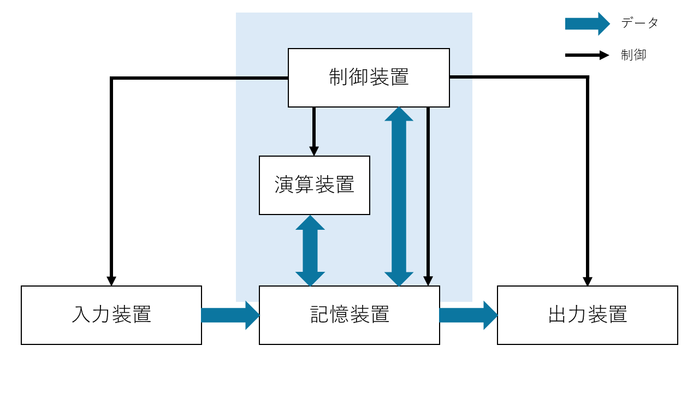

 

と、ここで、勘のいい人は違和感に気付くだろう。
図をよく見ると、記憶装置の上半分も色づいているのだ。

実は、コンピュータの内部には 制御装置と演算装置の他に、記憶装置が入っている。  
この記憶装置を、HDDやSSDといった「ストレージ」と分けるために、メモリ や 主記憶装置 と呼ぶ。
主記憶に対して、外付けのストレージを 補助記憶装置 と呼ぶこともある。  

ということで、構成をもう少し正確に書くと、次のようになる。

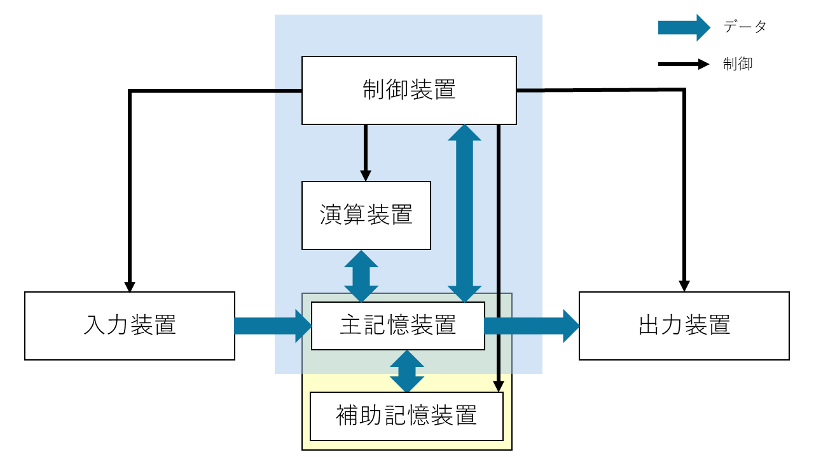

次項からは、コンピュータの構成要素について掘り下げてみる。

入力装置はキーボードやマウス、ボタン・スイッチなど、
出力装置はディスプレイやスピーカー、
補助記憶装置はよく言う「容量が足りない」みたいな みんながイメージしやすい記憶装置 のこと
なので、これらは良いだろう。

制御装置と演算装置、メモリ（主記憶装置）について順に見ていく。

    

**余談**
実際にコンピュータがどういうところで使われてるかの話でもしようか。

分かりやすいのは、今使っているパソコン。それに、もはや必需品とされるようなスマホにも入っている。
でも、そんなハイテクな「なんでも出来る」機械じゃなくても、大体の機械に入っていることが多い。

例えば信号機。時間で点灯させる色を変えたり、歩行者用の押ボタンで青信号の時間を変えたり。
スマート家電とかじゃない普通の炊飯器にも入っている。
ヒーターを制御したり、温度管理、炊きあがり時間の推定だったり、様々な作業を担っている。

電気を使う製品には、大体 特定のことを行うための制御装置 としてコンピュータが入っている。
**組み込み系** と呼ばれる分野では、そういった「特定のことを行うため」の小型コンピュータを作る。

### 1.1.2 CPUとは
  
コンピュータの内部に、具体的に何をする構成要素があるかは分かった。
では、実際のところ、物理的には何が入っているだろうか。

　世の中には、たくさんの回路素子が集まった「回路の集合体」（集積回路; IC）とした部品が存在する。
このICは、板に張り付けられ ICチップ として、今日では様々な機器に組み込まれている。
　コンピュータにもそんな回路の集合体があり、 CPU と呼ぶ。
中央演算処理装置（**C**entral **P**rocessing **U**nit）の略称であり、名前の通り 演算 と 処理 を行う。
構成要素でいうところの、制御装置と演算装置が合体したものだ。
　制御装置を積んだ *司令塔* であるCPUは、コンピュータの頭脳などと呼ばれることもある。

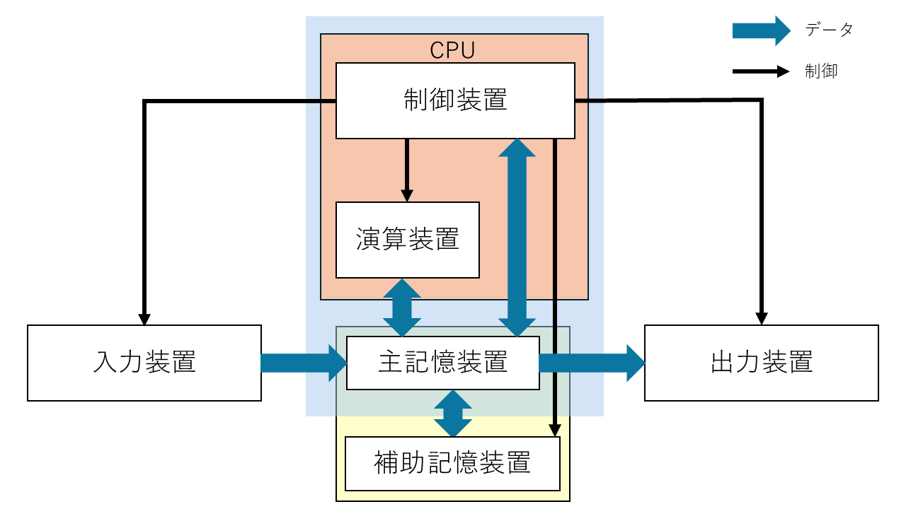

**問題**
上の画像が見えないように隠そう！！
(1) コンピュータの五大要素を全て述べよ。
(2) CPUは、コンピュータの五大要素でいう 何 と 何 を担っているか。

 

**余談**
「パソコンにCPUが入っているのはわかるけど、特定の作業しかしない炊飯器とかに CPU は入ってる？」

組み込みの歴史をお話ししよう。

　もともとは、それぞれの機械に適した 必要な制御回路 だけが作成され、機械に組み込まれていた。
炊飯器ならお米を炊く機能と保温する機能を持った回路を作って機械に埋め込む、
掃除機ならモーターの回転数を制御して吸い込む回路を埋め込む、みたいな。
　しかし、これでは機械とその専用回路を両方開発する必要がある。
パーツや期間・費用などの観点から、量産や新規開発において負担が大きかった。  

　そこで、色んな作業が出来る「汎用的な回路」を作成し、それを使いまわすことが考えられた。
これなら回路は同じものを使えるため、生産が早く進む。
掃除機や冷蔵庫や炊飯器など、機械のガワを作成して回路と繋げば、同じ回路を使いまわせる。
　ということで、汎用的な回路を使いまわして、制御用の 手順 を内部に組み込むタイプが覇権を握った。

　汎用的な回路の集合体ICと、制御手順を組み込んだメモリ、入出力用のピン　をまとめたチップを、
「小さなコンピュータ」ということで マイコン（マイクロコンピュータ）と呼ぶ。
　今の組み込み系は、そんなマイコンに書き込む制御手順を作る。

### 1.1.3 メモリとは

用語：**RAM　ROM　アドレス・番地**

メモリとは、データの保存場所である。ストレージ（HDD や SSD、USBメモリなど）とは別物です。
メモリには、コンピュータを制御するための手順や、一時的なデータが入っている。

　制御の手順は常に同じである。掃除機はボタンを押せばモーターを制御して吸い込みを行う。
ある日いきなり曲が流れたり、テレビが付いたりはしない。
　機械を制御する手順など 常に変わらないもの は、製造段階で内蔵してしまえばいいと納得できるだろう。
さらに、使用者に勝手に手順を改変されても困る。魔改造はサポート対象外だ。
製造時に一度だけ書き込んで、あとは読み込みだけ出来るようにしたい。
　こういう読み込み専用なメモリを、ROM（Read Only Memory） と呼ぼう。

　一時データは、右クリックなどでコピーを行った内容であったり、保存を行っていないメモ帳の落書きなど。
このデータは電源が入っている間しか生きられない一時的なもので、一度電源を落とせば消えてしまう。
　こちらのメモリは、電気を落とすと蒸発するみたいに消えるから 揮発性メモリ、
あるいは読み書きを好きに出来るから RAM（Random Access Memory） と呼ばれる。  

　そんなメモリに作業中の進捗を一時保存しておき、「保存ボタンを押す」などをトリガーに、
内容をストレージへまとめて保存する。
　なんですぐストレージに書き込まないのかというと、単純に時間がかかるから。
ストレージは容量が大きい分、空き や データ を探すのに時間がかかる（メモリと比べて1000倍以上）。

「何かするたびに処理がカクカクする」となっては困るので、
容量が小さい代わりに比較的高速な メモリ に、細かい変更を貯めこんでおくのだ。  

  

**余談**
ROMに書かれている、制御の手順を、**ファームウェア** と呼んだりします。

現在のパソコンにおいて、ROMを占領しているのは BIOS と呼ばれる部分です。
パソコンを起動したとき、電源が入ったら最初に、Windows や Mac のロゴが出るよりも先に動きます。
CPU だったりストレージだったりが動くかを確認して初期化し、Windowsなど OS を動かす準備を整える者です。
この子が壊れると、パソコンが全く起動しなくなります。設定を迂闊に触ると終わります。

**メモリのイメージ**

先頭から連番のついた、更衣室や駅のロッカーのような、縦並びの箱である。
この箱の一つ一つに、データや命令を詰め込める。

「10番のロッカーに入った物を取り出したい」「30番にこのデータ入れといて」といった形で、
番号を指定してロッカーを扱う。
この、ロッカー番号を アドレス や 番地 と呼ぶ。つまり住所です。  
番地は 0番 から始まる。先頭は1番目ではなく0番目であることに注意したい。

下の図だと、「0番地に2457が入ってる」、「1番地に6751が格納されている」といった表現がされる。
メモリの大きさは機械によって異なるが、
各ロッカーの容量（ワード長）と、ロッカーの数（アドレス空間）が影響する。

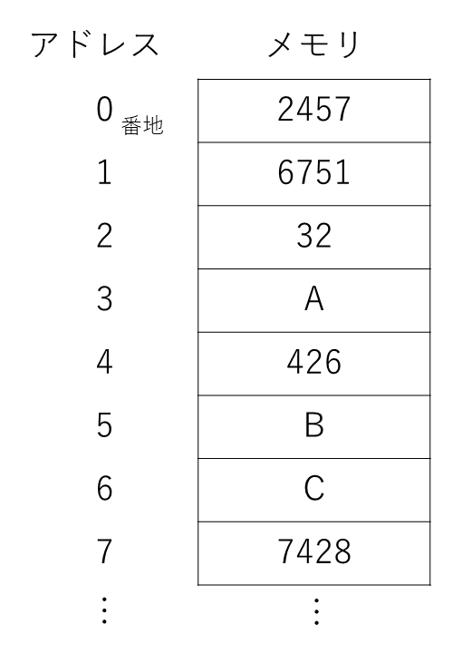

**問題**
(1) 書き込みが自由にできるメモリをアルファベット三文字で何というか。
(2) (1) に対して、書き込みが自由に**できない**メモリをアルファベット三文字で何というか。
(3) メモリにおいて、データを格納する一つ一つの場所を指す番号を何というか。
(4) 上の図について、A が格納されている (2) は、いくつか。

組込み用に少し踏み込んだ話を。

プログラムに与えられるメモリには4つの領域が存在し、それぞれ役割が異なる。

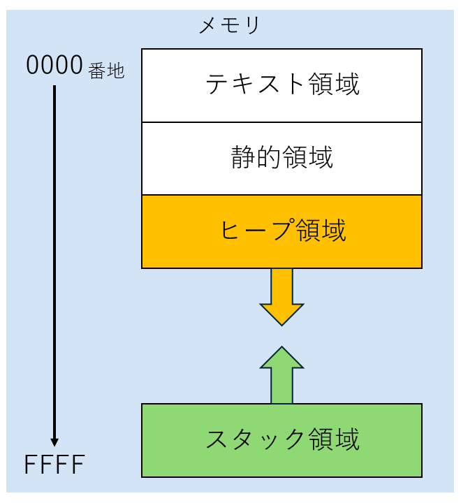

- テキスト領域 : 機械語が記されている。これを上から順番に読んで、実行していく。
- 静的領域 : プログラム作成時に宣言されている、初期値がある変数に割り当てる領域。「この箱にはこれを入れるよ」が決まっている。
- ヒープ領域 : 「大きめの保存領域が欲しいよ」みたいなときに、動的に割り当てられる領域。出現した順に置かれていく。
- スタック領域 : プログラム作成時から宣言されているものではなく、「ここでしか使わない」変数などに対する領域。メモリの一番後ろから、前の方に上ってくる。

まず、「これをしてね」「次はこれを動かしてね」といった処理を次々と書いた手順書の場所があります。
これを上から順番に読んで、その通りに動かすことで、コンピュータは動作します。  

次に、途中で大きさが変わったりしない ( **静的** ) 、初めから決まっているデータを保存する場所があります。  

その下に、途中で大きさが変わったり ( **動的** ) 、急に大きい保存場所が欲しくなった時に使う場所があります。
「名簿表使いたいから、中のデータ入れられるだけのまとまった場所をくれ」
「やっぱこのデータも入れるから領域大きくして」
みたいな、動的に変わる、まとまった範囲を確保する場所です。

最後に、「この処理するときだけ使う、ちょっとしたデータ」とか「ちょっとこのタスク先にやってくれる？」
みたいに命令の順番が変わったときの「元々やってた仕事の進捗具合」、戻り先（本の しおり みたいな）とかが保存される場所があります。
これはちょっと特殊で、一番後ろ（数字が大きい番地）から前（小さい番地）に進んでいきます。
下から上に積み上げていくので、「スタックを *積む* 」と表現したりします。

## 1.2 機械語とアセンブリ言語

### 1.2.1 制御装置と機械語、アセンブリ言語

コンピュータは電気で動く電子機器である。
つまり、基本的に「電気が流れている」「電気が流れていない」の2状態しか扱うことが出来ない。
では、そんなコンピュータはどのようにして、色々な制御やデータの保持が出来るのだろう？

答えは、制御装置の役割にある。
　制御装置は、コンピュータの各部分に「電気を流す」「電気を流さない」を制御する。
これにより、「今は足し算をしてくれ」「いまはデータ読み込んでくれ」と、
やることを切り替えることで望んだ操作が出来るようにする。
　「こことここに電気を流せば、この回路が動くから足し算が出来る」みたいな感じで、
複雑にオンとオフを切り替えるのだ。すごく電気代にクリティカルヒットしそうですね。

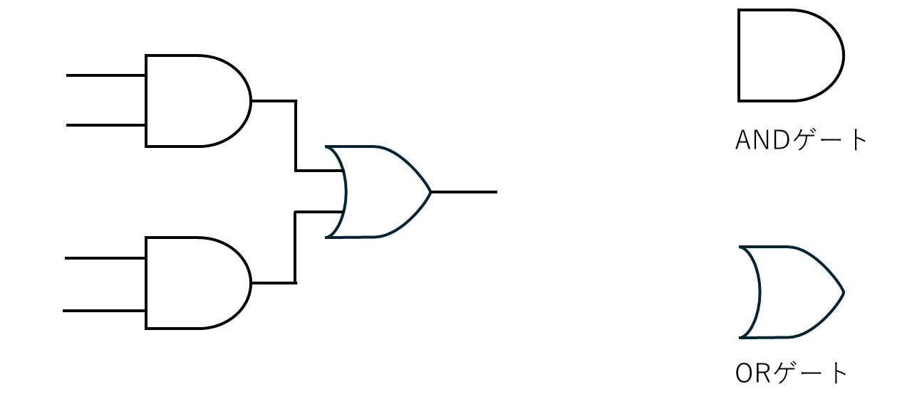

上の図は 論理回路図 という。
　左から4本の線が来ており、中央にはよくわからない図形、右側に1本の線が伸びている。
線は電気を流す銅線である。
左側から電気を流して、中央で処理して、最終的に電気を右に流すか、流さないかを決定する。
　ANDゲート は「全部の線からの入力がON (電気が流れている) とき、電気を流してあげるよ！」という処理だ。
勇者パーティーが全員揃ったら扉が開く感じ？  
　ORゲート は「入力がどれか一つでもONなら、電気を流してあげるよ！」といった処理をする。
パーティーの誰か一人でも鍵を持っていたら扉が開けられる感じ？  

この状況において、左側のどこに電気を流すか、2パターン考えてみよう。  

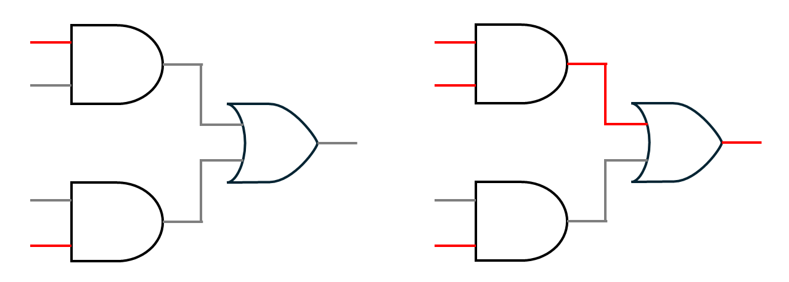

左の図では、一番上と一番下に電気を流した。
この場合、どちらも ANDゲート でOFFが出力されるから、最終的に電気は流れない。

右の図では、さらに上から2番目に電気を流した。
この場合、上の ANDゲート でONが出力される。
すると、次の ORゲート もONとなり、最終的に電気が流れる。  

このように、コンピュータはそれぞれの導線の電気の流し方を変えることで、
「どの回路に電気が流れて、何が動作するか」を制御する。  
「どの回路に電気を流すか」を決定する機構が 制御装置 であり、
そのために「どの 導線 に電気を流すか」の指示書が ROM に記されている。

ROM では、各導線に電気を流す・流さないを記録しておくので、流す→1, 流さない→0 と表現すると都合がいい。
導線の順番を決めて、01の羅列を記すだけで手順書になる。
そのため、コンピュータの内部では、データは全て 1 と 0 の2種類を組み合わせて表現される。  

1 と 0 の組み合わせにより記された、制御を行うための手順を 機械語 と呼ぶ。
機械が理解できる言語なので機械語だ。しかし、これでは人間に理解できない。
手順を作ってデータとして組み込むのは人間なのに、肝心の人間が理解できなければ意味がない。

そこで、機械語と一対一で対応した、ちょっと人間向きの言語を作ることにした。
これを アセンブリ言語 と呼ぶ。
jump や add など、英単語（の略）をキーワードに使うことで、ちょっとだけ読みやすくしている。

本教材では、このアセンブリ言語を学ぶことで、コンピュータへの理解を高めたい。

   

また、ここで用語として、**プログラム** と **ソースコード** を整理したい。

命令を書き記した機械語の「手順書」のことを プログラム と呼ぶ。
プログラムを作るために頑張ることを プログラミング といって、
その時に使う言語を プログラミング言語 と呼ぶ。アセンブリ言語もプログラミング言語の一種ですね。

プログラミング言語にも色々と種類があって、アセンブリ言語の他にも、C言語、Pythonなど挙げればキリがない。この中で、「人間にとって分かりやすい」言語を **高級言語**、「機械の動きに忠実な、機械語に近い」言語を **低級言語** と言ったり。

また、プログラミング言語で書いた 人間向きの命令群を ソースコード や、単に コード と呼ぶ。
人間用のソースコードを機械語のプログラムに翻訳することを コンパイル という。
特に、アセンブリ言語を機械語にする場合は、アセンブル という。
 

つまり、
プログラム は、機械向けの命令（ 010001101101 のような）
ソースコード は、人間向けの命令（ int a = 0 のような）
といった認識で良いでしょう。

2章以降では、プログラムや高級言語といった用語が出てくるので、なんとなくのイメージを持っておくと良い。

### 1.2.2 ビットとデータ表現

用語：2進数、ビット、バイト、文字コード

前節で出てきた機械語など「1 と 0 の組み合わせ」による表現を、ビット列 と呼ぶ。101101 みたいな。  
0 と 1 で構成された文字列の、一つ一つを ビット（bit） と呼び、
そんなビットが列になっているから、ビット列である。

そして、8個のビットでまとめた単位を バイト（Byte） と呼ぶ。
「10100000」 や 「00010001」 などを「8ビット」や「1バイト」、
「11110000 10110011」 を「16ビット」や「2バイト」と数える。
ストレージの容量で、「ギガバイト(GB)」や「2TB」といった表現がされるが、その「バイト(B)」だ。

キロメートルkm の「キロ」が 1000 を表すように、1KB は 1000Bということである。
そんな KB が 1000個あって、1000KB = 1MB （メガバイト）になる。
同様に、1000MB = 1GB、1000GB = 1TBである。つまり1TBは1兆バイトです。デカすぎ。
ちなみに、1000 区切りではなく $2^{10}$ (1024) を基準にすることもある。1024B = 1KiB といったように。
この場合、上の単位系と混同しないように、KBではなく KiB（キ**ビ**バイト）、MBではなく MiB（メ**ビ**バイト）
など、間に i を入れた書き方をすることもある。

 

さて、実際のところ、そんなビット列でデータをどのように表現しているのだろう。  
これは非常に単純なもので、「データの一つ一つに対応する番号を割り振る」のだ。
アルファベットを書きたいなら、a から z まで26文字あるから、00000 から 00001, ..., 11010 までを対応させる。

これは、対象のコンピュータや空間の中で統一された対応表があれば、一対一で対応しているから復元できる。
小学生の時に経験があるかも、友達間で使う秘密の創作文字みたいな感じです。
そういうことで、世界的に統一された「文字とビット列の対応表」が存在する。
文字コード と呼ばれ、「この文字はこのビット列だよ」が取り決められている。  

文字コードにも unicode や Shift-JIS, ISO-2022-JP などたくさんの種類があり、
文字コードが違うと復元結果が変わるので、文字化け が発生したりするのだが……。

例えば、
unicode だと「あ」は `11100011 10000001 10000010` というビット列になる。
Shift-JIS だと「あ」は `10000010 10100000` というビット列になり、全然違う。
`11100011 10000001 10000010`（unicodeの「あ」）を Shift-JIS として読むと「縺�」になってしまう。
そのため、「unicode でビット列に変換したものを Shift-JIS と思って元に戻す」など、
コード化にするとき と 文字に戻すとき で文字コードを間違えて変換を行うと、文字化けする。

 

次のページに、今回使用する文字コード「asciiコード」を紹介する。

| 行 \ 列 | 2    | 3   | 4   | 5   | 6   | 7      |
| :-----: | :--: | :-: | :-: | :-: | :-: | :----: |
| **0**   | 間隔 | 0   | @   | P   | `   | p      |
| **1**   | !    | 1   | A   | Q   | a   | q      |
| **2**   | "    | 2   | B   | R   | b   | r      |
| **3**   | #    | 3   | C   | S   | c   | s      |
| **4**   | $    | 4   | D   | T   | d   | t      |
| **5**   | %    | 5   | E   | U   | e   | u      |
| **6**   | &    | 6   | F   | V   | f   | v      |
| **7**   | '    | 7   | G   | W   | g   | w      |
| **8**   | (    | 8   | H   | X   | h   | x      |
| **9**   | )    | 9   | I   | Y   | i   | y      |
| **10**  | *    | :   | J   | Z   | j   | z      |
| **11**  | +    | ;   | K   | [   | k   | {      |
| **12**  | ,    | <   | L   | \   | l   | &#124; |
| **13**  | -    | =   | M   | ]   | m   | }      |
| **14**  | .    | >   | N   | ^   | n   | ~      |
| **15**  | /    | ?   | O   | _   | o   | 削除   |

  

表の見方は、列→行 の順番で数字を当てはめる。例えば、  
20 が 「間隔」（半角スペース）に対応する。　2列目 の 0行目 を指す。  
41 が 大文字の A に対応する。　　　　　　　　4列目 の 1行目 を指す。

といったようになる。  
なぜ 0 ~ 15 なのかは、2進数の桁上がりの特徴と、次節の 16進数 が関係する。

 

**問題**
(1) 0 と 1 の組み合わせにより表現された数字列を、何というか。
(2) (1) を構成するそれぞれの 0 や 1 を何と呼ぶか。
(3) (1) を 8つ区切り にしたとき、それぞれをどういった単位で呼ぶか。
(4) asciiコードにおいて、`3` は 何列目の何行目 か。
(5) asciiコードにおいて、`.` は 何列目の何行目 か。

### 1.2.3 2進数と10進数、16進数

私たちが普段使用している数字は、10進数 と呼ばれる。
0 ~ 9 の数字を使い、10を基準に繰り上がるから、**10** で桁が **進** む **数** である。

それに対し、先で話しているビット列は、0 と 1 しかない。
0, 1, と来て、2 は使えないので繰り上がって 10。その次の3は 11。次の4は二回繰り上がって 100。
というように数える。2を基準に桁を上げるから、2進数 と呼ぶ。  

 

2進数と10進数は相互に変換が可能であり、2進数から10進数は以下のように求められる。
各位の数字が $a_i$ である二進数について（$1011$ なら $a_1=1, \ a_2 = 0, \ a_3 = 1, \ a_4 = 1$）

$$
\begin{align}
a_1 a_2 \cdots a_n &= \sum_{i=1}^n {a_i \times 2^{n-i}} \cr
               &= a_1 \times 2^{n-1} + a_2 \times 2^{n-2} + \cdots + a_{n-1} \times 2^1 + a_n \times 2^0
\end{align}
$$

 

数式が出てきて拒否反応が表れた方もいると思うので、簡単に10進数で話をします。

まず、1024という数字は、一の位や十の位など、それぞれの位の数字と、基準となる10を使って、
次のように表現できます。

$$
\begin{align}
1024 &= 1 \times 1000 + 0 \times 100 + 2 \times 10 + 4 \times 1 \cr
     &= 1 \times 10^3 + 0 \times 10^2 + 2 \times 10^1 + 4 \times 10^0 \cr
\end{align}
$$

お金のイメージです。1000円が1枚と、100円が0枚と、10円が2枚と、1円が4枚 みたいに、  
桁ごとに「基準（を何回か掛け合わせたもの；累乗）が何個あるか」を見ます。

同様に、917235は、以下のようになります。
$$
\begin{align}
917235 &= 9 \times 100000 + 1 \times 10000 + 7 \times 1000 + 2 \times 100 + 3 \times 10 + 5 \times 1 \cr
       &= 9 \times 10^5 + 1 \times 10^4 + 7 \times 10^3 + 2 \times 10^2 + 3 \times 10^1 + 5 \times 10^0
\end{align}
$$

このように、数字は「それぞれの位の数と、基準の累乗」の組み合わせで表現できます。

 

これを使って、2進数についても同じように考えてあげると、基準は 10 ではなく 2 になるから、

$$
\begin{eqnarray}
1011 &=& 1 \times 2^3 + 0 \times 2^2 + 1 \times 2^1 + 1 \times 2^0 \cr
     &=& 1 \times 8 + 0 \times 4 + 1 \times 2 + 1 \times 1 \cr
     &=& 11
\end{eqnarray}
$$

$$
\begin{eqnarray}
100110 &=& 1 \times 2^5 + 0 \times 2^4 + 0 \times 2^3 + 1 \times 2^2 + 1 \times 2^1 + 0 \times 2^0 \cr
       &=& 32 + 4 + 2 \cr
       &=& 38
\end{eqnarray}
$$

というように、2進数から10進数が得られます。
なので、「各位の数値について、2 の (桁目-1)乗 したものを足す」ことで、2進数から10進数に変換できるというわけです。  

逆に、10進数 → 2進数は、「2の乗数の組み合わせに分解する」ことで、表現が得られる。

$$
\begin{eqnarray}
500 &=& 256 + 128 + 64 + 32 + 16 + 4 \cr
    &=& 1 \times 2^8 + 1 \times 2^7 + 1 \times 2^6 + 1 \times 2^5 + 1 \times 2^4 + 0 \times 2^3 + 1 \times 2^2 + 0 \times 2^1 + 0 \times 2^0 \cr
    &=& 111110100
\end{eqnarray}
$$

しかし、数字が大きくなると困ってしまう。$2^n$ なんて覚えていられない。
そこで、実際には「2で割った余りを逆順に並べる」といった操作をする。
簡単にするため、「割り算の筆算」を逆向きに書いたような記号で計算をする。

商が 0 になるまで、2 で割り続ける。最終的に、出た余りを逆順に並べると、それが2進数表現になっている。

しかし、これでは同じ数を表すにも、2進数と10進数で全然違う値になってしまう。
関係性が見えづらくて、計算しなければ変換しづらいのだ。500 と 111110100 のように。  
そこで、2進数を基準に「2進数の4桁を対応させた、別の進数」を作る。
2進数の5桁目で繰り上がりするから、$2^4$ = 16が基準で 16進数 と呼ぶ。

とはいっても、私たちの知っている一桁の数字は 0 ~ 9 までの10個しかない。
そこで16進数では、 0 ~ 9, A, B, C, D, E, F で値を表現する。
10進数で言う10 を A, 11 を B, 12 を C といったように対応している。  
なお、16進数であることを分かりやすく書くために、先頭に `0x` や `#` を書くことがある。
`0x21` とか `#1BF6` とか。  

この16進数を使って、2進数を変換すると、

1010 0110 → 0xA6
0011 0101 → #35

といったように、4桁ずつそのまま値が対応する。  
16進数から2進数は特に「35だから 3 → 0011, 5 → 0101 で 00110101だな」といったように、
計算を必要とせずにすぐ変換が出来る。
そのため、機械語などコンピュータの中身を表現する際は、10進数を使うよりも
「内部は2進数、人間が読むときは16進数」といった棲み分けをすることが多い。
 

**問題**
(1) 173 を 8桁の2進数と、16進数に直しなさい。
(2) `01001011` を 10進数に直しなさい。

### 1.2.4 2進数と負の数（二の補数表現）

さて、コンピュータ上で正の数を表現する方法はわかった。では、負の数はどのように表現しよう。

コンピュータには 0 と 1 しかないから、「マイナス」を意味する記号は存在しない。
　そこで、「一番左のビット（最上位ビット）」を 符号ビット とし、
「ここが 0 なら正の数、1 なら負の数」といった解釈を行う方法を考えてみよう。  
例えば、1 は 0001 なので -1 は 1001、2 は 0010 なので -2 は 1010、といった感じである。  
　しかし、これでは足し算を行うときに不都合が生じる。
例えば $1 + (-1)$ は $0$ なので 0000 になってほしいが、上の方法では 0001 + 1001 で 1010 になる。

これでは不便なので、足し算で都合が良くなるように 逆順で マイナスを割り振っていく。
0000 を基準に、1 は 0001，-1 は 1111、2 は 0010，-2 は 1110、といったように割り当てる。  
こうすると、符号違いの同じ数を足したときに、結果が（0 + 0以外）必ず 10000 になるのだ。  
この方式で負の数を実現する表現方法を、二の補数表現 という。  

補数とは、「元の数と足した結果が、基準となる数と等しくなるような数」である。
60について「100の補数」なら、「60と足した結果、基準100になるような数」なので 40 である。
正直 「二の補数」というより「2のべき乗の補数」といった方が正しい気もするが……。

補数を用いない普通の2進数を、マイナスの符号を考えないという意味で 符号なし 2進数と呼ぶ。  
この方法では、$0 \sim 2^{(桁数)} \ -1$ までの整数を表現できる。4桁なら 0 ~ 15 まで。  
それに対し、負の数を扱える2進数を、マイナスの符号を考えるという意味で 符号付き 2進数と呼ぶ。  
この方法では、最上位ビットが符号になるから、実質的に数字を表現するのは **(全体の桁数 - 1)** 桁である。  
よって、表現できる整数の範囲は $-2^{(桁数 - 1)} \ \sim 2^{(桁数 - 1)} \ -1$ となる。4桁なら -8 ~ 7 まで。

二の補数表現で負の数を表すには、以下の手順を踏む。

1. 普通の正の数でのビット列を考える。 例えば 4 を4桁で `0100` と表す。
2. これに、0 と 1 を反転したものを考える。0 のところを 1 に、1 のところを 0 にする。 `1011`
3. 1 を足した値を考える。繰り上がりに注意。 `1100`

これで、2の補数表現による -4 が完成する。普通の2進数を考え、ビットを反転、+1 という手順だ。

|2進数|16進数|符号なし|符号付き|｜|2進数|16進数|符号なし|符号付き|
|:--:|:--:|:--:|:--:|:--:|:--:|:--:|:--:|:--:|
|0000|0| 0| 0|｜|1000|8| 8|-8|
|0001|1| 1| 1|｜|1001|9| 9|-7|
|0010|2| 2| 2|｜|1010|A|10|-6|
|0011|3| 3| 3|｜|1011|B|11|-5|
|0100|4| 4| 4|｜|1100|C|12|-4|
|0101|5| 5| 5|｜|1101|D|13|-3|
|0110|6| 6| 6|｜|1110|E|14|-2|
|0111|7| 7| 7|｜|1111|F|15|-1|

**問題**
(1) 2進数8桁で -20 を表現せよ。ヒント：普通の 20 は `00010100` である。
(2) `10000110` は、符号なし2進数でいくつか。また、符号付き2進数でいくつか。

## 1.3 命令セットアーキテクチャ

前節で出た 機械語 や アセンブリ言語 には、実は様々な種類が存在する。
というのも、コンピュータを作る会社は一つではない。
さまざまな会社が、自分に都合のいい命令や回路、仕様を作っている。

コンピュータによって、導線の組み合わせ方も、内部に入っている回路の順番や種類も異なる。
そのため、同じ機械語を適用しても、電気の流れ方が全然変わってしまう。
同じアセンブリ命令を適用しても、「この命令をするための回路を持ってないよぉ」なんてことも起こる。

世の中には、様々な会社による規格が存在する。
それらを分類するため、CPUの論理的な構成を アーキテクチャ と呼び、分類を作った。  
「こうすればこう動く」、つまり どのような機械語で特定の動作をするか による分類を
命令セットアーキテクチャ と呼び、例えば以下のような命令セットとCPUの実装例がある。

- x86　　　(Intel社のCoreシリーズ, AMD社のRizenシリーズ)
- ARM　　　(Apple社のA/Mシリーズ)
- RISC-V　(EsperantoTechnologies社のAIプロセッサ)

あなたのパソコンの命令セットはなんだろうね。
IntelのCore i7 やCore i9などの人は x86 や x64 と呼ばれるアーキテクチャだと思います。ARMの人もいるかも？
ARMはスマホとかIoT家電とか、小型のデバイスに使われることが多いですね。

ただ、x86 とかって命令とかビット数の制御とかが多くて、初めてだと難しすぎるんですよ……。
ということで！

本教材では、
情報処理技術者試験の問題の中で扱われる仮想的なコンピュータである **COMETⅡ** および、
COMETⅡに対応した命令セット、アセンブリ言語である **CASLⅡ** を基に、
仮想的なCPUを使ってアセンブリ言語を学習する。

## 1.4 仮想CPUの構成

この仮想CPUは、命令とデータを一つの同じメモリの中に内蔵する プログラム内蔵方式 であり、
命令を上から順番に実行する 逐次制御方式 を採用している。  
また、このようなプログラム内蔵方式かつ逐次制御方式を採用したコンピュータを、
この方法を提唱した数学者ジョン・フォン・ノイマンの名前から、ノイマン型コンピュータ と呼ぶ。  

と、堅く言ってもわかりづらいので、要するに
「実行する前にやりたいことと使うデータをメモリに全部書き込んでおいて、それを順番に実行するよ」
ということだ。  
当たり前と思うかもしれないが、最近話題の量子コンピュータは非ノイマン型のコンピュータだったり。

この仮想CPUは、以下の要素で構成されている。

- PC  プログラムカウンタ  (次に実行する命令が書いてあるメモリのアドレスを保持する)
- IR  命令レジスタ  (命令を保持する)
- GR  汎用レジスタ (計算結果とかデータとかを保持しておく)
- FR  フラグレジスタ (数値に応じて変わる。「今読み込んだ値は負の数！」「計算結果が0！」とか)
- SP  スタックポインタ (スタック領域の先頭であるアドレスを保持する)
- メモリ (各16ビット、0 から 65535 番地まで 65536個の領域がある)
- デコーダー （IRに来た命令を解析するところ。何をしたいか解読する）
- ALU (Arithmetic Logic Unit; 算術論理演算器 の略。計算を行う場所。演算装置のこと)

フラグレジスタには、以下のフラグが 1ビットずつ存在する。

- OV (オーバーフローフラグ)  値が大きすぎたり小さすぎて表現できなくなった場合に、1となる
- SF (サインフラグ)  値が 負の数 になった場合に、1となる
- ZF (ゼロフラグ)  値が 0 になった場合に、1となる

なお、COMETⅡでは通常、プログラムカウンタのことを「プログラムレジスタ PR」と呼ぶが、本CPUでは PC とする。

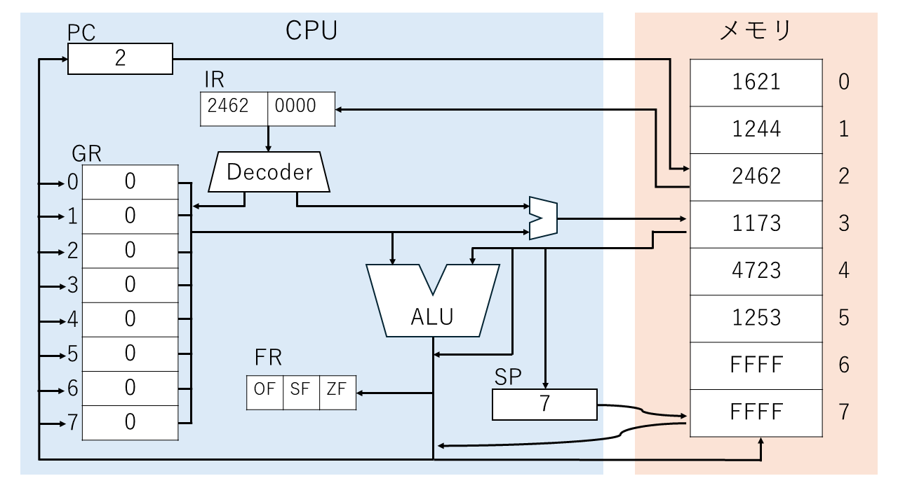

## 1.5 コンピュータの基本動作

ノイマン型コンピュータは、大きく分けて、次の3つを繰り返して動作している。

1. fetch（フェッチ） : PCの値を参照し、それをアドレスとしてメモリの中身を IR に保存する。そして、PCの値を増やす。
2. decode（デコード）: IRに入った命令を解読する。
3. execute（実行）　 : 解読した結果に基づき、どのような処理をするか制御装置で逐次制御・実行する。

これを繰り返すことで、「メモリに書かれた命令を上から順番に読み実行する」逐次制御方式を実現する。  

例えば、メモリからデータを読み込んで、汎用レジスタ0に保存する場合、次のように制御とデータが流れる。

fetch を 赤色、decode を 紫色、execute を 緑色 でそれぞれ色分けしてみた。
赤 → 紫 → 緑 の順番で処理が行われる。

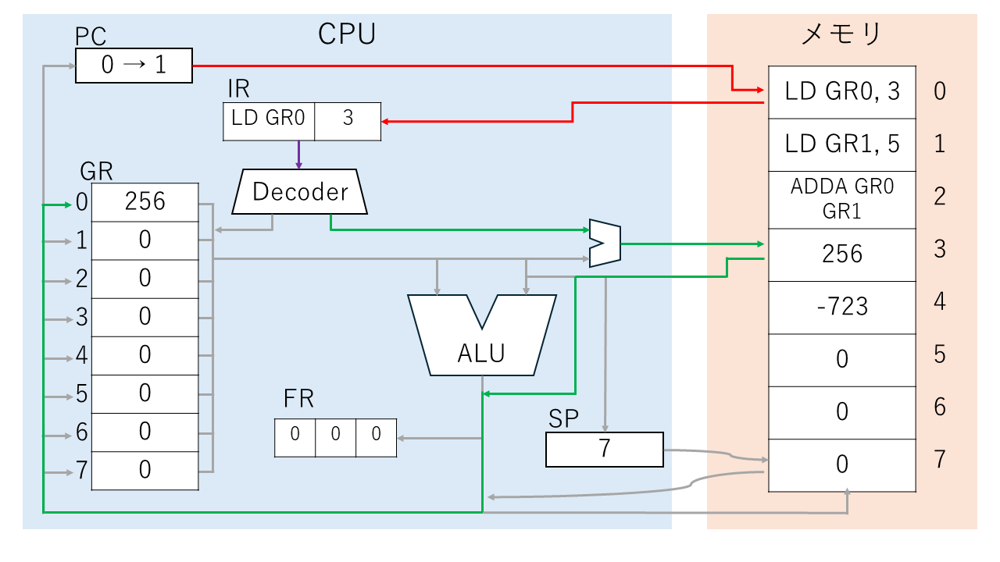

まず、（fetch；赤色）PCの値を参照して、0番地の命令をIRに読み込む。そして、PCの値を増やす。  
次に、（deocode；紫色）デコーダーに命令を渡し、解読を行う。  
その後（execute；緑色）解読結果から、どの回路を動かすか決定し、処理を行う。今回はメモリの3番地に入ったデータをGR0に格納する。  
そして、これが終われば、またPCの値を参照して命令を読み込む。……といったように処理が続く。

次の命令も続けて見てみよう。

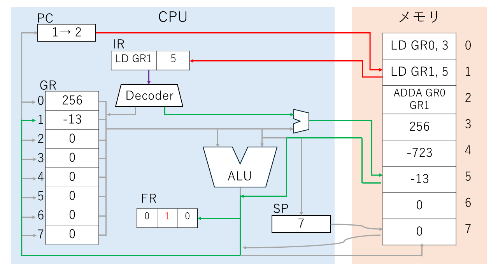

PCの値を参照して、1番地の命令をIRに読み込む。そして、PCの値を増やす。  
次に、デコーダーに命令を渡し、解読を行う。  
解読結果から、どの回路を動かすか決定し、処理を行う。今回はメモリの5番地に入ったデータをGR1に格納する。  
ここで、GR1に読みだした値が 負の数 だったため、SFが1になる。  
そして、これが終われば、またPCの値を参照して命令を読み込む。……といったように処理が続く。

次の命令も見よう。

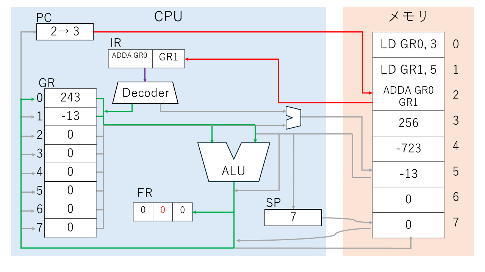

PCの値を参照して、2番地の命令をIRに読み込む。そして、PCの値を増やす。  
次に、デコーダーに命令を渡し、解読を行う。  
解読結果から、どの回路を動かすか決定し、処理を行う。今回はGR0の値とGR1の値を足して、GR0に格納する。足す操作はALUにて行う。  
結果、256 + (-13) により、GR0の値は 243 に変わった。また、計算結果が正の数だったので、SFは0に戻る。  
そして、これが終われば、またPCの値を参照して命令を読み込む。……といったように処理が続く。
