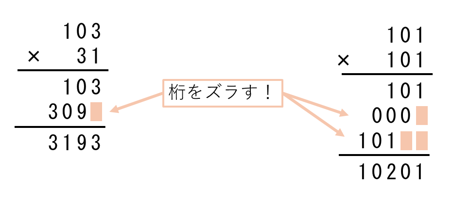
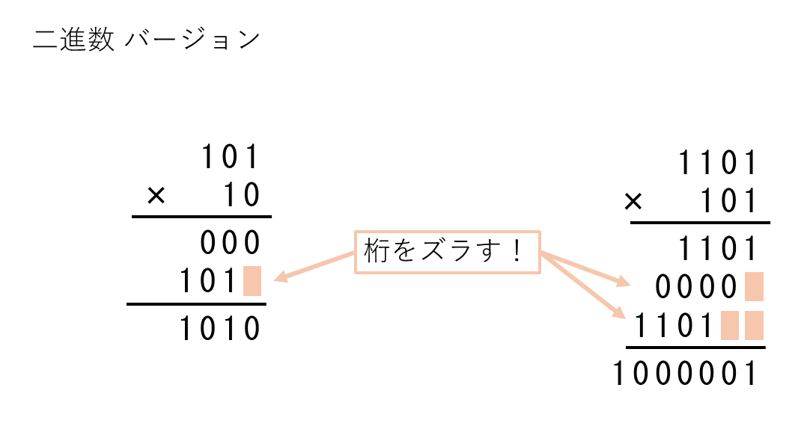
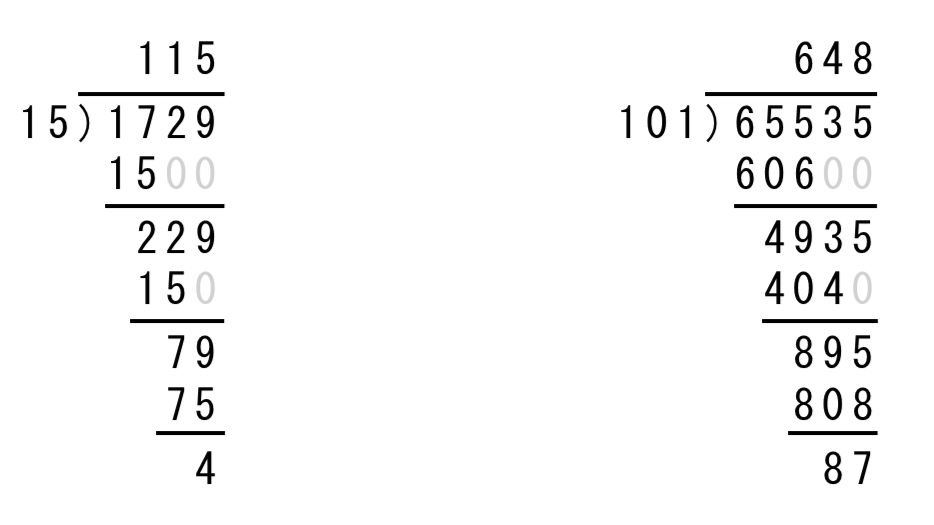
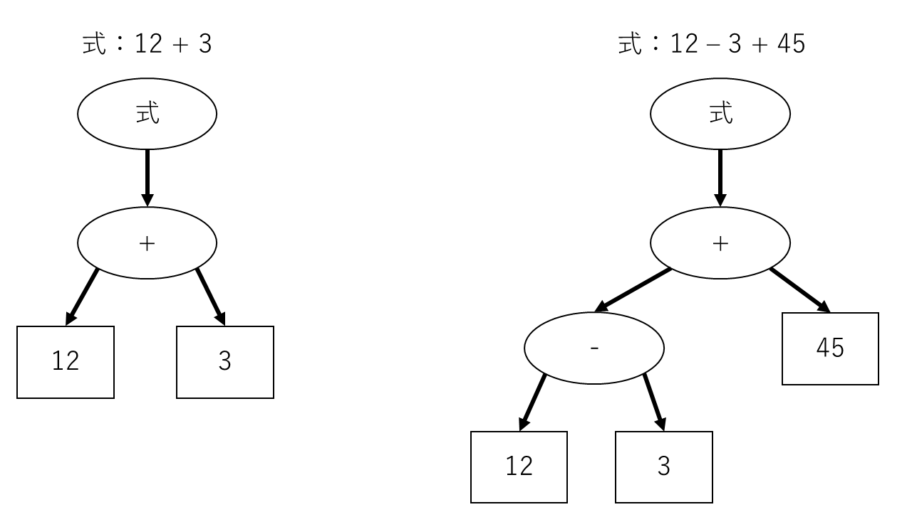
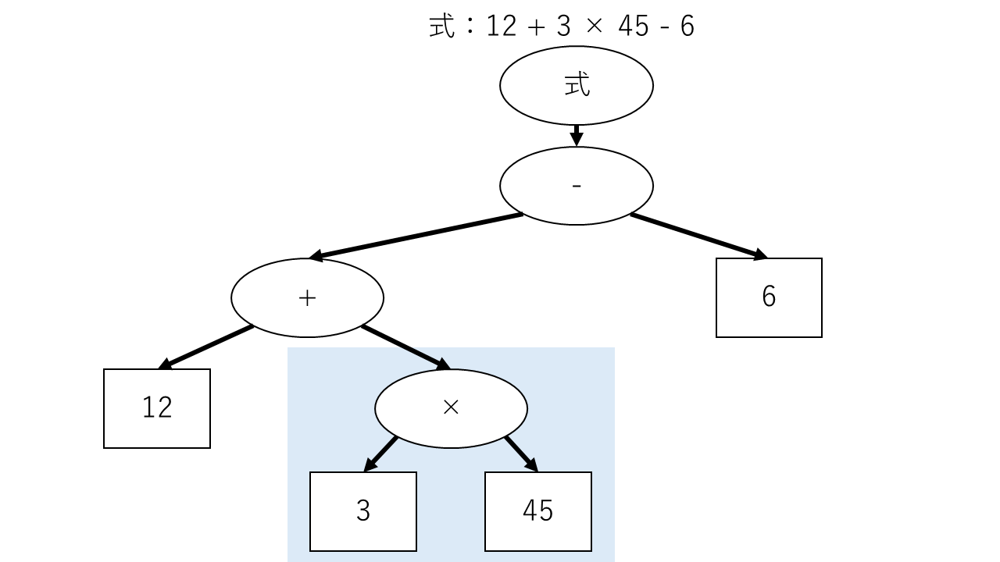
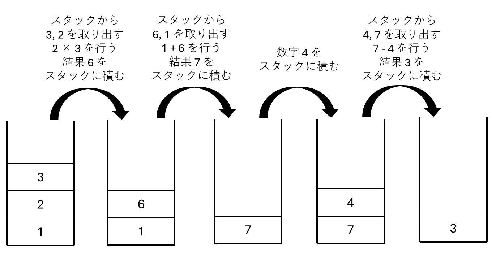

# 5章 電卓を洗練しよう

本章では、前章で作った電卓をもう少し便利にしてみる。
具体的には、

- 計算処理を高速化
- 2桁以上の数字入力に対応
- 計算の順序を正しく解釈

を目指す。

- [5章 電卓を洗練しよう](#5章-電卓を洗練しよう)
  - [5.1 計算処理の高速化](#51-計算処理の高速化)
    - [5.1.1 掛け算](#511-掛け算)
      - [筆算のお話](#筆算のお話)
    - [5.1.2 割り算](#512-割り算)
    - [5.1.3 出力における計算](#513-出力における計算)
  - [5.2 入力の改良（2桁以上の数字入力）](#52-入力の改良2桁以上の数字入力)
  - [5.3 計算順序の解釈](#53-計算順序の解釈)
    - [5.3.1 字句解析（トークナイズ）](#531-字句解析トークナイズ)
    - [5.3.2 構文解析](#532-構文解析)
    - [5.3.3 逆ポーランド記法](#533-逆ポーランド記法)
    - [5.3.4 構文解析の実装](#534-構文解析の実装)
  - [まとめ](#まとめ)

<div style="page-break-before:always"></div>

## 5.1 計算処理の高速化

本節では、計算処理の高速化を目指す。特に、掛け算・割り算をより早く行えるように最適化したい。

### 5.1.1 掛け算

現状のプログラムでは、掛け算を「掛けられる数 を (掛ける数) 回だけ足す」形で実装している。
これでは、例えば $2 \times 100$ をしようものなら、2 を 100回もループして足す必要が出てくる。
そこで、別の方法による掛け算を考えたい。

我々が掛け算を行うときは、どのような方法を取るだろうか。
初めは、定義 $m \times n := m + m + m + \cdots + m$ にしたがって考えるかもしれない。
しかし、慣れてくると「九九」を覚えたり、もっと大きな数については「筆算」を考えるだろう。

かけ算の筆算は、「**桁をずらして** 掛け算の結果を足し合わせる」ことで行った。



ということで、より早く計算するために、筆算を考えてみたい。
コンピュータが扱うのは 二進数 であるから、二進数の領域で掛け算の筆算を考える。
2進数においては、数は ×0 か ×1 しか現れない。
×0 では結果は 0 に、×1 では掛けられる数そのままになる。
つまり、筆算のために「九九」のようなものを考えなくていい。
よって、10進数の筆算に倣って二進数で筆算を行うと、次のようになる。



右側の結果が少し変な感じもするが、二進数は 2 で桁上がりが起きるため、桁上がりを観察すると確かにこうなる。
大事なのは、この結果が「実際に掛け算の結果としてあっているか」である。
左側 $101 \times 10$ は、10進数に直すと $5 \times 2$ である。結果は 10 になるはずで、二進数だと `1010` になる。
右側 $1101 \times 101$ は、10進数に直すと $13 \times 5$ である。結果は 65 になるはずで、二進数だと `1000001` になる。
結果を筆算の物と見比べてみると、筆算でも同じ答えが得られることが分かる。

ということで、筆算の形式で掛け算を行うように実装してみたい。
「桁をずらす」という点については、非常に都合のいい命令がある。シフト命令は、数を好きなだけ左右にずらせた。
よって、

- 現在見てる 桁目 だけ、掛けられる数を `SLA` 命令でずらす
- 掛ける数を一桁ずつ見る
- ずらした数 or 0 を計算結果に足す

を繰り返すことで、計算ができるはずだ。
前章 4.4.1 での `3 * 5` の計算を書き直してみよう。

```CASL
; 掛けられる数を GR2, 掛ける数を GR3 に入れているとする。
MAIN    START
        LAD     GR2, 3
        LAD     GR3, 5          ; 3 * 5 となる
        LAD     GR5, 0          ; GR5 の初期化

MUL     CPA     GR3, =0         ; 掛ける数が 0 じゃないかの確認
        JZE     M_END           ; 0 だったら計算しないで M_END に
        ; 掛ける数を一桁ずつ見る。右シフトで溢れた値（OFに格納）を見る
        SRL     GR3, 1          ; 掛ける数を右シフト
        JOV     M_PLS           ; 溢れたのが 1 だったら足す作業 M_PLS へ
M_SFT   SLA     GR2, 1          ; 掛けられる数を左シフト。「桁をずらす」に相当
        JUMP    MUL
M_PLS   ADDA    GR5, GR2        ; 一時的に GR5 に GR2 を足す。掛け算の結果が GR5 に格納
        JUMP    M_SFT           ; 1桁目を計算する前にずらさないように、最後にシフト作業
M_END   LD      GR2, GR5        ; 掛け算の結果を GR2 に移す
        RET

        END
```

処理の順番が分かりづらいので、書いておく。

1. `MUL` で掛ける数を確認。0 だったら掛け算終了で `M_END` に飛ぶ。
2. 掛ける数を右シフトして、一番下位のビットから順に「今見てる桁」を取得する。
3. 「今見てる桁」が 1 だったら、`M_PLS` に飛んで、掛けられる数を足す。その後に `M_SFT` に飛ぶ。  「今見てる桁」が 0 だったら、そのまま `M_SFT` に行く。
4. `M_SFT` では、掛けられる数を 一桁左シフトする。次以降の計算で「桁をずらし」た値を足せるように。
5. `MUL` に戻って、掛ける数を確認。掛ける数は 1桁 減ってるはず。

これを繰り返して、掛ける数が全部溢れて 0 になったら終了する。

この実装方法では、愚直な足し算の繰り返しに比べて何倍も早く計算できる。
特に、掛ける数が大きいほど、計算の速さを実感できるはずだ。
GR3 を 100 に変えて、`3 * 100` の計算にかかる時間を測ってみよう。

計算中に GR2 や GR3 の中身を、二進数表記になっている項目を見てみても面白いと思う。
シフト命令で、「桁をずらす」をしっかり行っている様子がよく見える。

<br><br><br>

#### 筆算のお話

そもそも筆算ってなんで計算できんの？ってところを覚えている人は少ないのではないだろうか。
特に文系の人にとっては、「こうやって計算すれば答えが出る。そういうルール」と片づけているかもしれない。
ということで、筆算の原理のお話をします。

筆算は、「掛け算を小分けにする」と「各位の数で分ける」をポイントにしている。
1章で、数を 〇〇の位 で分ける話をした。
$1024 = 1 \times 1000 + 0 \times 100 + 2 \times 10 + 4$ といった感じのやつだ。
これを、掛け算における 掛ける数 に使ってあげる。
例えば、$103 \times 31$ であれば、$103 \times (30 + 1)$ といった感じに、位で分ける。
そして、これを分配する。$103 \times 30 + 103 \times 1$ といった感じだ。
すると、「103 を 3 倍して、10倍したもの」と「103 を 1 倍したもの」の足し算になる。
「10倍」というのは特別なもので、1 は 10、2 は 20、57 は 570 といったように、桁を 1つ 左にずらす操作に当たる。
よって、「103 を 3 倍した 309 について、桁をずらした 3090」と「103 を 1 倍したもの」と言い換えることができて、
$3090 + 103 = 3193$ といったようになる。この、$3090 + 103$ を筆算の形で書いてみるとどうだろう。
掛け算の筆算で真ん中に出てくる、309 と 103 にそっくりになる。

桁が大きくなっても同様で、 $101 \times 123$ なら、
$101 \times (100 + 20 + 3)$ と見て、
$101 \times 100 + 202 \times 10 + 303$ となり、
$10100 + 2020 + 303$ を計算する。

ということで、掛け算の筆算は、「桁で小分けにした足し算」に落とし込むことにしているのだ。
桁をずらすのは、「十の位での10倍 や 百の位での100倍」などで生じる 0 を省略した結果である。

二進数についても同様で、この場合は「2の累乗で分ける」ことになる。
$101 \times 10$ なら、$101 \times (1 \times 2 + 0)$ と見る。
$1101 \times 101$ なら、$1101 \times (1 \times 2^2 + 0 \times 2^1 + 1)$ と見る。
よって、合計して掛けている数は変わらないから、結果も正しく出てくる。

<div style="page-break-before:always"></div>

### 5.1.2 割り算

割り算においても、筆算の方法を踏襲したい。
のだが……。割り算の筆算は結構めんどくさい方法を取っている。

一の位からではなく、大きい数字から考える。
「(割る数) $\times$ (1 ~ 9) $\times 10^n$ 」の範囲で、元の値を超えない最大値を見つける。
1 ~ 9 を商の一番前に立てて、元の値と最大値の差分を取る。
差分について、同様に「(割る数) $\times$ (1 ~ 9) $\times 10^{n-1}$ 」の範囲で、元の値を超えない最大値を見つける。
また商に立てて、差分を取る。
これを繰り返して、差分が割る数より小さくなったら、その差分を余りとして計算終了。

といった流れになる。言葉で言っても難しいので、筆算を見ながら考えてみよう。



まず、15 や 30, 45などを考えていって、10倍の150, 300, 450, ...、100倍の...、と増やしていき最大値 1500 を見つける。商に 100 が立つ。
そしたら元の値 1729 との差分を取って、229 を得る。
229 についても同様に考えていって、超えない最大値 150 を見つける。商に 10 が追加される。
229 との差分を取って、79 を得る。
79 についても同様にして、最大値 75 を見つける。商に 5 が追加される。
79 との差分を取って、4 を得る。
4 は 割る数 15 より小さいので、余りを 4 として計算終了となる。

まあ、もっとも普通の人は
上から2桁を見て 17 だから 1立てて 1500 引く、残り 229 も 22 だから 1立てて 150 引く、
といったようにやっていくだろうが、機械的に解くなら 15 から 2倍、3倍、と増やしていく必要がある。

これを、二進数についても同様に行う。
割られる数 と 割る数 を比較して、割られる数が大きければ、割られる数を超えない最大値を見つける。
1 を立てて、まだ大きくできるならシフトして 10 を立てて、まだ大きくできるなら 100、1000 といったように探していく。
最大値が見つかれば、商として保持して、割られる数との差分を計算する。
差分について同様に比較・最大値・差分を繰り返して、割る数の方が大きくなったら終了だ。

<div style="page-break-before:always"></div>

```CASL
; 割られる数を GR2, 割る数を GR3 に入れているとする。
MAIN    START
        LAD     GR2, 11
        LAD     GR3, 2          ; 11 / 2 となる
        LAD     GR6, 0          ; GR6 の初期化

DIV     CPA     GR3, =0         ; 割る数が 0 じゃないかの確認
        JZE     E_DIV0          ; 0 だったら E_DIV0 に飛ぶ
D_MAIN  CPA     GR2, GR3        ; 割られる数・残り と 割る数を比較
        JMI     D_END           ; 残り < 割る数 なら D_END に飛ぶ
        ; 商を GR4、その時の最大値を GR5 に入れる。
        LAD     GR4, 1          ; GR4 の初期化（予め商を 1 としておく）
        LD      GR5, GR3        ; GR5 の初期化（合わせて、最大値を 割る数 にしておく）
D_SFT   CPA     GR2, GR5        ; 割られる数・差分 と 最大値 を比較
        JMI     D_PLS           ; 差分 < 最大値 なら D_PLS に飛ぶ
        SLA     GR4, 1          ; 商を左シフト
        SLA     GR5, 1          ; 最大値を左シフト
        JUMP    D_SFT
D_PLS   SRA     GR4, 1          ; GR4, GR5 は 割られる数・差分を超えるまで増やしてるので、
        SRA     GR5, 1          ; 1回分 戻す。右シフト
        SUBA    GR2, GR5        ; GR2 - 最大値。一回割った差分が GR2 に再格納される
        ADDA    GR6, GR4        ; 商を GR6 に足す
        JUMP    D_MAIN          ; D_MAIN に戻って繰り返し

; 割り算の結果 今は商がGR4、余りがGR2に入っている
D_END   LD      GR3, GR2        ; 余りを GR3 に移す
        LD      GR2, GR6        ; 割り算の結果を GR2 に移す
        RET

; 0除算のエラー文を出力
E_DIV0  OUT     ='Error: divided by 0', =19
        RET

        END
```

<div style="page-break-before:always"></div>

### 5.1.3 出力における計算

さて、式を計算する部分において、計算の最適化はできた。
しかし、掛け算・割り算はそれ以外の場所でも行っている。

出力の処理を思い返してほしい。
出力では、「複数桁の出力に対応するために、計算結果を ÷10 していって、余りを各位の数として取り出す」ことを行った。ここの ÷10 も高速化してあげよう。

<br>

```CASL
MAIN    START
        LAD     GR2, 173

NUMTOS  LAD     GR3, 0          ; 使うレジスタたちの初期化
        LAD     GR4, 0
        LAD     GR5, 0
        LAD     GR6, 0
        CPL     GR2, =0         ; 値が 0 じゃなければ、DIV10 に飛ぶ
        JNZ     DIV10
        PUSH    0               ; 値が 0 なら、0 を積んで 桁数を1にして SETANS へ
        LAD     GR6, 1
        ST      GR6, anslen
        JUMP    SETANS
DIV10   CPL     GR2, =0         ; 値が 0 になるまでループ
        JZE     SETANS
        ; GR2 / 10 をして、商を GR3 に
        CPL     GR2, =10        ; 割られる数・差分が 10 より小さくなったら
        JMI     STACK           ; 割り算終了。STACK に飛ぶ
        LAD     GR4, 1          ; GR4 の初期化（予め商を 1 としておく）
        LAD     GR5, 10         ; 割る数の設定
D10_SFT CPA     GR2, GR5        ; 割られる数・差分 と 最大値 を比較
        JMI     D10_PLS         ; 差分 < 最大値 なら D_PLS に飛ぶ
        SLA     GR4, 1          ; 商を左シフト
        SLA     GR5, 1          ; 最大値を左シフト
        JUMP    D10_SFT
D10_PLS SRA     GR4, 1          ; GR4, GR5 は 割られる数・差分を超えるまで増やしてるので、
        SRA     GR5, 1          ; 1回分 戻す。右シフト
        SUBA    GR2, GR5        ; GR2 - 最大値。一回割った差分が GR2 に再格納される
        ADDA    GR3, GR4        ; 商を GR3 に足す
        JUMP    DIV10           ; DIN10 に戻って繰り返し
        ; GR2 / 10 が終わったら、余りは GR2 に入っている
STACK   PUSH    0, GR2          ; インデックス修飾で GR2 の値を PUSH
        LD      GR2, GR3        ; 商を GR2 に移動
        LAD     GR3, 0          ; GR3 を初期化
        LAD     GR6, 1, GR6     ; 桁数を GR6 に保持
        ST      GR6, anslen     ; 桁数を anslen にも格納
        JUMP    DIV10

; スタックから取り出して数字列を作る。今何桁目 を GR3 に入れるとする
SETANS  CPL     GR6, GR3        ; 全桁終わるまで繰り返し
        JZE     OUTPUT
        POP     GR2
        ADDA    GR2, =#0030     ; 数値 を 数字 に変換
        ST      GR2, ans, GR3   ; インデックス修飾で「何桁目」を指定する
        LAD     GR3, 1, GR3     ; 今読んだ桁数を増やす
        JUMP    SETANS

; 答えの出力
OUTPUT  OUT     ans, anslen
        
        RET
anslen  DS      1       ; 答えの桁数
ans     DS      5       ; 値は 0 ~ 65535 の最大5桁
        END
```

<div style="page-break-before:always"></div>

## 5.2 入力の改良（2桁以上の数字入力）

本節では、入力の改善を目指す。具体的には、12 や 1729 といった複数桁の数字を正しく読み取る。

とはいっても、前章の 出力 の項で行ったことと大体同じだ。一桁ずつ読み取って、数を足していく。

例えば 123 だったら、

1 を読み取る。
2 を読み取る。今持ってる 1 を 10 にして、2を足す。
3 を読み取る。今持ってる 12 を 120 にして、3を足す。

といった処理をすれば上手くいきそうだ。

現状持っている数を 10倍 して、新しく読んだ数を足してあげればよいだろう。
10倍 をシフト演算で実装するには、 $10 = 2 + 8 = 2^1 + 2^3$ として分解して考えればいい。
1桁左シフトと、3桁左シフトの結果を足す。

<br>

また、文字を読むのに毎回 `LD    GR0, STR, GR1`、`LAD    GR1, 1, GR1` を書くのは面倒なので、
サブルーチン `READ_C` として作って呼び出せるようにしよう。read charactor の略で `READ_C` です。

そして、数値を読むのは複数の場面で使うので、同様に `READ_V`（read value）として関数にしておく。
さらに、読み取った文字が数字かどうかの判定も、関数 `ISNUM` としてまとめておく。

改行されると見づらいので、実装例は次のページにおいておきます。

<div style="page-break-before:always"></div>

```CASL
MAIN    START
        IN      STR, =256
        CALL    READ_V          ; n桁の数値を読み取る。GR2 に入る
        RET

; 数字列を数値に直して GR2 に格納する（戻り値 が 数値で、GR2 に）
READ_V  CALL    READ_C          ; 1文字読む
        ; 読み取った文字が数字か
        CALL    ISNUM
        CPL     GR6, =0         ; 数字じゃないなら
        JZE     RETURN          ; 終了
        ; 数字 を 数値 に変換して GR2 に格納する
        SUBA    GR0, ='0'
        LD      GR2, GR0
READ_V2 ; 二文字目以降
        LD      GR0, STR, GR1   ; 1文字見る
        CALL    ISNUM           ; 数字かどうか
        CPL     GR6, =0         ; 数字じゃないなら
        JZE     RETURN          ; 終了
        CALL    READ_C          ; 見るだけじゃなく読む
        SUBA    GR0, ='0'       ; 数字を数値に変換
        ; GR2 に元々持っている数を 10 倍して、
MUL10   LD      GR4, GR2        ; 一時的に GR2 の値を GR4 に移す
        SLA     GR4, 1          ; GR4 を 1桁 左シフト。2倍に相当
        SLA     GR2, 3          ; GR2 を 3桁 左シフト。8倍に相当
        ADDA    GR2, GR4        ; GR2 + GR4。8倍 + 2倍 なので 10倍 になる
        ; GR2 に新しく読んだ数値を足す
        ADDA    GR2, GR0
        ; 数字が続く限り読み続けるので JUMP でループ
        JUMP    READ_V2

; 1文字読み取って GR0 に格納する
READ_C  LD      GR0, STR, GR1
        LAD     GR1, 1, GR1
        RET

; 読み取った文字が 数字（0 ~ 9 の間）か。数字なら GR6 を 1 に、数字じゃないなら 0 にする
ISNUM   LAD     GR6, 0          ; GR0 の初期化
        CPL     GR0, ='0'       ; '0' つまり 0x30 より小さい -> 違う
        JMI     RETURN
        CPL     GR0, ='9'       ; '0' つまり 0x39 より大きい -> 違う
        JPL     RETURN
        LAD     GR6, 1          ; 数字なので GR6 を 1 にする
        RET

RETURN  RET
STR     DS      256
        END
```

`3` や `7` など一文字を読み取るのには時間がかかってしまうが、これで複数桁に対応できる。
`57` や `123`、 `5678` などを入力して、GR2 に正しく数値が入っているか確認しよう。

## 5.3 計算順序の解釈

本節では、計算式を正しく解釈して、計算の順番を作る。
例えば、`3+5*7-(2+5)*3` といった式を入力したときに、

掛け算が先なので、5 * 7 を行う。
3 + (5 * 7 の結果) を行う。
括弧が先なので、2 + 5 を行う。
掛け算が先なので(2 + 5 の結果) * 3 を行う。
(3 + (5 * 7 の結果) の結果) - ((2 + 5 の結果) * 3 の結果) を行う。

といったように、順番を正しく解釈してもらう。
そのために、**構文解析** というものを学んでいこう。

### 5.3.1 字句解析（トークナイズ）

まず、数式を パーツに分ける ことを考える。
一文字ずつ読み取っていくのもいいが、パーツで考えた方が利便性が高いのだ。
1 が来た。
2 が来た。じゃあ 12 かな
\+ が来た。足し算か。
3 が来た。 12 + 3 かな？
4 が来た。12 + 34 だったか。
5 が来た。12 + 345 かよ。
みたいに、一文字ずつ読んでいたら面倒になる。
そこで、「12 が来た。 次は + だから足し算だ。345 が来たから 12 + 345 だな」みたいに、パーツで分けておくと後々読みやすい。

この パーツ を **トークン（token; 字句）** といい、パーツに分ける処理を **トークナイズ（tokenize; 字句解析）** という。

現状入力されるものについて考えてみよう。
例えば数字がある。これは前節で作った `READ_V` 関数で分けられる。
他には演算子がある。これは `+`, `-`, `*`, `/` といった一文字の記号である。`READ_C` 関数で取れそうだ。
また、括弧にも対応したい。これも `(` と `)` という一文字の記号だから、`READ_C` 関数で良いだろう。

ということで、トークナイズを脳内でやってみよう。

式：`123*(45+4)-31`

1文字目を見る。`1` なので数字と予想。`READ_V` 関数で 数値 123 を得る。文字は3文字まで進む。
4文字目を見る。`*` なので演算子と予想。`READ_C` 関数で 記号 * を得る。文字は4文字まで進む。
5文字目を見る。`(` なので記号と予想。`READ_C` 関数で 記号 ( を得る。文字は5文字まで進む。
6文字目を見る。`4` なので数字と予想。`READ_V` 関数で 数値 45 を得る。文字は7文字まで進む。
8文字目を見る。`+` なので演算子と予想。`READ_C` 関数で 記号 + を得る。文字は8文字まで進む。
9文字目を見る。`4` なので数字と予想。`READ_V` 関数で 数値 4 を得る。文字は9文字まで進む。
10文字目を見る。`-` なので演算子と予想。`READ_C` 関数で 記号 + を得る。文字は10文字まで進む。
11文字目を見る。`(` なので記号と予想。`READ_C` 関数で 記号 ) を得る。文字は11文字まで進む。
12文字目を見る。`3` なので数字と予想。`READ_V` 関数で 数値 31 を得る。文字は13文字まで進む。
14文字目を見る。式は無く 初期値 0xFFFF なので、文字じゃない → 読み取り終了。

これをプログラムで行うなら、次のようになる。
これを動かすと、数値は GR2 に保持され、記号は出力されるはずだ。

```CASL
MAIN    START
        IN      STR, =256
        
TOKEN   LD      GR0, STR, GR1   ; 見るだけなので、GR1を増やさない
        CPL     GR0, =#0080     ; 文字じゃない（asciiコード範囲の0x80より大きい）か
        JPL     RETURN
        CALL    ISNUM           ; 数字かどうか
        CPL     GR6, =1         ; 数字のとき、
        JZE     CALL_RV         ; READ_Vを呼ぶ。CALLだと無条件になっちゃうので緩衝する
        JNZ     CALL_RC         ; 数字じゃないとき、READ_Cを呼ぶ

CALL_RV LAD     GR2, 0          ; GR2 の初期化
        CALL    READ_V
        JUMP    TOKEN           ; まだ式が続いてるかもしれないので JUMP

CALL_RC CALL    READ_C
        ST      GR0, opr        ; 読み取った記号を opr に入れる
        OUT     opr, =1         ; 読み取った記号を出力
        JUMP    TOKEN           ; まだ式が続いてるかもしれないので JUMP

; --- 以下、前節の関数たち ---
; READ_C, READ_V, ISNUM （長くなっちゃうので省略）
; --------------------------

RETURN  RET
STR     DS      256
opr     DS      1
        END
```

GR2 の変化と 出力された記号を見て、トークナイズが出来ていることを確認しよう。

<div style="page-break-before:always"></div>

### 5.3.2 構文解析

トークナイズが出来たら、次はこれを適切に解釈して、順番を付ける。
式を解釈するために式の構成を調べるから、この作業を **構文解析** と呼ぶ。

今回は、構文解析の中でも基本的な **再帰降下構文解析法** という手法を使ってみる。
聞きなれない漢字が連続して難しく感じるだろうが、一つずつ見ていきたい。
まずは **降下** について。
これは、「文法的に次はこれのはず」を仮定して、どんどん深く中身を掘り進んでいく方法を指す。
逆に、トークンから文法を構築して、文全体が正しい構文になっているか確認する、という方法もある。
これを **上昇型** や **上向き** と呼ぶ。

今回は降下型にするから、先に文法を仮定する。
数式における文法は、前章でも出てきた `数値 {演算子 数値}の繰り返し` に（基本的には）なっている。
なので、`式 = 数値 {演算子 数値}の繰り返し` という文法が考えられる。

図にするとこんな感じになるだろうか。
ちなみに、このように 構文解析によって階層化されたものを可視化すると、
広がり方が 根幹から葉っぱへの木みたいな構造 に見えることから、この図を **構文木** と呼ぶ。



上の図の右側では、
「足し算をする。じゃあ足される数（左側）は何かな？あ、引き算をしないとわからないか。」
「足される数 にあたる部分は、12 - 3 の計算結果だな。」
「よし、足される数が分かったぞ。足す数（右側）は何かな？お、45か。じゃあ 12 - 3 + 45 をしよう」
といった感じで、左 → 右の順で、どんどん階層を深掘りしていくことで、一番最初に計算しないといけない物を決める。

<div style="page-break-before:always"></div>

さて、ここに追加で、「掛け算、割り算を先に計算する」を考える。
これは入れ子的な考え方で、「足し算・引き算における 足す数 足される数 に、掛け算割り算が入る」といった階層構造を考える。ここが難しい……。
概念としては、
「足し算がしたい。じゃあ足される数と足す数を知らないといけない。」
「足される数の中に掛け算がある。こっちを先に計算しないと足される数が求まらないな」
といった優先順序になる。
文法としては
`式 = 足し引き = 掛け割り {+-の演算子 掛け割り}の繰り返し`
`掛け割り = 数値 {*/の演算子 数値}の繰り返し`
といった感じになるだろうか。
これで、`式` を、`足し引き` と、より優先度の高い（階層の深い）`掛け割り` で表現できた。



次に、括弧について考えたい。括弧の中は、`(3+4)` や `(7-3*2)` など、式が入ってくるだろう。
なので、`( 式 )` という文法が考えられる。
ということで、`掛け割り` に `数値` 以外に `( 式 )` が使えるようにしよう。

`足し引き = 掛け割り {+-の演算子 掛け割り}の繰り返し`
`掛け割り = 末端 {*/の演算子 末端}の繰り返し`
`末端 = 数値 もしくは ( 式 )`

ここで、式 の中に 式 が入っていることに気付くだろうか。
これを解析するには、「式を解析する関数」を「式を解析している中で」呼び出す必要がある。
この、自分自身を呼び出すといった処理を **再帰処理** と呼ぶ。
なので、この構文解析は、**再帰**的に **降下**型で **構文解析** をするから **再帰降下構文解析** と呼ぶ。

ちなみに、こういった構文・文法を書くための記法が存在し、**BNF記法（Backus–Naur form）** という。
これは少し利便性が悪いので、拡張した **EBNF記法** に倣って構文を書くと次のようになる。
ただし、`式` を `expr`、`掛け割り` を `muldiv`、`末端` を `primary` とする。

`<expr> ::= <muldiv> ( "+" <muldiv> | "-" <muldiv> )*`
`<muldiv> ::= <primary> ( "*" <primary> | "/" <primary> )*`
`<primary> ::= number | "(" <expr> ")"`

この構文を使って、数式を構文解析してみよう。

```CASL
MAIN    START
        IN      STR, =256
        
; <expr> ::= <muldiv> ( "+" <muldiv> | "-" <muldiv> )*
EXPR    CALL    MULDIV          ; <muldiv> の部分を読む
EXPR_LP LD      GR0, STR, GR1   ; 1文字見る。+ か - のはず
        CPL     GR0, ='+'       ; + のとき
        JZE     TERM_PL
        CPL     GR0, ='-'       ; - のとき
        JZE     TERM_MI
        RET                     ; + でも - でもない -> <expr> の終了
; + のとき
TERM_PL LAD     GR1, 1, GR1     ; 1文字進める（実質 + を読んだことになる）
        CALL    MULDIV          ; <muldiv> の部分を読む
        OUT     ='+', =1        ; + を出力
        JUMP    EXPR_LP         ; "+" <muldiv> | "-" <muldiv> が後ろにまだあるかもしれないので JUMP
; - のとき
TERM_MI LAD     GR1, 1, GR1     ; 1文字進める（実質 - を読んだことになる）
        CALL    MULDIV          ; <muldiv> の部分を読む
        OUT     ='-', =1        ; - を出力
        JUMP    EXPR_LP         ; "+" <muldiv> | "-" <muldiv> が後ろにまだあるかもしれないので JUMP

; <muldiv> ::= <primary> ( "*" <primary> | "/" <primary> )*
MULDIV  CALL    PRIMARY         ; <primary> の部分を読む
MD_LP   LD      GR0, STR, GR1   ; 1文字見る。* か / のはず
        CPL     GR0, ='*'       ; * のとき
        JZE     TERM_ML
        CPL     GR0, ='/'       ; / のとき
        JZE     TERM_DV
        RET                     ; * でも / でもない  -> <muldiv> の終了
; * のとき
TERM_ML LAD     GR1, 1, GR1     ; 1文字進める（実質 * を読んだことになる）
        CALL    PRIMARY         ; <primary> の部分を読む
        OUT     ='*', =1        ; * を出力
        JUMP    MD_LP           ; "*" <primary> | "-" <primary> が後ろにまだあるかもしれないので JUMP
; / のとき
TERM_DV LAD     GR1, 1, GR1     ; 1文字進める（実質 / を読んだことになる）
        CALL    PRIMARY         ; <primary> の部分を読む
        OUT     ='/', =1        ; / を出力
        JUMP    MD_LP           ; "*" <primary> | "-" <primary> が後ろにまだあるかもしれないので JUMP

; <primary> ::= number | "(" <expr> ")"
PRIMARY LD      GR0, STR, GR1   ; 1文字見る
        CALL    ISNUM           ; 数字かどうか
        CPL     GR6, =1         ; 数字だったら
        JZE     NUMBER          ; number に飛ぶ
        ; それ以外のときは、 "(" <expr> ")" のはず
        LAD     GR1, 1, GR1     ; 1文字進める（実質 ( を読んだことになる）
        CPL     GR0, ='('
        JNZ     ERROR           ; ( じゃなければ、文法的に間違っている
        OUT     ='(', =1        ; ( を出力
        CALL    EXPR            ; <expr> の部分を読む
        CALL    READ_C          ; 1文字読む
        CPL     GR0, =')'
        JNZ     ERROR           ; ) じゃなければ、文法的に間違っている
        OUT     =')', =1        ; ) を出力
        RET

; number
NUMBER  CALL    READ_V          ; 数値を読む
        RET

; 文法的に間違っているとき
ERROR   OUT     ='Syntax Error!', =13   ; エラーメッセージを出力
FIN     POP     GR0
        JUMP    FIN             ; スタックにあるものを全部吐き出して異常停止させる

; --- 以下、前節の関数たち ---
; READ_C, READ_V, ISNUM （省略）
; --------------------------

STR     DS      256
        END
```

これを実行して、例えば式を `12+3*(2-1)+5` とすると、
GR2 に 12 が入る　（`EXPR`(+左側) → `MULDIV` → `PRIMARY` → `NUMBER`）
GR2 に 3 が入る　 （`EXPR`(+中側) → `MULDIV`(*左側) → `PRIMARY` → `NUMBER`）
`(` が出力される　（`EXPR`(+中側) → `MULDIV`(*右側) → `PRIMARY` → `(`）
GR2 に 2 が入る　 （`EXPR`(+中側) → `MULDIV`(*右側) → `PRIMARY` → `EXPR`(-左側) → `MULDIV` → `PRIMARY` → `NUMBER`）
GR2 に 1 が入る　 （`EXPR`(+中側) → `MULDIV`(*右側) → `PRIMARY` → `EXPR`(-右側) → `MULDIV` → `PRIMARY` → `NUMBER`）
`-` が出力される　（`EXPR`(+中側) → `MULDIV`(*右側) → `PRIMARY` → `EXPR`(-)）
`)` が出力される　（`EXPR`(+中側) → `MULDIV`(*右側) → `PRIMARY` → `)`）
`*` が出力される　（`EXPR`(+中側) → `MULDIV`(*)）
`+` が出力される　（`EXPR`(+)）
GR2 に 5 が入る　 （`EXPR`(+中側) → `TERM_PL` → `EXPR_LP`(+)）
`+` が出力される　（`EXPR`(+中側) → `TERM_PL` → `EXPR_LP`(+)）
という順番に処理される。

数字と演算子の順番に注目すると、

12　3　2　1　-　*　+　5　+

となる。この順番にはとても重要な価値があるのだが、それは次項で。

<div style="page-break-before:always"></div>

### 5.3.3 逆ポーランド記法

構文解析が出来たら、実際に計算をしたい。
しかし、これをする上で少し厄介なことがある。
それは、「数字を保持しておけない」という点だ。
例えば `1+2*3` をしたいとき、1 + を読んで、「足す数は 先に 2*3 をしないとわからない」となる。
計算を行う上で、レジスタはハードコーディング（プログラムに直書きで指定）なので、変えることが出来ない。
そこで、「2 * 3 を行うために、1 + で設定した 足される数 を 2 で上書きする」事態に陥ってしまう。
こうなってしまっては、足される数 6 が分かっても、肝心の 1 + が出来ない。

そこで、**足す数をスタックに避難させる** ことを考えてみよう。
数字だった場合、一度、数をスタックに避難させる。
足す数も素直に数字だったら、スタックから持ってきて計算する。
足す数を知るために計算が必要だったら、先にそこを計算してから、スタックから持ってきて足す。
こうすれば途中で「先にこっちを計算しなきゃ！」という事態に陥っても、数を保持して正しく計算できそうだ。

ここで、スタックを活用した計算に関連して、**逆ポーランド記法** という数式の記述方法を導入しよう。
逆ポーランド記法とは、「演算子を非演算子の後にする書き方」である。
といってもむずかしいので、簡単に言うと、「日本語っぽい書き方」を指す。
「1 + 2」なら、「1 と 2 を 足す」なので「1 2 +」といったように、演算子を後に書く。
「(1 + 2) × (3 + 4)」なら、「1 と 2 を足した数と、3 と 4 を足した数を、掛け合わせる」なので「1 2 + 3 4 + *」となる。

この記法の良いところは、**左から順番に処理すればいい** 点にある。
括弧を必要としないし、「掛け算のほうが足し算より先」とか考えなくていい。
この記法はさらに、**コンピュータと非常に相性が良い**。
先頭から順番に見ていって、数字だったら保持、演算子だったら対応する計算をする、を繰り返すだけで計算できる。
先頭から順番に見るのは、式をメモリに連続して書き出せば 逐次実行の特性から 簡単に行える。
数字だったら保持するのは、スタックに積めば簡単に実装できる。
数字はとにかくスタックに積んで、演算子が来たら上から2つ取り出して計算する。計算結果をまたスタックに積む。
これを繰り返すだけで、式を全て処理したときに最終的な計算結果がスタックに残る。

`1 + 2 * 3 - 4` を逆ポーランド記法にした `1 2 3 * + 4 -` について、スタックの流れを図で見てみよう。



まず、数字が続くので、スタックに 1, 2, 3 の順で積まれる。
`*` が来たので、スタックから 2つ 取り出して計算する。2 * 3 になり、結果の 6 をスタックに積む。
`+` が来たので、スタックから 2つ 取り出して計算する。1 + 6 になり、結果の 7 をスタックに積む。
`4` が来たので、スタックに積む。現在のスタックは 7, 4 の順。
`-` が来たので、スタックから 2つ 取り出して計算する。7 - 4 になり、結果の 3 をスタックに積む。
式をすべて処理したので、計算結果は 3 になる。スタックから戻せば出力とかもできる。

ここで思い返してほしいのだが、構文解析によって生まれた順番は、よく見ると逆ポーランド記法になっている。

前項の例 `12 3 2 1 - * + 5 +` について言えば、
12, 3, 2, 1 を積んで、
2 - 1 をして 1 が積まれて（現在 12, 3, 1）、
3 * 1 をして 3 が積まれて（現在 12, 3）、
12 + 3 をして 15 が積まれて（現在 15）、
5 を積んで（現在 15, 5）、
15 + 5 をして 20 が積まれて終了
となる。確かに `12+3*(2-1)+5` を正しい順番で計算しているだろう。

<div style="page-break-before:always"></div>

### 5.3.4 構文解析の実装

構文解析によって逆ポーランド記法が得られることが分かったので、残りは「実際の計算」を組み込みたい。
そこで、次のことをする。

- `number` で GR2 に数値を入れたのち、スタックにその数値を積む。
- 現在 `+` や `*` などを出力しているところで、「スタックから取り出して計算してスタックに戻す」を行う。

特に注意しなければならない点は、「スタックにいつ数値を積むか」である。
考えなしに「数値を GR2 に入れて・計算結果を求めて、すぐにスタックに積む」としてしまうと、`RET` で関数から戻るときにその数値を使われてしまう。`CALL` での復帰先もスタックに積まれるので、それを邪魔してしまうと戻れなくなる。そうなれば、たちまち予期せぬ場所に飛んでバグってしまう。
そのため、数値・計算結果をいつまで保持しておいて、いつスタックに積めば干渉しないかを考えなければならない。

これを実装すると、このようなプログラムになるだろう。
なお、「計算」は、該当の計算部分を直書きしても良い。私は分離させて `CALL` で呼ぶ方法にした。

`13+(7-2*2)-5` などを入力して、正しく計算が出来たら完成だ。

```CASL
MAIN    START
        IN      STR, =256
        CALL    EXPR            ; 構文解析と計算
        CALL    NUMTOS          ; 結果の出力
        RET
        
; <expr> ::= <muldiv> ( "+" <muldiv> | "-" <muldiv> )*
EXPR    CALL    MULDIV          ; <muldiv> の部分を読む
EXPR_LP LD      GR0, STR, GR1   ; 1文字見る。+ か - のはず
        CPL     GR0, ='+'       ; + のとき
        JZE     TERM_PL
        CPL     GR0, ='-'       ; - のとき
        JZE     TERM_MI
        RET                     ; + でも - でもない -> <expr> の終了
; + のとき
TERM_PL LAD     GR1, 1, GR1     ; 1文字進める（実質 + を読んだことになる）
        PUSH    0, GR2          ; 計算結果をスタックに再格納
        CALL    MULDIV          ; <muldiv> の部分を読む
        PUSH    0, GR2          ; 計算結果をスタックに積む
        POP     GR3             ; 右側の数をスタックから取り出す
        POP     GR2             ; 先に読んだ左側の数をスタックから取り出す
        CALL    PLUS            ; 計算する
        JUMP    EXPR_LP         ; "+" <muldiv> | "-" <muldiv> が後ろにまだあるかもしれないので JUMP
; - のとき
TERM_MI LAD     GR1, 1, GR1     ; 1文字進める（実質 - を読んだことになる）
        PUSH    0, GR2          ; 計算結果をスタックに再格納
        CALL    MULDIV          ; <muldiv> の部分を読む
        PUSH    0, GR2          ; 計算結果をスタックに積む
        POP     GR3             ; 右側の数をスタックから取り出す
        POP     GR2             ; 先に読んだ左側の数をスタックから取り出す
        CALL    MINUS           ; 計算する
        JUMP    EXPR_LP         ; "+" <muldiv> | "-" <muldiv> が後ろにまだあるかもしれないので JUMP

; <muldiv> ::= <primary> ( "*" <primary> | "/" <primary> )*
MULDIV  CALL    PRIMARY         ; <primary> の部分を読む
MD_LP   LD      GR0, STR, GR1   ; 1文字見る。* か / のはず
        CPL     GR0, ='*'       ; * のとき
        JZE     TERM_ML
        CPL     GR0, ='/'       ; / のとき
        JZE     TERM_DV
        RET                     ; * でも / でもない  -> <muldiv> の終了
; * のとき
TERM_ML LAD     GR1, 1, GR1     ; 1文字進める（実質 * を読んだことになる）
        PUSH    0, GR2          ; 数値をスタックに積む
        CALL    PRIMARY         ; <primary> の部分を読む
        PUSH    0, GR2          ; 数値をスタックに積む
        POP     GR3             ; 右側の数をスタックから取り出す
        POP     GR2             ; 先に読んだ左側の数をスタックから取り出す
        CALL    MUL             ; 計算する
        JUMP    MD_LP           ; "*" <primary> | "-" <primary> が後ろにまだあるかもしれないので JUMP
; / のとき
TERM_DV LAD     GR1, 1, GR1     ; 1文字進める（実質 / を読んだことになる）
        PUSH    0, GR2          ; 数値をスタックに積む
        CALL    PRIMARY         ; <primary> の部分を読む
        PUSH    0, GR2          ; 数値をスタックに積む
        POP     GR3             ; 右側の数をスタックから取り出す
        POP     GR2             ; 先に読んだ左側の数をスタックから取り出す
        CALL    DIV             ; 計算する
        JUMP    MD_LP           ; "*" <primary> | "-" <primary> が後ろにまだあるかもしれないので JUMP

; <primary> ::= number | "(" <expr> ")"
PRIMARY LD      GR0, STR, GR1   ; 1文字見る
        CALL    ISNUM           ; 数字かどうか
        CPL     GR6, =1         ; 数字だったら
        JZE     NUMBER          ; number に飛ぶ
        ; それ以外のときは、 "(" <expr> ")" のはず
        LAD     GR1, 1, GR1     ; 1文字進める（実質 ( を読んだことになる）
        CPL     GR0, ='('
        JNZ     ERROR           ; ( じゃなければ、文法的に間違っている
        CALL    EXPR            ; <expr> の部分を読む
        CALL    READ_C          ; 1文字読む
        CPL     GR0, =')'
        JNZ     ERROR           ; ) じゃなければ、文法的に間違っている
        RET

; number
NUMBER  CALL    READ_V          ; 数値を読む
        RET

; 文法的に間違っているとき
ERROR   OUT     ='Syntax Error!', =13   ; エラーメッセージを出力
FIN     POP     GR0
        JUMP    FIN             ; スタックにあるものを全部吐き出して異常停止させる

; 計算結果の出力
NUMTOS  LAD     GR3, 0          ; 使うレジスタたちの初期化
        LAD     GR4, 0
        LAD     GR5, 0
        LAD     GR6, 0
        CPL     GR2, =0         ; 値が 0 じゃなければ、DIV10 に飛ぶ
        JNZ     DIV10
        PUSH    0               ; 値が 0 なら、0 を積んで 桁数を1にして SETANS へ
        LAD     GR6, 1
        ST      GR6, anslen
        JUMP    SETANS
DIV10   CPL     GR2, =0         ; 値が 0 になるまでループ
        JZE     SETANS
        ; GR2 / 10 をして、商を GR3 に
        CPL     GR2, =10        ; 割られる数・差分が 10 より小さくなったら
        JMI     STACK           ; 割り算終了。STACK に飛ぶ
        LAD     GR4, 1          ; GR4 の初期化（予め商を 1 としておく）
        LAD     GR5, 10         ; 割る数の設定
D10_SFT CPA     GR2, GR5        ; 割られる数・差分 と 最大値 を比較
        JMI     D10_PLS         ; 差分 < 最大値 なら D_PLS に飛ぶ
        SLA     GR4, 1          ; 商を左シフト
        SLA     GR5, 1          ; 最大値を左シフト
        JUMP    D10_SFT
D10_PLS SRA     GR4, 1          ; GR4, GR5 は 割られる数・差分を超えるまで増やしてるので、
        SRA     GR5, 1          ; 1回分 戻す。右シフト
        SUBA    GR2, GR5        ; GR2 - 最大値。一回割った差分が GR2 に再格納される
        ADDA    GR3, GR4        ; 商を GR3 に足す
        JUMP    DIV10           ; DIN10 に戻って繰り返し
        ; GR2 / 10 が終わったら、余りは GR2 に入っている
STACK   PUSH    0, GR2          ; インデックス修飾で GR2 の値を PUSH
        LD      GR2, GR3        ; 商を GR2 に移動
        LAD     GR3, 0          ; GR3 を初期化
        LAD     GR6, 1, GR6     ; 桁数を GR6 に保持
        ST      GR6, anslen     ; 桁数を anslen にも格納
        JUMP    DIV10

; スタックから取り出して数字列を作る。今何桁目 を GR3 に入れるとする
SETANS  CPL     GR6, GR3        ; 全桁終わるまで繰り返し
        JZE     OUTPUT
        POP     GR2
        ADDA    GR2, =#0030     ; 数値 を 数字 に変換
        ST      GR2, ans, GR3   ; インデックス修飾で「何桁目」を指定する
        LAD     GR3, 1, GR3     ; 今読んだ桁数を増やす
        JUMP    SETANS

; 答えの出力
OUTPUT  OUT     ans, anslen
        RET


; ----------------------
; 構文解析に使う関数たち

; 数字列を数値に直して GR2 に格納する（戻り値 が 数値で、GR2 に）
READ_V  CALL    READ_C          ; 1文字読む
        ; 読み取った文字が数字か
        CALL    ISNUM
        CPL     GR6, =0         ; 数字じゃないなら
        JZE     RETURN          ; 終了
        ; 数字 を 数値 に変換して GR2 に格納する
        SUBA    GR0, ='0'
        LD      GR2, GR0
READ_V2 ; 二文字目以降
        LD      GR0, STR, GR1   ; 1文字見る
        CALL    ISNUM           ; 数字かどうか
        CPL     GR6, =0         ; 数字じゃないなら
        JZE     RETURN          ; 終了
        CALL    READ_C          ; 見るだけじゃなく読む
        SUBA    GR0, ='0'       ; 数字を数値に変換
        ; GR2 に元々持っている数を 10 倍して、
MUL10   LD      GR4, GR2        ; 一時的に GR2 の値を GR4 に移す
        SLA     GR4, 1          ; GR4 を 1桁 左シフト。2倍に相当
        SLA     GR2, 3          ; GR2 を 3桁 左シフト。8倍に相当
        ADDA    GR2, GR4        ; GR2 + GR4。8倍 + 2倍 なので 10倍 になる
        ; GR2 に新しく読んだ数値を足す
        ADDA    GR2, GR0
        ; 数字が続く限り読み続けるので JUMP でループ
        JUMP    READ_V2

; 1文字読み取って GR0 に格納する
READ_C  LD      GR0, STR, GR1
        LAD     GR1, 1, GR1
        RET

; 読み取った文字が 数字（0 ~ 9 の間）か。数字なら GR6 を 1 に、数字じゃないなら 0 にする
ISNUM   LAD     GR6, 0          ; GR0 の初期化
        CPL     GR0, ='0'       ; '0' つまり 0x30 より小さい -> 違う
        JMI     RETURN
        CPL     GR0, ='9'       ; '0' つまり 0x39 より大きい -> 違う
        JPL     RETURN
        LAD     GR6, 1          ; 数字なので GR6 を 1 にする
        RET

; ----------------------
; 計算する関数たち

; + のとき
PLUS    ADDA    GR2, GR3
        RET
; - のとき
MINUS   SUBA    GR2, GR3
        RET
; * のとき
MUL     LAD     GR5, 0          ; GR5 の初期化
M_MAIN  CPA     GR3, =0         ; 掛ける数が 0 じゃないかの確認
        JZE     M_END           ; 0 だったら計算しないで M_END に
        ; 掛ける数を一桁ずつ見る。右シフトで溢れた値（OFに格納）を見る
        SRL     GR3, 1          ; 掛ける数を右シフト
        JOV     M_PLS           ; 溢れたのが 1 だったら足す作業 M_PLS へ
M_SFT   SLA     GR2, 1          ; 掛けられる数を左シフト。「桁をずらす」に相当
        JUMP    M_MAIN
M_PLS   ADDA    GR5, GR2        ; 一時的に GR5 に GR2 を足す。掛け算の結果が GR5 に格納
        JUMP    M_SFT           ; 1桁目を計算する前にずらさないように、最後にシフト作業
M_END   LD      GR2, GR5        ; 掛け算の結果を GR2 に移す
        RET
; / のとき
DIV     LAD     GR6, 0          ; GR6 の初期化
        CPA     GR3, =0         ; 割る数が 0 じゃないかの確認
        JZE     E_DIV0          ; 0 だったら E_DIV0 に飛ぶ
D_MAIN  CPA     GR2, GR3        ; 割られる数・残り と 割る数を比較
        JMI     D_END           ; 残り < 割る数 なら D_END に飛ぶ
        ; 商を GR4、その時の最大値を GR5 に入れる。
        LAD     GR4, 1          ; GR4 の初期化（予め商を 1 としておく）
        LD      GR5, GR3        ; GR5 の初期化（合わせて、最大値を 割る数 にしておく）
D_SFT   CPA     GR2, GR5        ; 割られる数・差分 と 最大値 を比較
        JMI     D_PLS           ; 差分 < 最大値 なら D_PLS に飛ぶ
        SLA     GR4, 1          ; 商を左シフト
        SLA     GR5, 1          ; 最大値を左シフト
        JUMP    D_SFT
D_PLS   SRA     GR4, 1          ; GR4, GR5 は 割られる数・差分を超えるまで増やしてるので、
        SRA     GR5, 1          ; 1回分 戻す。右シフト
        SUBA    GR2, GR5        ; GR2 - 最大値。一回割った差分が GR2 に再格納される
        ADDA    GR6, GR4        ; 商を GR6 に足す
        JUMP    D_MAIN          ; D_MAIN に戻って繰り返し
; 割り算の結果 今は商がGR4、余りがGR2に入っている
D_END   LD      GR3, GR2        ; 余りを GR3 に移す
        LD      GR2, GR6        ; 割り算の結果を GR2 に移す
        RET
; 0除算のエラー文を出力
E_DIV0  OUT     ='Error: divided by 0', =19
        RET

RETURN  RET
STR     DS      256
anslen  DC      1               ; 答えの桁数
ans     DS      5               ; 値は 0 ~ 65535 の最大5桁
        END
```

<div style="page-break-before:always"></div>

## まとめ

4章までと比べてかなり重い内容だったと思うが、いかがだっただろうか。

複数桁に対して、「今持ってる数 × 10 と 新しく読んだ数 を足す」を繰り返して読めるようにしたり、
数式のルールを「再帰降下構文解析」を使って解釈して計算順序を決めたり、
計算自体も「シフト演算」による実装にしてみたり。

一つ一つの内容だけでもかなり大変だったと思う。

しかし、ここで学んだ内容は 組み込みエンジニア という職業柄、かなり有用に働くものだ。
シフト演算による高速化は、これを知っているかどうかで組み込み機器の処理速度が数十倍変わる。
実用性に欠ける遅さの機械を作ってしまえば、顧客はつかず利益にならない。処理の最適化は重要なポイントになるのだ。
また、再帰降下構文解析については、現在よく使われる「プログラミング言語」と密接にかかわっている。
機械語と一対一で対応するアセンブリ言語だから簡単にアセンブルできる。
しかし、色々な書き方や種類のあるプログラミング言語はどうだろう。この辺の話を次章で学んでいきたい。

この教材の内容は「知っていなくても仕事はできるが、知っていると質が何十倍も良くなる」を詰め込んでいる。
頑張って理解していってほしい。