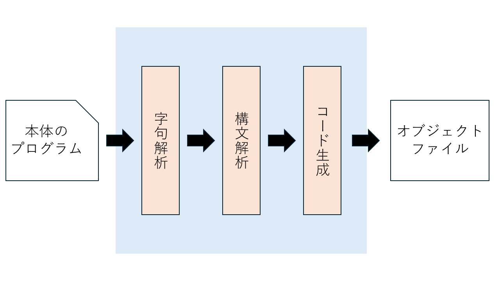
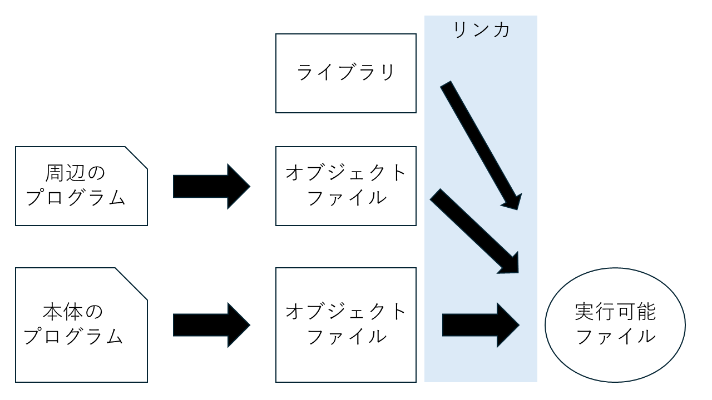

# 6章 時代を進めよう

ここまで扱ってきた「アセンブリ言語」は、機械に与える命令「機械語」に一対一で対応する記述をする。
いわば、**機械レベルで命令を全部手書きする** 状態である。
命令セットアーキテクチャという言葉も出したが、CPUの作り手によって、機械語も、対応するアセンブリ言語も変わってしまう。
本教材では CASLⅡ を使ったが、世界的に広まっている Intel Core iなんとか は x86_64 と呼ばれる命令セットだ。
命令も `LD` や `ST` ではなく `mov` という記述をしたり、「この命令セットにはあるけど、CASLⅡには対応する命令が無い」なんてこともある。

そこで、命令セットが違っても、機械が違っても、統一した記法で命令を書ける「言語」を開発したい。
いちいち機械によって違うアセンブリ言語を何個も覚えなくてもいい、よりわかりやすい言語だ。
これが「**プログラミング言語**」の始まりである。
x86 でも RISC-V でも MIPS でも、どんな命令セットに対しても「同じ記述」で命令が書ける。
そんな物を作りたい。

とはいっても、そんな「プログラミング言語」を考えたとしても、結局は機械語に直さなければ動かない。
機械が理解できるのは あくまで 0 と 1 で記述されたビット列しかない。
なので、プログラミング言語を機械語に直す、そんな機械が必要になる。
この「機械語に直す」物を **コンパイラ** と呼び、直す作業を **コンパイル** と呼ぶ。
アセンブリ言語を機械語にするアセンブラ、アセンブルとよく似ているが、どうも言い回しが違うらしい。

ということで、本章では、アセンブリ言語から、少し便利なプログラミング言語に時代を進める。その過程でコンパイラについて理解を深めたい。

<br>

そういえば、何の定義も無しに「高級言語」だとか「プログラム」だとか使ってましたね。
高級言語は、人間が理解しやすい書き方の言語を指します。機械語とかアセンブリ言語に比べて直感的で分かりやすい記述で、大変な処理を簡潔に書ける言語です。C言語 とか Python とか。
プログラムは、命令を組み合わせて作った、特定の機能を持った命令群のことです。特に、プログラミング言語で記述した人間向けのテキストを ソースコード と呼んだりもします。

<br>

- [6章 時代を進めよう](#6章-時代を進めよう)
  - [6.1 言語を作ろう](#61-言語を作ろう)
  - [6.2 構文を明確化しよう](#62-構文を明確化しよう)
  - [6.3 自作言語のコンパイラを作ろう](#63-自作言語のコンパイラを作ろう)
    - [6.3.1 構文解析](#631-構文解析)
    - [6.3.2 アセンブリ言語に直す処理](#632-アセンブリ言語に直す処理)
    - [6.3.3 コンパイラのお仕事](#633-コンパイラのお仕事)
    - [6.3.4 アセンブル](#634-アセンブル)
    - [6.3.5 実行可能ファイル](#635-実行可能ファイル)
  - [6.4 総評](#64-総評)

<div style="page-break-before:always"></div>

## 6.1 言語を作ろう

私たちがいるのは「機械があって、それを動かす機械語がある。書きやすいように、人間向きの言葉っぽいニーモニック、アセンブリ言語がある」という時代だ。いわば、コンピュータの黎明期 1940年代 にいる。
ここから、全く新しい言語を作りたい。

例えば、「レジスタにデータを入れるのに `LD` とか `LAD` とか書くの長いし煩わしい」と思った。
そこで、「レジスタ名 = 値」でデータを入れられるようにしたら簡潔だろうと考える。

こんな感じで、自分がより分かりやすいように書きやすい記述を考えてみる。

ここでは、以下のような言語を考えてみる。適当に考えたので、貴方自身の好きな書き方に変えて作ってみても面白いだろう。

|記述|意味|対応するアセンブリ言語プログラム|
|:--|:--:|:--|
|レジスタ名=レジスタ名|レジスタ間でデータをコピー|LD    レジスタ1, レジスタ2|
|レジスタ名=数式|レジスタに式の計算結果を代入する|（CALL    EXPR）<br>（CALL  NUMTOS）<br>LAD   GR2, 結果<br>LD    レジスタ, GR2|
|レジスタ名=?|レジスタに入力値を代入する|IN    STR, =256<br>CALL  READ_V<br>LD    レジスタ, GR7|
|?=レジスタ名|レジスタのデータを出力する|LD    GR2, レジスタ<br>CALL  NUMTOS<br>CALL  OUTPUT|
|?=数式|式の計算結果を出力する|（CALL    EXPR）<br>LAD   GR2, 結果<br>CALL  NUMTOS<br>CALL  OUTPUT|
|?=?|（要らないけど）入力値をそのまま出力する|IN    STR, =256<br>CALL  READ_V<br>LD    GR2, GR7<br>CALL  NUMTOS<br>CALL  OUTPUT|

値を代入したり、値を計算したり、ユーザー入力で値を入れたり、値を出力したりする。
たったそれだけの言語だ。もっと最近の高級言語みたいにループしたり関数の宣言など便利な機能はない。

<div style="page-break-before:always"></div>

## 6.2 構文を明確化しよう

上で作ったプログラミング言語は、どのような文法になっているだろうか。
文法のルールを決めよう。

まず、基本となるルールは、「代入先=代入元」という、`=` で左右が分かれた形だ。
そして、左辺（代入先）には、レジスタ名 か `?` が入る。
右辺（代入元）には、値 や レジスタ名、数式、`?` が入る。

ということで、これを前章のように 構文 にしよう。
プログラムの一文 `row` は、「代入先 `dest` =代入元 `source`」 で構成される。
`dest` は、レジスタ名 か `?` になる。
`source` は、レジスタ名 か 数式 か `?` になる。

`<row> ::= <dest> "=" <source>`
`<dest> ::= "GR" number | "?"`
`<source> ::= "GR" number | <expr> | "?"`

<div style="page-break-before:always"></div>

## 6.3 自作言語のコンパイラを作ろう

さて、言語とその構文が決まったら、これを機械語に直す必要が出てくる。
自作言語を機械語に直す、**コンパイラ** を作ろう。
これは、現状のアセンブリ言語を使って、それぞれの機械に合った機械語に変える必要がある。
言い換えれば、コンパイラがそれぞれの機械における機械語の違いを緩衝してくれる。

### 6.3.1 構文解析

前章での 数式の構文解析 のように、自作言語を構文解析しよう。
`MAY_REG` 関数で、「1文字ずつ読んで `GR` + (0 ~ 7の数字) にならなければ ERROR」を行っている。

`GR2=GR5` や `?=GR0` や `?=123` などがしっかり解析出来ているかを確認しよう。

```CASL
MAIN    START
        IN      STR, =256

; <row> ::= <dest> "=" <source>
ROW     CALL    DEST
        CALL    READ_C
        CPL     GR0, ='='
        JNZ     ERROR
        CALL    SOURCE
        RET

; <dest> ::= "GR" number | "?"
DEST    LD      GR0, STR, GR1
        ; ? のとき
        CPL     GR0, ='?'
        JZE     DEST_?
        ; レジスタ名 のはず
        CALL    MAY_REG
        ; レジスタ名 のとき
        ADDA    GR2, =#0030
        ST      GR2, regNum
        OUT     regName, =3
        RET
        ; ? のとき
DEST_?  LAD     GR1, 1, GR1
        OUT     ='?', =1
        RET

; <source> ::= "GR" number | <expr> | "?"
SOURCE  LD      GR0, STR, GR1
        ; ? のとき
        CPL     GR0, ='?'
        JZE     SRC_?
        ; 数式 の時
        CALL    ISNUM
        CPL     GR6, =1
        JZE     SRC_EX
        ; レジスタ名 のはず
        CALL    MAY_REG
        ; レジスタ名 のとき
        ADDA    GR2, =#0030
        ST      GR2, regNum
        OUT     regName, =3
        RET
        ; ? のとき
SRC_?   LAD     GR1, 1, GR1
        OUT     ='?', =1
        RET
        ; 数式のとき
SRC_EX  OUT     ='expr', =4
        RET

; レジスタ名かどうか
MAY_REG CALL    READ_C
        CPL     GR0, ='G'
        JNZ     ERROR
        CALL    READ_C
        CPL     GR0, ='R'
        JNZ     ERROR
        LD      GR0, STR, GR1
        CALL    ISNUM
        CPL     GR6, =0
        JZE     ERROR
        CALL    READ_V
        CPL     GR2, =7
        JPL     ERROR
        RET

; --- 以下、前章の関数たち ---
; （長すぎるので省略）
; --------------------------

STR     DS      256
regName DC      'GR'
regNum  DS      1
        END
```

<div style="page-break-before:always"></div>

### 6.3.2 アセンブリ言語に直す処理

構文解析が出来たら、実際にこれをアセンブリ言語に直す。

数式を実際に計算したときのように、`OUT` の代わりに実際の処理を記述する。
今回は、「対応したアセンブリ言語を出力する」であるから、それぞれの状況に応じて命令を出力するようにする。

と、ここで、処理の順番を考えたい。
命令は「左辺 に 右辺の値 を代入する」であるから、右辺の値 が分かっていなければ代入が出来ない。
なので、一度「左辺」を保持しておき、右辺の値を計算する。計算が終わったら、左辺に応じた処理をする。といった手順を踏んでみる。
左辺の値を `var` に代入して保持しておこう。

なお、出力の際には `\t` をタブ文字として使用する。
説明書の最後にちょろっと書いてある **エスケープシーケンス** だ。

```CASL
MAIN    START
        IN      STR, =256

; <row> ::= <dest> "=" <source>
ROW     CALL    DEST
        CALL    READ_C
        CPL     GR0, ='='
        JNZ     ERROR
        CALL    SOURCE
        ; 左辺に応じて処理
        LD      GR0, var
        CALL    ISNUM
        CPL     GR6, =1
        JZE     LEFT_GR
        ; ? のとき
        LAD     GR2, #0032
        ST      GR2, var
        OUT     LDop, LDlen
        OUT     ='\tCALL\tNUMTOS', =12
        OUT     ='\tCALL\tOUTPUT', =12
        RET
        ; レジスタ名のとき
LEFT_GR OUT     LDop, LDlen
        RET

; <dest> ::= "GR" number | "?"
DEST    LD      GR0, STR, GR1
        ; ? のとき
        CPL     GR0, ='?'
        JZE     DEST_?
        ; レジスタ名 のはず
        CALL    MAY_REG
        ; レジスタ名 のとき -> レジスタ番号を var に
        ADDA    GR2, =#0030
        ST      GR2, var
        RET
        ; ? のとき -> ? を var に
DEST_?  LAD     GR1, 1, GR1
        ST      GR0, var
        RET

; <source> ::= "GR" number | <expr> | "?"
SOURCE  LD      GR0, STR, GR1
        ; ? のとき
        CPL     GR0, ='?'
        JZE     SRC_?
        ; 数式 の時
        CALL    ISNUM
        CPL     GR6, =1
        JZE     SRC_EX
        ; レジスタ名 のはず
        CALL    MAY_REG
        ; レジスタ名 のとき -> SrcNum にレジスタ番号を代入
        ADDA    GR2, =#0030
        ST      GR2, SrcNum
        RET
        ; ? のとき -> IN, CALL READ_V を呼んで SrcNum に 7 を入れる
SRC_?   LAD     GR1, 1, GR1
        OUT     ='\tIN\tSTR, =256', =13
        OUT     ='\tCALL\tREAD_V', =12
        LAD     GR2, #0037
        ST      GR2, SrcNum
        RET
        ; 数式のとき -> 計算して、計算結果を文字列に変換、'LAD    GR2, 結果', SrcNum: 2
SRC_EX  CALL    EXPR
        CALL    NUMTOS
        ADDA    GR6, =10
        ST      GR6, LADlen
        OUT     LADop, LADlen
        LAD     GR2, #0032
        ST      GR2, SrcNum
        RET

; レジスタ名かどうか
MAY_REG CALL    READ_C
        CPL     GR0, ='G'
        JNZ     ERROR
        CALL    READ_C
        CPL     GR0, ='R'
        JNZ     ERROR
        LD      GR0, STR, GR1
        CALL    ISNUM
        CPL     GR6, =0
        JZE     ERROR
        CALL    READ_V
        CPL     GR2, =7
        JPL     ERROR
        RET

; --- 以下、前章の関数たち ---
; （長すぎるので省略）
; --------------------------

; NUMTOS は、anslenに記す処理を消し、OUTPUT に飛ばず SETANS で RET する
; 完全版は Programs フォルダにあるので、分からなかったらそれを見てください。

STR     DS      256
LADlen  DC      0
LADop   DC      '\tLAD\tGR2, '
ans     DS      5
LDlen   DC      12
LDop    DC      '\tLD\tGR'
var     DS      1
regSrc  DC      ', GR'
SrcNum  DS      1
        END
```

例えば、以下のような出力がされる。

|入力するプログラム|出力されるアセンブリ|
|:--:|:--|
|GR3=GR6|LD    GR3, GR6|
|GR1=?  |IN    STR, =256<br>CALL  READ_V<br>LD    GR1, GR7|
|GR2=156-45*3+5|LAD   GR2, 26<br>LD    GR2, GR2|
|?=GR4|LD    GR2, GR4<br>CALL  NUMTOS<br>CALL  OUTPUT|
|?=12+34-56/7*8+90|LAD   GR2, 72<br>LD    GR2, GR2<br>CALL  NUMTOS<br>CALL  OUTPUT|

ここで、自作言語のプログラムが変換されて、アセンブリ言語になった物（つまり出力されたプログラム群）を **オブジェクトファイル** と呼ぶ。

また、`GR2=156-45*3+5` など数式を入れると、`156-45*3+5` の計算過程をアセンブリ言語に直すのではなく、計算結果 `26` をそのまま `LAD` する。
この、先に計算しておくことを **コンパイル時計算** と呼び、高速化の手法の一つである。
予め計算しておいてコンパイルしちゃった方が、実行するたびに毎回値を計算するよりも「計算の手間が無い」ので処理時間が短くなるのだ。

<div style="page-break-before:always"></div>

### 6.3.3 コンパイラのお仕事

コンパイラは、プログラムをアセンブリ言語に書き直す他にもやることがある。
**リンカ** という部分のお話をしよう。

一つのアプリケーション・ソフトウェアを作るときに、「一つのファイルにプログラムを全部書く」とは限らないことがある。
例えば、前章までの電卓では、「四則演算をする `PLUS`、`MINUS`、`MUL`、`DIV` は別の `math` ファイルにまとめておく」「文字を読み取る `READ_C`、`READ_V`、`ISNUM` は別の `string` ファイルにまとめておく」みたいな、処理内容で纏めておいて参照するといった開発方法を取ることがある。
このようなときに、「参照するファイルたち」もアセンブリ言語に直さなければ、「こんな関数ないよ！（この仮想CPUでは `Error: 不明なラベル` の表示）」と怒られてしまう。
そこで、リンカ は、そんな「プログラム本体ではない、参照している周りのプログラム」を探して、アセンブリ言語に直す、そしてそのプログラムを本体のオブジェクトファイルにくっつける（リンクする）、という作業を行う。

つまり、「これも必要！ってなったときに、そいつも一緒にコンパイルしてくっつけてくれる」機構である。

今回は簡易的に、「`READ_V` 関数などをまとめたユーティリティファイル」を参照しているとして、その内容を出力するプログラムを書いてみよう。
といっても、文字列をリテラルで宣言して `OUT` し続けるだけなので、これはいいかな。
私もこれは適当に python で生成した。
手動で文字数数えたり整形したり色々頑張らずに、`Programs` にあるプログラムをそのまま使ってもらって構わない。

<br><br><br>

### 6.3.4 アセンブル

全ての役者が出揃った。
自作言語のプログラム本体をアセンブリ言語に直したものと、それが使っている外部のプログラムのアセンブリ言語版だ。
あとは、この子たちを「機械語」に直す作業が残っている。アセンブルをしよう。
といっても、今回は実装しない。
今回は CASLⅡ 用のプログラムを出力しているから、アセンブルと実行の作業は、仮想CPUにお任せしてしまおうと思う。

ということで、Output に出てきたプログラムたちを、マウスカーソルで選択して おまじない（`START` と `RET`）の間にコピーして、コード入力ボックスにペーストしよう。
出来たら [ Assemble ] ボタンを押して、機械語に変換されて実行できることを確認する。
自作言語で書いたとおりの結果になってくれれば大成功だ。

<div style="page-break-before:always"></div>

### 6.3.5 実行可能ファイル

さて、プログラムを書いて、アセンブリ言語に直して、機械語に直す。コンパイラの仕事を全てやってみた。

全てが終わって完成する機械語を、機械が実行することが出来るということで **実行可能形式** と呼び、Windowsでは `.exe` や `.bat` の拡張子になる。
プログラムを書いて、コンパイルをすると、（複数の）オブジェクトファイルが生まれる。それらを一つにして、実行可能ファイルになる。実行可能ファイルをクリックすると、プログラムに書いた通りの処理をする機械語が動いてくれる。

コンパイラの仕事を図にしてみた。





<div style="page-break-before:always"></div>

## 6.4 総評

ここまで、プログラミング言語の作り方を学んだ。

考えた言語がどういう文法になっているか、明確に示して トークン に分けて 構文解析 をする。
解析結果を使って、対応するアセンブリ言語に変換していく。
アセンブリ言語が出来たら、そのプログラムが依存している（使用している）外部のプログラムを参照して、これもアセンブリ言語に直す。
全てアセンブリ言語に出来たら、これをつなげて、一つのアセンブリ言語にする。
アセンブリ言語になったら、機械語に直して 一つの「実行可能ファイル」にする。

このような流れでプログラミング言語は 作成され、コンパイルされ、動くようになる。

しかし、少し考えてほしいのだが、これでは「機能を追加したい」「ほかの言語を作りたい」と思ったら、色々なアセンブリ言語を学習してコンパイラを追記・作成しなければならない。
「命令セットの差異を考えなくてもプログラムが書ける」を目標にしているのに、本末転倒になってしまう。
そこで、「自作言語で、自分自身をコンパイルするコードを書く」ようにする。
これが上手くいけば、一度 アセンブリ言語製のコンパイラ でコンパイルを行えば、生成される機械語は「コンパイラ」になる。
以降は、自作言語に機能・文法を追加して、自作言語製のコンパイラプログラムに追加機能のコンパイルプログラムを付け足す形で機能追加が行える。
自作言語の中だけで、言語の拡張・開発が出来るようになるのだ。

こんな流れで、現在のプログラミング言語は作られた。実際、「C言語のコンパイラはC言語で書かれている」といった逸話がある。
もっとも、最近のプログラミング言語はアセンブリ言語まで戻らず、既存の便利な言語を使ってコンパイラを記述することが多いが……。pythonの中でもCPythonと呼ばれるものは、C言語でコンパイラを書いたpythonだし。
でも、考え方は「既存の動くもので、新しいものを作り出す。動いたら自己完結できるように機能追加する」で一緒だ。

<br>

**まとめ**

現在のプログラミング言語は、「コンパイラ」と呼ばれるものによって、アセンブリ言語（オブジェクトファイル）を経て機械語（実行可能ファイル）に変換される。
コンパイラは、その言語が登場する前からあった言語で作られている。
そのため、元をたどっていけば、アセンブリ言語で記述された「最初のプログラミング言語」とそのコンパイラに辿り着く。
アセンブリ言語は一見、こんなもの学んで意味あるのか？と思われがちな古い言語だが、機械語と密接に関わっている。そのため、アセンブリ言語を知っていることが処理速度の改善やコンピュータの理解に非常に有利に働く。

<div style="page-break-before:always"></div>

**おまけ**

「自作言語で、自分自身をコンパイルするコードを書く」ことを **セルフホスト** と呼ぶ。
セルフホストが出来ると、「この言語は、ある程度の機能を持った言語である」ことの示しになる。
そのため、セルフホストは自作言語の一つの目標として上げられることがある。
今回作った言語は、入力をレジスタに入れたり、計算して値を出力する程度しか機能が無いため、セルフホストは到底できない。
しかし、もっと機能を拡張していけば、色々なことが出来る便利な言語になるかもしれない。
比較する機能とか、文字を一文字ずつ読み取る機能があれば……？

今回やったコンパイラのお仕事は、本当に初歩的な内容である。
現在世界で動いているようなコンパイラは、学んだ「構文解析」など以外にも作業を行っている。
その一つが、「コードの最適化」である。
例えば、本編でも行った コンパイル時計算 がある。他にも、
「この `abc` ってラベル（変数）、宣言されるだけでプログラムの中で使われてないな」といったときに、`abc` の宣言をコンパイルしないで無視する。
「このループって効率悪くね？こっちの方が同じ処理で動作早いぞ」といったときに、勝手に早く動くコードに書き換えて機械語に変換してくれる。
などなど、コンパイラが頑張ってくれている。
しかしながら、コンパイラが最適化した結果が、却って「この処理無いとバグるんだよ……勝手に消さないでくれ」といった悲劇を生んだりもする。そのため、アセンブリ言語を理解して、コンパイラが何をしでかしたか、どうすれば正しく最適化できるかを人間が直せることが重要なのだ。アセンブリ言語を知っているかどうかは、この 組み込み系 において本当に重要な資産となる。

<br><br>

ところで、「センブリ言語のアセンブラは？」とは思わないだろうか。自作言語は、それより前に既存のプログラミング言語を使って作られる。じゃあ根幹となるアセンブリ言語は、そもそもどうやって機械語に変換されるの？というお話だ。

答えは単純で、機械語でアセンブラを作る。
アセンブリ言語と機械語は一対一で対応している。
ならば、アセンブリ言語でアセンブラを書けば、手作業で機械語に直すことでアセンブラが完成する。
言葉にするのも思考するのも簡単だけど、たぶん作るのはとんでもなく大変だと思う。コンピュータの歴史ってすごいね。
