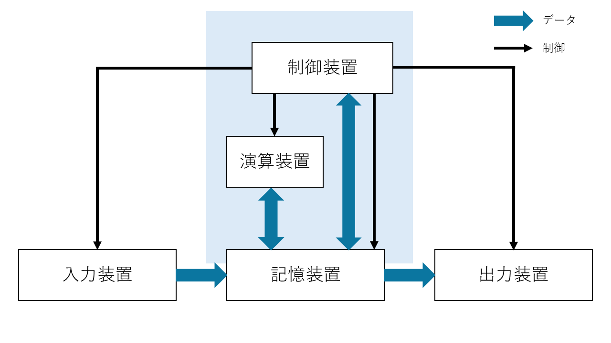
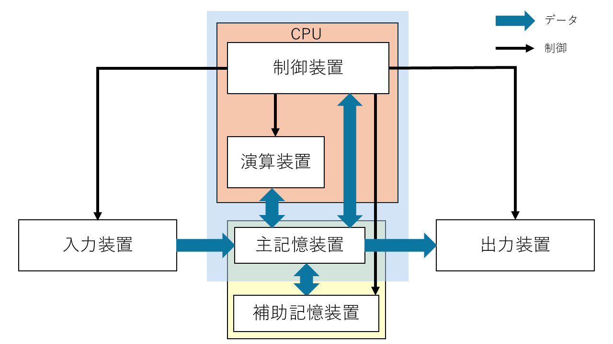
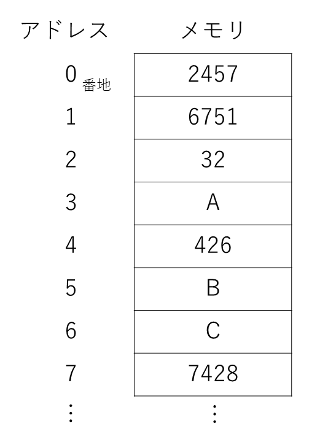
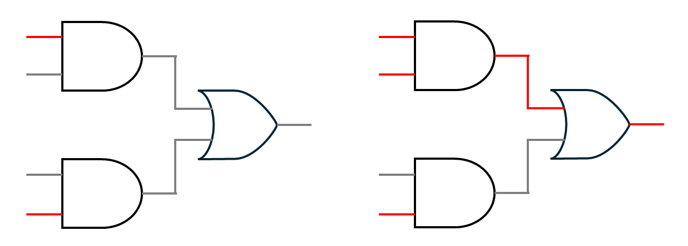
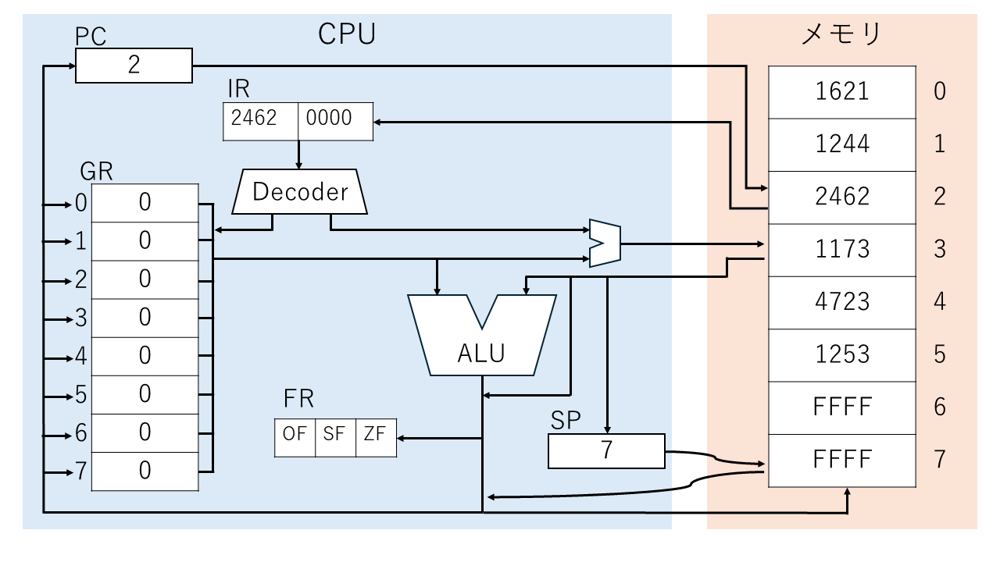
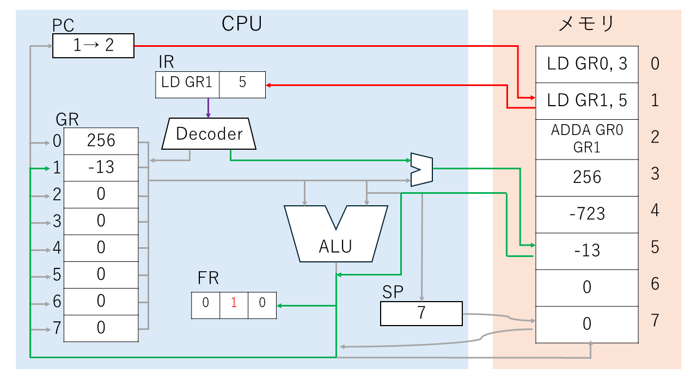
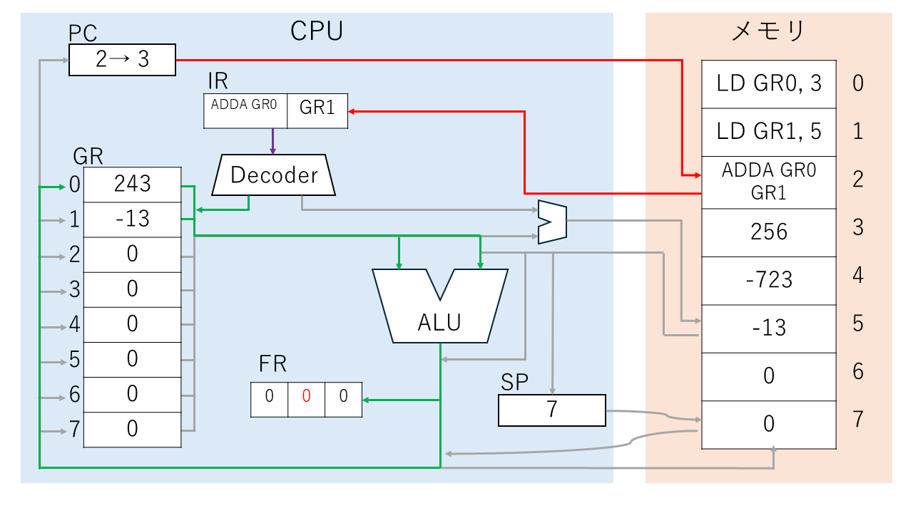

# 体験版

私の卒研に付き合ってくれる優しきテスターの皆様用の簡易版です。

初めに、フォルダに

これ、説明書、命令一覧、実行ファイル（2種類）、アンケート先URL

が揃っていることを確認してください。
<br>

解答冊子は、本文中に出てくる「問題」の答えが書いてあります。
SourseCodes フォルダは、アセンブリ言語のソースコードがまとめてあります。
必要であれば、3章で [ ソースコードを開く ] から使ってください。
<br>

これの 1章 を行った後、説明書、これの 3章 の順番で見ると分かりやすいかもです。
<br>

そして、体験版を最後（3.3節は、やってもやらなくてもOK）まで行うのに要した時間を知りたいので、
お手数ですが **ストップウォッチ** をご準備ください。スマホやPCの機能でかまいません。

<br>

- [体験版](#体験版)
- [コンピュータのお話（本編 1章）](#コンピュータのお話本編-1章)
  - [1.1 コンピュータの構成要素](#11-コンピュータの構成要素)
    - [1.1.1 コンピュータの大まかな構成](#111-コンピュータの大まかな構成)
    - [1.1.2 CPUとは](#112-cpuとは)
    - [1.1.3 メモリとは](#113-メモリとは)
  - [1.2 機械語とアセンブリ言語](#12-機械語とアセンブリ言語)
    - [1.2.1 制御装置と機械語、アセンブリ言語](#121-制御装置と機械語アセンブリ言語)
    - [1.2.2 ビットとデータ表現](#122-ビットとデータ表現)
    - [1.2.3 2進数と10進数、16進数](#123-2進数と10進数16進数)
    - [1.2.4 2進数と負の数（二の補数表現）](#124-2進数と負の数二の補数表現)
  - [1.3 命令セットアーキテクチャ](#13-命令セットアーキテクチャ)
  - [1.4 仮想CPUの構成](#14-仮想cpuの構成)
  - [1.5 コンピュータの基本動作](#15-コンピュータの基本動作)
- [アセンブリ言語で世界に挨拶 (本編 3章)](#アセンブリ言語で世界に挨拶-本編-3章)
  - [3.1 「Hello, World!」](#31-hello-world)
  - [3.2 くどいくらいの挨拶を](#32-くどいくらいの挨拶を)
  - [3.3 出力する回数を指定しよう（おまけ）](#33-出力する回数を指定しようおまけ)
  - [3.4 おまけ課題](#34-おまけ課題)

<div style="page-break-before:always"></div>

# コンピュータのお話（本編 1章）

本章では、組み込み機器におけるコンピュータを理解する上で必要な知識を纏める。要は座学パートだ。

結構内容が多いので頑張ってください（他人事）  

<div style="page-break-before:always"></div>

## 1.1 コンピュータの構成要素

### 1.1.1 コンピュータの大まかな構成

用語：**コンピュータの五大要素**

早速だが、「コンピュータ」と聞いて何が思い浮かぶだろうか。  
「パソコン」、「計算機」、「量子コンピュータ」など、色々考えられよう。  

実は Computer は Compute (計算する) -er (～な人) であるから、元は 計算をする人 を指していた。  
特に、戦争における砲弾の弾道予測とか、軍事目的の用途が強かった。
そこから電子計算機の発明があり、重い計算を人力の手計算ではなく、機械が自動で行う進化を経た。

では、そんな「コンピュータ」は、どのようなパーツから構成されているだろう。  
「パソコン（パーソナルコンピュータ）」（デスクトップPCやノートPCなど）を基に考えてみよう。
まず、画面を映す「液晶ディスプレイ」、そして入力する「マウス」や「キーボード」がある。
さらに、データを保存するHDDやSSDなど「ストレージ」もあるだろう。

内部にもパーツが存在する。何があるだろうか。  
まず、画面描画やデータ保存などを実際に行うために、各部品に命令を送る「制御機構」がある。  
そして、Computerの名の通り、計算を行う「演算機構」も備えられている。*電卓* が最たる例かな。

これらを踏まえてコンピュータの構成要素を纏めると、以下のようになる。

- <span class=orange>制御装置</span> : 各部に制御指令を送る
- <span class=orange>演算装置</span> : 計算を行う
- <span class=orange>記憶装置</span> : データを保存する
- <span class=orange>入力装置</span> : キーボードなど入力する
- <span class=orange>出力装置</span> : 画面表示など出力する

これら5つの ○○装置 を <span class=red>コンピュータの五大要素</span> と呼び、概念図にすると次のようになる。



<br>

と、ここで、勘のいい人は違和感に気付くだろう。
図をよく見ると、記憶装置の上半分も色づいているのだ。

<div style="page-break-before:always"></div>

実は、コンピュータの内部には 制御装置と演算装置の他に、記憶装置が入っている。  
この記憶装置を、HDDやSSDといった「ストレージ」と分けるために、<span class=orange>メモリ</span> や <span class=orange>主記憶装置</span> と呼ぶ。
主記憶に対して、外付けのストレージを <span class=orange>補助記憶装置</span> と呼ぶこともある。  

ということで、構成をもう少し正確に書くと、次のようになる。


次項からは、コンピュータの構成要素について掘り下げてみる。

入力装置はキーボードやマウス、ボタン・スイッチなど、
出力装置はディスプレイやスピーカー、
補助記憶装置はよく言う「容量が足りない」みたいな みんながイメージしやすい記憶装置 のこと
なので、これらは良いだろう。

制御装置と演算装置、メモリ（主記憶装置）について順に見ていく。

<br><br><br><br>

**余談**
実際にコンピュータがどういうところで使われてるかの話でもしようか。

分かりやすいのは、今使っているパソコン。それに、もはや必需品とされるようなスマホにも入っている。
でも、そんなハイテクな「なんでも出来る」機械じゃなくても、大体の機械に入っていることが多い。

例えば信号機。時間で点灯させる色を変えたり、歩行者用の押ボタンで青信号の時間を変えたり。
スマート家電とかじゃない普通の炊飯器にも入っている。
ヒーターを制御したり、温度管理、炊きあがり時間の推定だったり、様々な作業を担っている。

電気を使う製品には、大体 <span class=under>特定のことを行うための制御装置</span> としてコンピュータが入っている。
**組み込み系** と呼ばれる分野では、そういった「特定のことを行うため」の小型コンピュータを作る。

<div style="page-break-before:always"></div>

### 1.1.2 CPUとは
  
コンピュータの内部に、具体的に何をする構成要素があるかは分かった。
では、実際のところ、物理的には何が入っているだろうか。

　世の中には、たくさんの回路素子が集まった「回路の集合体」（集積回路; IC）とした部品が存在する。
このICは、板に張り付けられ ICチップ として、今日では様々な機器に組み込まれている。
　コンピュータにもそんな回路の集合体があり、 <span class=red>CPU</span> と呼ぶ。
中央演算処理装置（**C**entral **P**rocessing **U**nit）の略称であり、名前の通り 演算 と 処理 を行う。
構成要素でいうところの、制御装置と演算装置が合体したものだ。
　制御装置を積んだ *司令塔* であるCPUは、コンピュータの頭脳などと呼ばれることもある。



**問題**
上の画像が見えないように隠そう！！
(1) コンピュータの五大要素を全て述べよ。
(2) CPUは、コンピュータの五大要素でいう 何 と 何 を担っているか。

<div style="page-break-before:always"></div>

### 1.1.3 メモリとは

用語：**RAM　ROM　アドレス・番地**

メモリとは、データの保存場所である。ストレージ（HDD や SSD、USBメモリなど）とは別物です。
メモリには、コンピュータを制御するための手順や、一時的なデータが入っている。

　制御の手順は常に同じである。掃除機はボタンを押せばモーターを制御して吸い込みを行う。
ある日いきなり曲が流れたり、テレビが付いたりはしない。
　機械を制御する手順など 常に変わらないもの は、製造段階で内蔵してしまえばいいと納得できるだろう。
さらに、使用者に勝手に手順を改変されても困る。魔改造はサポート対象外だ。
製造時に一度だけ書き込んで、あとは読み込みだけ出来るようにしたい。
　こういう読み込み専用なメモリを、<span class=red>ROM（Read Only Memory）</span> と呼ぼう。

　一時データは、右クリックなどでコピーを行った内容であったり、保存を行っていないメモ帳の落書きなど。
このデータは電源が入っている間しか生きられない一時的なもので、一度電源を落とせば消えてしまう。
　こちらのメモリは、電気を落とすと蒸発するみたいに消えるから <span class=red>揮発性メモリ</span>、
あるいは読み書きを好きに出来るから <span class=red>RAM（Random Access Memory）</span> と呼ばれる。  

　そんなメモリに作業中の進捗を一時保存しておき、「保存ボタンを押す」などをトリガーに、
内容をストレージへまとめて保存する。
　なんですぐストレージに書き込まないのかというと、単純に時間がかかるから。
ストレージは容量が大きい分、空き や データ を探すのに時間がかかる（メモリと比べて1000倍以上）。

「何かするたびに処理がカクカクする」となっては困るので、
容量が小さい代わりに比較的高速な メモリ に、細かい変更を貯めこんでおくのだ。  

<br><br>

**余談**
ROMに書かれている、制御の手順を、**ファームウェア** と呼んだりします。

現在のパソコンにおいて、ROMを占領しているのは BIOS と呼ばれる部分です。
パソコンを起動したとき、電源が入ったら最初に、Windows や Mac のロゴが出るよりも先に動きます。
CPU だったりストレージだったりが動くかを確認して初期化し、Windowsなど OS を動かす準備を整える者です。
この子が壊れると、パソコンが全く起動しなくなります。設定を迂闊に触ると終わります。

<div style="page-break-before:always"></div>

**メモリのイメージ**

先頭から連番のついた、更衣室や駅のロッカーのような、<span class=under>縦並びの箱</span>である。
この箱の一つ一つに、データや命令を詰め込める。

「10番のロッカーに入った物を取り出したい」「30番にこのデータ入れといて」といった形で、
<span class=under>番号を指定</span>してロッカーを扱う。
この、ロッカー番号を <span class=red>アドレス</span> や <span class=red>番地</span> と呼ぶ。つまり住所です。  
番地は 0番 から始まる。<span class=under>先頭は1番目ではなく0番目である</span>ことに注意したい。

下の図だと、「0番地に2457が入ってる」、「1番地に6751が格納されている」といった表現がされる。
メモリの大きさは機械によって異なるが、
各ロッカーの容量（ワード長）と、ロッカーの数（アドレス空間）が影響する。



**問題**
(1) 書き込みが自由にできるメモリをアルファベット三文字で何というか。
(2) (1) に対して、書き込みが自由に**できない**メモリをアルファベット三文字で何というか。
(3) メモリにおいて、データを格納する一つ一つの場所を指す番号を何というか。
(4) 上の図について、A が格納されている (2) は、いくつか。

<div style="page-break-before:always"></div>

## 1.2 機械語とアセンブリ言語

### 1.2.1 制御装置と機械語、アセンブリ言語

コンピュータは電気で動く電子機器である。
つまり、基本的に「電気が流れている」「電気が流れていない」の2状態しか扱うことが出来ない。
では、そんなコンピュータはどのようにして、色々な制御やデータの保持が出来るのだろう？

答えは、制御装置の役割にある。
　制御装置は、コンピュータの各部分に「電気を流す」「電気を流さない」を制御する。
これにより、「今は足し算をしてくれ」「いまはデータ読み込んでくれ」と、
やることを切り替えることで望んだ操作が出来るようにする。
　「こことここに電気を流せば、この回路が動くから足し算が出来る」みたいな感じで、
複雑にオンとオフを切り替えるのだ。すごく電気代にクリティカルヒットしそうですね。


上の図は 論理回路図 という。
　左から4本の線が来ており、中央にはよくわからない図形、右側に1本の線が伸びている。
線は電気を流す銅線である。
左側から電気を流して、中央で処理して、最終的に電気を右に流すか、流さないかを決定する。
　ANDゲート は「<span class=under>全部</span>の線からの入力がON (電気が流れている) とき、電気を流してあげるよ！」という処理だ。
勇者パーティーが全員揃ったら扉が開く感じ？  
　ORゲート は「入力が<span class=under>どれか一つでも</span>ONなら、電気を流してあげるよ！」といった処理をする。
パーティーの誰か一人でも鍵を持っていたら扉が開けられる感じ？  

この状況において、左側のどこに電気を流すか、2パターン考えてみよう。  



左の図では、一番上と一番下に電気を流した。
この場合、どちらも ANDゲート でOFFが出力されるから、最終的に電気は流れない。

右の図では、さらに上から2番目に電気を流した。
この場合、上の ANDゲート でONが出力される。
すると、次の ORゲート もONとなり、最終的に電気が流れる。  

<div style="page-break-before:always"></div>

このように、コンピュータはそれぞれの導線の電気の流し方を変えることで、
「どの回路に電気が流れて、何が動作するか」を制御する。  
「どの回路に電気を流すか」を決定する機構が 制御装置 であり、
そのために「どの 導線 に電気を流すか」の指示書が ROM に記されている。

ROM では、各導線に電気を流す・流さないを記録しておくので、<span class=under>流す→1, 流さない→0</span> と表現すると都合がいい。
導線の順番を決めて、01の羅列を記すだけで手順書になる。
そのため、コンピュータの内部では、データは全て 1 と 0 の2種類を組み合わせて表現される。  

1 と 0 の組み合わせにより記された、制御を行うための手順を <span class=red>機械語</span> と呼ぶ。
機械が理解できる言語なので機械語だ。しかし、これでは人間に理解できない。
手順を作ってデータとして組み込むのは人間なのに、肝心の人間が理解できなければ意味がない。

そこで、機械語と一対一で対応した、ちょっと人間向きの言語を作ることにした。
これを <span class=red>アセンブリ言語</span> と呼ぶ。
jump や add など、英単語（の略）をキーワードに使うことで、ちょっとだけ読みやすくしている。

本教材では、このアセンブリ言語を学ぶことで、コンピュータへの理解を高めたい。

<br><br><br>

また、ここで用語として、**プログラム** と **ソースコード** を整理したい。

命令を書き記した<span class=under>機械語の「手順書」</span>のことを <span class=red>プログラム</span> と呼ぶ。
プログラムを作るために頑張ることを <span class=orange>プログラミング</span> といって、
その時に使う言語を <span class=orange>プログラミング言語</span> と呼ぶ。アセンブリ言語もプログラミング言語の一種ですね。

プログラミング言語にも色々と種類があって、アセンブリ言語の他にも、C言語、Pythonなど挙げればキリがない。この中で、「人間にとって分かりやすい」言語を **高級言語**、「機械の動きに忠実な、機械語に近い」言語を **低級言語** と言ったり。

また、プログラミング言語で書いた <span class=under>人間向きの命令群</span>を <span class=red>ソースコード</span> や、単に コード と呼ぶ。
人間用のソースコードを機械語のプログラムに翻訳することを <span class=orange>コンパイル</span> という。
特に、アセンブリ言語を機械語にする場合は、<span class=orange>アセンブル</span> という。
<br>

つまり、
プログラム は、機械向けの命令（ 010001101101 のような）
ソースコード は、人間向けの命令（ int a = 0 のような）
といった認識で良いでしょう。

2章以降では、プログラムや高級言語といった用語が出てくるので、なんとなくのイメージを持っておくと良い。

<div style="page-break-before:always"></div>

### 1.2.2 ビットとデータ表現

用語：2進数、ビット、バイト、文字コード

前節で出てきた機械語など「1 と 0 の組み合わせ」による表現を、<span class=red>ビット列</span> と呼ぶ。101101 みたいな。  
0 と 1 で構成された文字列の、一つ一つを <span class=red>ビット（bit）</span> と呼び、
そんなビットが列になっているから、ビット列である。

そして、8個のビットでまとめた単位を <span class=red>バイト（Byte）</span> と呼ぶ。
「10100000」 や 「00010001」 などを「8ビット」や「1バイト」、
「11110000 10110011」 を「16ビット」や「2バイト」と数える。
ストレージの容量で、「ギガバイト(GB)」や「2TB」といった表現がされるが、その「バイト(B)」だ。

キロメートルkm の「キロ」が 1000 を表すように、1KB は 1000Bということである。
そんな KB が 1000個あって、1000KB = 1MB （メガバイト）になる。
同様に、1000MB = 1GB、1000GB = 1TBである。つまり1TBは1兆バイトです。デカすぎ。
ちなみに、1000 区切りではなく $2^{10}$ (1024) を基準にすることもある。1024B = 1KiB といったように。
この場合、上の単位系と混同しないように、KBではなく KiB（キ**ビ**バイト）、MBではなく MiB（メ**ビ**バイト）
など、間に i を入れた書き方をすることもある。

<br>

さて、実際のところ、そんなビット列でデータをどのように表現しているのだろう。  
これは非常に単純なもので、「データの一つ一つに対応する番号を割り振る」のだ。
アルファベットを書きたいなら、a から z まで26文字あるから、00000 から 00001, ..., 11010 までを対応させる。

これは、対象のコンピュータや空間の中で統一された対応表があれば、一対一で対応しているから復元できる。
小学生の時に経験があるかも、友達間で使う秘密の創作文字みたいな感じです。
そういうことで、世界的に統一された「文字とビット列の対応表」が存在する。
<span class=orange>文字コード</span> と呼ばれ、「この文字はこのビット列だよ」が取り決められている。  

文字コードにも unicode や Shift-JIS, ISO-2022-JP などたくさんの種類があり、
文字コードが違うと復元結果が変わるので、文字化け が発生したりするのだが……。

例えば、
unicode だと「あ」は `11100011 10000001 10000010` というビット列になる。
Shift-JIS だと「あ」は `10000010 10100000` というビット列になり、全然違う。
`11100011 10000001 10000010`（unicodeの「あ」）を Shift-JIS として読むと「縺�」になってしまう。
そのため、「unicode でビット列に変換したものを Shift-JIS と思って元に戻す」など、
コード化にするとき と 文字に戻すとき で文字コードを間違えて変換を行うと、文字化けする。

<br>

次のページに、今回使用する文字コード「asciiコード」を紹介する。

<div style="page-break-before:always"></div>

| 行 \ 列 | 2    | 3   | 4   | 5   | 6   | 7      |
| :-----: | :--: | :-: | :-: | :-: | :-: | :----: |
| **0**   | 間隔 | 0   | @   | P   | `   | p      |
| **1**   | !    | 1   | A   | Q   | a   | q      |
| **2**   | "    | 2   | B   | R   | b   | r      |
| **3**   | #    | 3   | C   | S   | c   | s      |
| **4**   | $    | 4   | D   | T   | d   | t      |
| **5**   | %    | 5   | E   | U   | e   | u      |
| **6**   | &    | 6   | F   | V   | f   | v      |
| **7**   | '    | 7   | G   | W   | g   | w      |
| **8**   | (    | 8   | H   | X   | h   | x      |
| **9**   | )    | 9   | I   | Y   | i   | y      |
| **10**  | *    | :   | J   | Z   | j   | z      |
| **11**  | +    | ;   | K   | [   | k   | {      |
| **12**  | ,    | <   | L   | \   | l   | &#124; |
| **13**  | -    | =   | M   | ]   | m   | }      |
| **14**  | .    | >   | N   | ^   | n   | ~      |
| **15**  | /    | ?   | O   | _   | o   | 削除   |

<br><br>

表の見方は、列→行 の順番で数字を当てはめる。例えば、  
20 が 「間隔」（半角スペース）に対応する。　2列目 の 0行目 を指す。  
41 が 大文字の A に対応する。　　　　　　　　4列目 の 1行目 を指す。

といったようになる。  
なぜ 0 ~ 15 なのかは、2進数の桁上がりの特徴と、次節の 16進数 が関係する。

<br>

**問題**
(1) 0 と 1 の組み合わせにより表現された数字列を、何というか。
(2) (1) を構成するそれぞれの 0 や 1 を何と呼ぶか。
(3) (1) を 8つ区切り にしたとき、それぞれをどういった単位で呼ぶか。
(4) asciiコードにおいて、`3` は 何列目の何行目 か。
(5) asciiコードにおいて、`.` は 何列目の何行目 か。

<div style="page-break-before:always"></div>

### 1.2.3 2進数と10進数、16進数

私たちが普段使用している数字は、<span class=red>10進数</span> と呼ばれる。
0 ~ 9 の数字を使い、10を基準に繰り上がるから、**10** で桁が **進** む **数** である。

それに対し、先で話しているビット列は、0 と 1 しかない。
0, 1, と来て、2 は使えないので繰り上がって 10。その次の3は 11。次の4は二回繰り上がって 100。
というように数える。2を基準に桁を上げるから、<span class=red>2進数</span> と呼ぶ。  

<br>

2進数と10進数は相互に変換が可能であり、2進数から10進数は以下のように求められる。
各位の数字が $a_i$ である二進数について（$1011$ なら $a_1=1, \ a_2 = 0, \ a_3 = 1, \ a_4 = 1$）

$$
\begin{align}
a_1 a_2 \cdots a_n &= \sum_{i=1}^n {a_i \times 2^{n-i}} \cr
               &= a_1 \times 2^{n-1} + a_2 \times 2^{n-2} + \cdots + a_{n-1} \times 2^1 + a_n \times 2^0
\end{align}
$$

<br>

数式が出てきて拒否反応が表れた方もいると思うので、簡単に10進数で話をします。

まず、1024という数字は、一の位や十の位など、それぞれの位の数字と、基準となる10を使って、
次のように表現できます。

$$
\begin{align}
1024 &= 1 \times 1000 + 0 \times 100 + 2 \times 10 + 4 \times 1 \cr
     &= 1 \times 10^3 + 0 \times 10^2 + 2 \times 10^1 + 4 \times 10^0 \cr
\end{align}
$$

お金のイメージです。1000円が1枚と、100円が0枚と、10円が2枚と、1円が4枚 みたいに、  
桁ごとに「基準（を何回か掛け合わせたもの；累乗）が何個あるか」を見ます。

同様に、917235は、以下のようになります。
$$
\begin{align}
917235 &= 9 \times 100000 + 1 \times 10000 + 7 \times 1000 + 2 \times 100 + 3 \times 10 + 5 \times 1 \cr
       &= 9 \times 10^5 + 1 \times 10^4 + 7 \times 10^3 + 2 \times 10^2 + 3 \times 10^1 + 5 \times 10^0
\end{align}
$$

このように、数字は「<span class=under>それぞれの位の数と、基準の累乗」の組み合わせ</span>で表現できます。

<br>

これを使って、2進数についても同じように考えてあげると、基準は 10 ではなく 2 になるから、

$$
\begin{eqnarray}
1011 &=& 1 \times 2^3 + 0 \times 2^2 + 1 \times 2^1 + 1 \times 2^0 \cr
     &=& 1 \times 8 + 0 \times 4 + 1 \times 2 + 1 \times 1 \cr
     &=& 11
\end{eqnarray}
$$

$$
\begin{eqnarray}
100110 &=& 1 \times 2^5 + 0 \times 2^4 + 0 \times 2^3 + 1 \times 2^2 + 1 \times 2^1 + 0 \times 2^0 \cr
       &=& 32 + 4 + 2 \cr
       &=& 38
\end{eqnarray}
$$

というように、2進数から10進数が得られます。
なので、「<span class=under>各位の数値について、2 の (桁目-1)乗 したものを足す</span>」ことで、2進数から10進数に変換できるというわけです。  

<div style="page-break-before:always"></div>

逆に、10進数 → 2進数は、「<span class=under>2の乗数の組み合わせに分解する</span>」ことで、表現が得られる。

$$
\begin{eqnarray}
500 &=& 256 + 128 + 64 + 32 + 16 + 4 \cr
    &=& 1 \times 2^8 + 1 \times 2^7 + 1 \times 2^6 + 1 \times 2^5 + 1 \times 2^4 + 0 \times 2^3 + 1 \times 2^2 + 0 \times 2^1 + 0 \times 2^0 \cr
    &=& 111110100
\end{eqnarray}
$$

しかし、数字が大きくなると困ってしまう。$2^n$ なんて覚えていられない。
そこで、実際には「<span class=under>2で割った余りを逆順に並べる</span>」といった操作をする。
簡単にするため、「割り算の筆算」を逆向きに書いたような記号で計算をする。

商が 0 になるまで、2 で割り続ける。最終的に、出た余りを逆順に並べると、それが2進数表現になっている。


しかし、これでは同じ数を表すにも、2進数と10進数で全然違う値になってしまう。
関係性が見えづらくて、計算しなければ変換しづらいのだ。500 と 111110100 のように。  
そこで、2進数を基準に「2進数の4桁を対応させた、別の進数」を作る。
2進数の5桁目で繰り上がりするから、$2^4$ = 16が基準で <span class=red>16進数</span> と呼ぶ。

とはいっても、私たちの知っている一桁の数字は 0 ~ 9 までの10個しかない。
そこで16進数では、 0 ~ 9, A, B, C, D, E, F で値を表現する。
10進数で言う10 を A, 11 を B, 12 を C といったように対応している。  
なお、16進数であることを分かりやすく書くために、先頭に `0x` や `#` を書くことがある。
`0x21` とか `#1BF6` とか。  

この16進数を使って、2進数を変換すると、

1010 0110 → 0xA6
0011 0101 → #35

といったように、4桁ずつそのまま値が対応する。  
16進数から2進数は特に「35だから 3 → 0011, 5 → 0101 で 00110101だな」といったように、
計算を必要とせずにすぐ変換が出来る。
そのため、機械語などコンピュータの中身を表現する際は、10進数を使うよりも
「<span class=under>内部は2進数、人間が読むときは16進数</span>」といった棲み分けをすることが多い。
<br>

**問題**
(1) 173 を 8桁の2進数と、16進数に直しなさい。
(2) `01001011` を 10進数に直しなさい。

<div style="page-break-before:always"></div>

### 1.2.4 2進数と負の数（二の補数表現）

さて、コンピュータ上で正の数を表現する方法はわかった。では、負の数はどのように表現しよう。

コンピュータには 0 と 1 しかないから、「マイナス」を意味する記号は存在しない。
　そこで、「一番左のビット（最上位ビット）」を <span class=orange>符号ビット</span> とし、
「ここが 0 なら正の数、1 なら負の数」といった解釈を行う方法を考えてみよう。  
例えば、1 は 0001 なので -1 は 1001、2 は 0010 なので -2 は 1010、といった感じである。  
　しかし、これでは足し算を行うときに不都合が生じる。
例えば $1 + (-1)$ は $0$ なので 0000 になってほしいが、上の方法では 0001 + 1001 で 1010 になる。

これでは不便なので、足し算で都合が良くなるように <span class=under>逆順で</span> マイナスを割り振っていく。
0000 を基準に、1 は 0001，-1 は 1111、2 は 0010，-2 は 1110、といったように割り当てる。  
こうすると、符号違いの同じ数を足したときに、結果が（0 + 0以外）必ず 10000 になるのだ。  
この方式で負の数を実現する表現方法を、<span class=red>二の補数表現</span> という。  

補数とは、「元の数と足した結果が、基準となる数と等しくなるような数」である。
60について「100の補数」なら、「60と足した結果、基準100になるような数」なので 40 である。
正直 「二の補数」というより「2のべき乗の補数」といった方が正しい気もするが……。

補数を用いない普通の2進数を、マイナスの符号を考えないという意味で <span class=red>符号なし</span> 2進数と呼ぶ。  
この方法では、$0 \sim 2^{(桁数)} \ -1$ までの整数を表現できる。4桁なら 0 ~ 15 まで。  
それに対し、負の数を扱える2進数を、マイナスの符号を考えるという意味で <span class=red>符号付き</span> 2進数と呼ぶ。  
この方法では、最上位ビットが符号になるから、実質的に数字を表現するのは **(全体の桁数 - 1)** 桁である。  
よって、表現できる整数の範囲は $-2^{(桁数 - 1)} \ \sim 2^{(桁数 - 1)} \ -1$ となる。4桁なら -8 ~ 7 まで。

二の補数表現で負の数を表すには、以下の手順を踏む。

1. 普通の正の数でのビット列を考える。 例えば 4 を4桁で `0100` と表す。
2. これに、0 と 1 を反転したものを考える。0 のところを 1 に、1 のところを 0 にする。 `1011`
3. 1 を足した値を考える。繰り上がりに注意。 `1100`

これで、2の補数表現による -4 が完成する。<span class=under>普通の2進数を考え、ビットを反転、+1</span> という手順だ。

|2進数|16進数|符号なし|符号付き|｜|2進数|16進数|符号なし|符号付き|
|:--:|:--:|:--:|:--:|:--:|:--:|:--:|:--:|:--:|
|0000|0| 0| 0|｜|1000|8| 8|-8|
|0001|1| 1| 1|｜|1001|9| 9|-7|
|0010|2| 2| 2|｜|1010|A|10|-6|
|0011|3| 3| 3|｜|1011|B|11|-5|
|0100|4| 4| 4|｜|1100|C|12|-4|
|0101|5| 5| 5|｜|1101|D|13|-3|
|0110|6| 6| 6|｜|1110|E|14|-2|
|0111|7| 7| 7|｜|1111|F|15|-1|

**問題**
(1) 2進数8桁で -20 を表現せよ。ヒント：普通の 20 は `00010100` である。
(2) `10000110` は、符号なし2進数でいくつか。また、符号付き2進数でいくつか。

<div style="page-break-before:always"></div>

## 1.3 命令セットアーキテクチャ

前節で出た 機械語 や アセンブリ言語 には、実は様々な種類が存在する。
というのも、コンピュータを作る会社は一つではない。
さまざまな会社が、自分に都合のいい命令や回路、仕様を作っている。

コンピュータによって、導線の組み合わせ方も、内部に入っている回路の順番や種類も異なる。
そのため、同じ機械語を適用しても、電気の流れ方が全然変わってしまう。
同じアセンブリ命令を適用しても、「この命令をするための回路を持ってないよぉ」なんてことも起こる。

世の中には、様々な会社による規格が存在する。
それらを分類するため、CPUの論理的な構成を <span class=red>アーキテクチャ</span> と呼び、分類を作った。  
「こうすればこう動く」、つまり <span class=under>どのような機械語で特定の動作をするか</span> による分類を
<span class=red>命令セットアーキテクチャ</span> と呼び、例えば以下のような命令セットとCPUの実装例がある。

- x86　　　(Intel社のCoreシリーズ, AMD社のRizenシリーズ)
- ARM　　　(Apple社のA/Mシリーズ)
- RISC-V　(EsperantoTechnologies社のAIプロセッサ)

あなたのパソコンの命令セットはなんだろうね。
IntelのCore i7 やCore i9などの人は x86 や x64 と呼ばれるアーキテクチャだと思います。ARMの人もいるかも？
ARMはスマホとかIoT家電とか、小型のデバイスに使われることが多いですね。

ただ、x86 とかって命令とかビット数の制御とかが多くて、初めてだと難しすぎるんですよ……。
ということで！

本教材では、
情報処理技術者試験の問題の中で扱われる仮想的なコンピュータである **COMETⅡ** および、
COMETⅡに対応した命令セット、アセンブリ言語である **CASLⅡ** を基に、
仮想的なCPUを使ってアセンブリ言語を学習する。

<div style="page-break-before:always"></div>

## 1.4 仮想CPUの構成

この仮想CPUは、命令とデータを一つの同じメモリの中に内蔵する <span class=red>プログラム内蔵方式</span> であり、
命令を上から順番に実行する <span class=red>逐次制御方式</span> を採用している。  
また、このようなプログラム内蔵方式かつ逐次制御方式を採用したコンピュータを、
この方法を提唱した数学者ジョン・フォン・ノイマンの名前から、<span class=red>ノイマン型コンピュータ</span> と呼ぶ。  

と、堅く言ってもわかりづらいので、要するに
「<span class=under>実行する前にやりたいことと使うデータをメモリに全部書き込んでおいて、それを順番に実行するよ</span>」
ということだ。  
当たり前と思うかもしれないが、最近話題の量子コンピュータは非ノイマン型のコンピュータだったり。

この仮想CPUは、以下の要素で構成されている。

- PC  プログラムカウンタ  (次に実行する命令が書いてあるメモリのアドレスを保持する)
- IR  命令レジスタ  (命令を保持する)
- GR  汎用レジスタ (計算結果とかデータとかを保持しておく)
- FR  フラグレジスタ (数値に応じて変わる。「今読み込んだ値は負の数！」「計算結果が0！」とか)
- SP  スタックポインタ (スタック領域の先頭であるアドレスを保持する)
- メモリ (各16ビット、0 から 65535 番地まで 65536個の領域がある)
- デコーダー （IRに来た命令を解析するところ。何をしたいか解読する）
- ALU (Arithmetic Logic Unit; 算術論理演算器 の略。計算を行う場所。演算装置のこと)

フラグレジスタには、以下のフラグが 1ビットずつ存在する。

- OV (オーバーフローフラグ)  値が大きすぎたり小さすぎて表現できなくなった場合に、1となる
- SF (サインフラグ)  値が 負の数 になった場合に、1となる
- ZF (ゼロフラグ)  値が 0 になった場合に、1となる

なお、COMETⅡでは通常、プログラムカウンタのことを「プログラムレジスタ PR」と呼ぶが、本CPUでは PC とする。



<div style="page-break-before:always"></div>

## 1.5 コンピュータの基本動作

ノイマン型コンピュータは、大きく分けて、次の3つを繰り返して動作している。

1. <span class=orange>fetch（フェッチ）</span> : PCの値を参照し、それをアドレスとしてメモリの中身を IR に保存する。そして、PCの値を増やす。
2. <span class=orange>decode（デコード）</span>: IRに入った命令を解読する。
3. <span class=orange>execute（実行）</span>　 : 解読した結果に基づき、どのような処理をするか制御装置で逐次制御・実行する。

これを繰り返すことで、「メモリに書かれた命令を上から順番に読み実行する」逐次制御方式を実現する。  

例えば、メモリからデータを読み込んで、汎用レジスタ0に保存する場合、次のように制御とデータが流れる。

fetch を 赤色、decode を 紫色、execute を 緑色 でそれぞれ色分けしてみた。
赤 → 紫 → 緑 の順番で処理が行われる。


まず、（fetch；赤色）PCの値を参照して、0番地の命令をIRに読み込む。そして、PCの値を増やす。  
次に、（deocode；紫色）デコーダーに命令を渡し、解読を行う。  
その後（execute；緑色）解読結果から、どの回路を動かすか決定し、処理を行う。今回はメモリの3番地に入ったデータをGR0に格納する。  
そして、これが終われば、またPCの値を参照して命令を読み込む。……といったように処理が続く。

次の命令も続けて見てみよう。



PCの値を参照して、1番地の命令をIRに読み込む。そして、PCの値を増やす。  
次に、デコーダーに命令を渡し、解読を行う。  
解読結果から、どの回路を動かすか決定し、処理を行う。今回はメモリの5番地に入ったデータをGR1に格納する。  
ここで、GR1に読みだした値が 負の数 だったため、SFが1になる。  
そして、これが終われば、またPCの値を参照して命令を読み込む。……といったように処理が続く。

次の命令も見よう。

<div style="page-break-before:always"></div>



PCの値を参照して、2番地の命令をIRに読み込む。そして、PCの値を増やす。  
次に、デコーダーに命令を渡し、解読を行う。  
解読結果から、どの回路を動かすか決定し、処理を行う。今回はGR0の値とGR1の値を足して、GR0に格納する。足す操作はALUにて行う。  
結果、256 + (-13) により、GR0の値は 243 に変わった。また、計算結果が正の数だったので、SFは0に戻る。  
そして、これが終われば、またPCの値を参照して命令を読み込む。……といったように処理が続く。

<div style="page-break-before:always"></div>

# アセンブリ言語で世界に挨拶 (本編 3章)

長かった座学パートも終わり。次は実際にアセンブリ言語を触ってみよう。

説明書を読んで、仮想CPUを起動してください。

<div style="page-break-before:always"></div>

## 3.1 「Hello, World!」

プログラミング言語を学習すると、大体初めにこれを行う。
まあ、文字を出力できなければ、計算をしても結果が分からないし、
「こいつ何か出来るんか？まず動いてる？」案件になってしまうので、最初に入出力を学ぶんですかね。知らんけど。

ということで、世界に挨拶しよう。「Hello, World!」という文字列を出力する。

文字列を出力するには、`OUT` 命令を使う。
使い方は

```CASL
    OUT    出力文字列領域, 文字長領域
```

と書く。`OUT` の前の先頭には、4つくらい半角でスペースを空けておこう。

しかし、**領域** と聞いてもイメージしづらいだろう。これは<span class="under">データがあるメモリ番地</span> を指す。
簡単に言えば、「文字列が格納されている場所（の先頭）」と「何文字ぶん出力するか」を指定してあげる。

例えば `0x0010` 番地から `0x0014` 番地にかけて、`aiueo` という文字列が入っているとしよう。
5文字全部出力したければ、文字数を例えば `0x0015` 番地に 5 を入れて、

```CASL
    OUT    #0010, #0015
```

と書けばよい。<span class=under>CASLⅡでは、16進数を `#` 付きで表現するよ！ `0x` じゃないので注意！</span>

`iue` を表示したければ、
先頭は `0x0010` から 1文字ぶん後の `0x0011` で、`0x0015` 番地の文字数を 3 に変えて、

```CASL
    OUT    #0011, #0015
```

 

<div style="page-break-before:always"></div>

しかし、実際のところ「メモリ上のどこにデータがあるか」を知るのは難しい。
そこで、「このデータが入るところを ○○ って呼ぶ」命名機能がある。
実際の場所は機械依存なので分からないが、名前で呼んであげれば上手く何とかしてくれる。べんり。
これは <span class=orange>ラベル</span> と呼び、データの場合は `DC` といった命令で名付ける。（今回は使わないけど `DS` もある）

「このデータを ○○ って名前で呼び出せるようにしてほしい」ときには `DC` を使う。

```CASL
ラベル名    DC    データ

test    DC    123     ; これで、10進数の 123 が test という名前で使える。
```

ということで、ラベルを使って文字を出力してみよう。

出力文字列領域は 「文字列」を意味する character string から `string` と名付けてみる。
文字長領域は「長さ」 length から `len` とでもしておこうか。

開いた時からあるものは残しておいて、`START` と `RET` の間に `OUT` を書いてみよう。

```CASL
MAIN    START

        OUT     string, len

        RET
        END
```

この状態だと、まだ動かすことが出来ない。[ Assemble ] ボタンを押したらエラーになる。
エラーメッセージは「不明なラベル名」が出るかな。

理由は簡単で、`DC` を使って string と len の中身を指定（**宣言**）していないからだ。
ラベルにデータを入れてあげよう。
文字列の場合は `'` （シングルクオーテーション） で囲う。シフトキーを押しながら 7 で出せるはず。
内容は `'Hello, World!'` としてみよう。
`len` には文字列の長さを指定する。文字列 `Hello, World!` は 13文字 だから、 13 を指定する。

`DC` 命令は少し特殊で、`RET` の後に書こう。

```CASL
MAIN    START

        OUT     string, len

        RET

string  DC      'Hello, World!'
len     DC      13

        END
```

これで「世界に挨拶」が出来そうだ。

<div style="page-break-before:always"></div>

[ Assemble ] すると、メモリ情報ボックスが更新される。
なにやら `0x0000 | 0111000000000001    (7001)` など色んな数字が出てくるが、
これは仮想CPUのメモリを先頭から順番に表現したものだ。
今書いた手順書（ソースコード）が機械語のプログラムに変換されて、メモリに書き込まれたことになる。
先頭が 0x0000 番地（`0x` は16進数って意味だった）で、そこには二進数で `0111000000000001`、
16進数では `7001` というデータが書き込まれている。
コンピュータはメモリを先頭から 0x0000, 0x0001, ...と順番に見て、命令だと思って実行することで動作する。

<br>

[ ▶ ] で実行してみよう。
実行時には、黄色いハイライトが上から下に移動していくのが見えるだろう。これが「逐次制御」だ。
順番に実行している証だね。

実行ログボックスには、命令をフェッチ、デコード、実行した内容が表示される。
`OUT` 命令はちょっと特殊で、複数の命令が組み合わさって作られている。
その関係で、実行ログには直接 `OUT` が出てくるわけじゃない。
詳しくは命令一覧にあるが、まあ実行ログに `OUT` という命令が出てこないことだけ分かってくれればいい。
~~教材に向いてない命令だね~~

そして、最後まで実行すると、Output 欄には `Hello, World!` が出てきているはず。

上手くできていたら、`string` や `len` の宣言を書き換えて遊んでみよう。
例えば `len` を 10とかに減らしたらどうなるかな？

このコードが理解出来たら、本節は以上になる。理解できるまで見返そう。ポイントは、

- 逐次制御方式では、プログラムは上から順番に実行される。
- 文字列の出力には `OUT` 命令を使う
- `OUT` 命令は「出力文字列領域, 文字長領域」を指定する。
- それぞれラベルで宣言して、`DC` 命令でメモリに格納する。
- 文字列は `'` で囲う必要があり、文字長には適切な文字数を指定する必要がある。

<br>

**問題**

あなたの名前をローマ字で Output してみよう。

**ヒント**
田所浩二 さんなら、名前は `Tadokoro Kouji` になる。これは出力する文字列だから `string` に宣言する。
じゃあその時の、`Tadokoro Kouji` は何文字だろう。文字数を `len` に設定すれば出てくるはず。

<div style="page-break-before:always"></div>

## 3.2 くどいくらいの挨拶を

文字を一回だけでなく、たくさん表示したい。他人が見たらドン引きするくらいの変人ムーブをしよう！

一つ思いつくのは、「表示したい数だけ `OUT` 命令を書く」だろう。

```CASL
MAIN    START
        OUT     string, len  ; この行を何個も書く
        OUT     string, len
        OUT     string, len
        OUT     string, len
        OUT     string, len
        RET
string  DC      'Hello, World!'
len     DC      13
        END
```

確かにこれでもたくさん表示できる。しかし、「10000回表示してくれ」となったらどうだろう。
コピー&ペーストでも手打ちでも、10000回ぶん律儀に `OUT     string, len` する？
流石に大変が過ぎるから、別の手を考えよう。

命令の中には、「ここから実行してね！」と、<span class=under>実行する場所を強制的に変える</span>物がある。
これらは「分岐命令」と呼ばれ、
例えば「引き算の結果が 0 より小さかったときだけ警告を表示する」など、
場合によって処理を「分岐」させるために使う。

しかし一方で、「実行する場所を変える」というのは、別の使い方も考えられる。
これを上手く使って、「<span class="under">前に実行したことをもう一度実行する</span>」が出来ないだろうか。

命令は上から順番に 逐次実行 される。既に実行したところに戻るとどうなるだろう。
まずは、`JUMP` という命令を使ってみよう。`JUMP 移動先アドレス` の形だ。

```CASL
MAIN    START                ; <────────────────────────┐
        OUT     string, len  ;                          │ 戻る
        JUMP    MAIN         ; MAIN、つまり先頭に戻る　　 ───┘

        RET

string  DC      'Hello, World!'
len     DC      13

        END
```

これをアセンブルして実行すると、無条件で先頭へ戻り続ける。無限に出力され続けて終わらない。
[ ▶ ] ボタンで実行した方は [ || ] ボタンを押して止めてください。
[ F ] をした方は残念。一生終わらないので、右上の × を押してアプリを消してください。開きなおしです。

<div style="page-break-before:always"></div>

ということで、指定された回数だけ戻るように改修しよう。

考え方は、「<span class=under>繰り返した回数（今、何週目？）が、〇回 より小さければ、もっと繰り返す</span>」である。
繰り返しに応じて、繰り返した回数 `カウンタ` が増えるように、カウンタを作る。
カウンタと 繰り返したい回数 を比較して、カウンタの方が小さければ、ジャンプして戻る。
<br>

まず、繰り返したい上限回数を宣言しよう。とりあえず 5回 繰り返すことを想定する。
上限なので `limit` と名付けて、`DC` 命令で宣言して 5 を入れてみよう。

今回は GR0 をカウンタとして運用してみる。<span class=under>繰り返すたびに、GR0 の値が 1 増える</span>ように設計しよう。
足し算を行うには、`ADDA` 命令がある。`ADDA    レジスタ, アドレス` の形だ。
指定するアドレスに 1 を入れて使ってみよう。
アドレスにデータを入れるには、お馴染み `DC` です。`ADDA GR0, one` と `one DC 1` を使いそうですね。
<br>

そしたら、<span class=under>カウンタGR0 と、繰り返し上限 `limit` を比較</span>する。
比較を行うには、`CPA` 命令がある。`CPA    レジスタ, アドレス` の形で使うと、
「レジスタ - (アドレスの中身データ)」 を計算して、FRの値を書き換えてくれる。
今回は、「いま何週目か - 上限 `limit` 」なので、`CPA GR0, limit` かな。
繰り返したいときは、この引き算の結果がどういう値になるだろうか。
<br>

<span class=under>引き算の結果に応じて、OUT命令の場所までジャンプ</span>しよう。命令一覧を見て、適切な分岐命令を考えてみよう。
`JPL` かな、`JMI` だろうか、`JZE` かも、`JOV` だったり……？
無条件でジャンプする `JUMP` 命令を、上で考えた条件に合わせて書き換える。
ついでに、ジャンプできるように、OUT命令の場所にラベル `FOR` を付けておく。
<br>

以上、「カウンタを増やす」「カウンタと上限を比較」「比較結果に応じてジャンプ」を組み合わせて、
指定回数だけ繰り返す <span class=red>forループ</span> を作ろう。
命令一覧の分岐命令の項目にも、forループのサンプルプログラムが存在する。そちらを参考にしても良い。

```CASL
MAIN    START

FOR     OUT     string, len  ; 繰り返したい部分の先頭を FOR とラベル付け　<---┐
        ADDA    GR0, one     ; カウンタを 1 増やす　　　　　　　　　　　　  ￤
        CPL     GR0, limit   ; カウンタ と 繰り返し回数 を比較　　　　　 　　￤
        JMI     FOR          ; カウンタ < 繰り返し回数 なら FOR に戻る   ----┘

        RET
string  DC      'Hello, World!'
len     DC      13
limit   DC      5            ; 繰り返し回数
one     DC      1
        END
```

まとめ

- 繰り返しには 分岐命令 を使って、自分より前（上）に飛ぶようにする。`JUMP` とか `JMI` とか。
- 条件を適切に考えることで、「○○回だけ繰り返す」のような処理が行える。

<div style="page-break-before:always"></div>

と、ここで少し脱線。この仮想PCだと実は関係ないんだけどね、
パソコンとかの場合、「色々なプログラムを実行する間で、この挨拶プログラムを動かす」ことになる。
ブラウザで調べものをした後だったり、電卓で計算した後だったり。
そのため、レジスタに「前に動かしたプログラムの結果が残ってる」なんてことがあり得る。

これを考慮しないとバグの原因になってしまう。
前のプログラムに影響されず、確実に予定通りの値を使えるように、使う前に初期値を入れておく。
これを <span class=red>初期化</span> という。

ということで、レジスタに値を入れる命令を練習してみよう。

詳しくは命令一覧を見ても良いが、今回は簡単に `LD` 命令を使う。
`LD レジスタ, アドレス` の形で、「アドレスの中身データを、レジスタにコピーする」という処理を行う。
例えば、以下のコードだと GR1 に 50 が、GR3 に -1 (符号なしだと 65535) が格納される。
Registerフレームや実行ログボックスに注目して実行してみよう。CPUモデル図を使っても面白い。

```CASL
TEST    START
        LD      GR1, value1
        LD      GR3, value2
        RET
value1  DC      50
value2  DC      -1
        END
```

また、これと `ADDA` や `ADDL` といった「足し算」を行う命令、
　あるいは、`SUBA` や `SUBL` といった「引き算」を行う命令
を組み合わせると、簡単な計算を行うことが出来る。

CPUモデル図を使って、<span class=under>[ ■ ] で処理の流れを見ながら</span>以下のコードを試してみよう。

```CASL
TEST    START
        LD      GR1, value1
        LD      GR3, value2

        ADDA    GR1, GR3    ; GR1 + GR3 の結果を、GR1 に保存する。レジスタ同士の加算も出来る！

        RET
value1  DC      50
value2  DC      -1
        END
```

`ADDA` の部分を、 `ADDL` に変えると、FR の結果が変わる。実行ログから理由を考えてみよう。

`SUBA` に変えてみると、しっかり $50 - (-1)$ を計算して、GR1 が 51 になるかな？

<div style="page-break-before:always"></div>

では話をもどして……。

レジスタに値を設定する `LD` 命令を使うことで、`カウンタ` を 0 に「初期化」して安全に運用しよう。

```CASL
MAIN    START
        LD      GR0, init    ; GR0 をカウンタとして使う。初期値 0 を代入

FOR     OUT     string, len  ; 繰り返したい部分の先頭を FOR とラベル付け　<---┐
        ADDA    GR0, one     ; カウンタを 1 増やす　　　　　　　　　　　　  ￤
        CPL     GR0, limit   ; カウンタ と 繰り返し回数 を比較　　　　　 　　￤
        JMI     FOR          ; カウンタ < 繰り返し回数 なら FOR に戻る   ----┘

        RET
string  DC      'Hello, World!'
len     DC      13
limit   DC      5            ; 繰り返し回数
init    DC      0            ; カウンタの初期化に使う値
one     DC      1
        END
```

**問題**

`GR0` の初期値を 3 にして、**5回繰り返して**みよう。

**ヒント**

初期値は `init` の値だった。ここを変えれば良さそう。

繰り返す回数は `count` だった。繰り返す条件は「GR0 が count より小さいとき」だった。
じゃあ、`count` が 5 のままだとどうなるかな？何を設定すれば 5回 繰り返してくれるだろう？

<div style="page-break-before:always"></div>

と、これでお試しは終了です。

本編で言う1章と3章をほぼ丸々やったことになるので、結構なボリュームがありましたね。

ストップウォッチを止めて、かかった時間を覚えておいてください。アンケートに使います。

<br>

記憶が新しいうちに、アンケートに答えてもらえると嬉しいです。

アンケート先URLは、配布のフォルダの中にテキストファイル形式で入っていると思います。

<br>

次のページからはおまけです。ここまでの内容で「おもしれ～」や「完全に理解した」となった方向けです。
ちょっとした応用と、関連する課題を出しておきます。

<div style="page-break-before:always"></div>

## 3.3 出力する回数を指定しよう（おまけ）

今のプログラムでは、命令の出力回数を変えるために、
`limit` の数をいちいち書き直して Assemble し直さなければならない。非常に手間である。

そこで、「プログラムは変えずに、ユーザーが好きなように回数を変えられる」ように変更したい。
具体的には、繰り返す回数を入力にて指定する。

入力を受け取るには `IN` 命令を用いる。

```CASL
IN    入力文字列領域, 文字長領域
```

OUT命令と似てますね。
同様に「入力を受け取るメモリ番地の先頭」と「入力する文字数が書かれたメモリ番地」を指定する。
これもラベルで指定すると良い。

入力を受け取って、それを `limit` に格納すれば、繰り返す回数を好きなように弄れそうだ。
なので、入力文字列領域 には `limit` を指定して、文字長領域には、桁数を指定する。
せっかくなのでリテラルで `=1` でも入れておく。とりあえず 1 ~ 9 回で指定できればいいと思う。
リテラルを使う代わりに、ラベルを使って `inlen  DC  1` など宣言しても良い。

```CASL
MAIN    START
        IN      limit, =1    ; 繰り返し回数を標準入力

        LD      GR0, init    ; GR0 をカウンタとして使う。初期値0 を代入

FOR     OUT     string, len  ; 繰り返したい部分の先頭を FOR とラベル付け
        ADDA    GR0, one     ; カウンタを 1 増やす
        CPL     GR0, limit   ; カウンタ と 繰り返し回数 を比較
        JMI     FOR          ; カウンタ < 繰り返し回数 なら FOR に戻る

        RET
string  DC      'Hello, World!'
len     DC      13
limit   DS      1            ; 繰り返し回数
init    DC      0            ; カウンタの初期化に使う値
one     DC      1
        END
```

これを [ ▶ ] で実行して、Input欄に 5 を入力する。5回繰り返されるはずだ。

<div style="page-break-before:always"></div>

……。
終わらない。ぜんっぜん終わらない。
ずっと待つと、終了時には GR0 が 53 になっている。53回も繰り返したらしい。どうして？

原因は「数字」と「数値」の違いにある。<span class=under>「文字としての数字」と「実際の数」が違う</span>のだ。
長い座学の中に、「文字コード」「asciiコード」というものがあった。思い出してみてほしい。

文字は、コンピュータ上では 2進数 として扱われる。それは asciiコード として変換される。
例えば `A` は `0x41`（10進数で 65）に、`a` は `0x61`（10進数で 97）に変換される。
数字に対しても変換が行われて、`0` は `0x30`（48）、`1` は `0x31`（49）、…、`9` は `0x39`（57）となる。

`IN` 命令で受け取った文字列は、「文字の列」であるから、文字として処理される。
`5` と入力したなら、コンピュータは `0x35`、10進数では 53 という数値として処理してしまう。
これを `limit` に格納するから、上のコードは「53回繰り返す」ことになる。


入力した数が、しっかりと「その数値」として解釈してもらえるように、プログラムを改修しよう。

ヒントはasciiコードの並びにある。`0` は `0x30`、`1` は `0x31`、…、`9` は `0x39` となる。
よく見てみると、数字は `0x3` がついている。数値 8 に `0x30` を足すと、数字 `0x38` になる。
つまり、`0x30` を引いてあげれば、数字→数値の変換が出来そうだ。
一度、これで変換が出来るか、数値入力のテストコードを書いてみよう。

```CASL
TEST    START
        IN      limit, =1
        LD      GR0, limit  ; limit の中身（つまり入力した数字）を GR0 にロード
        SUBA    GR0, =#0030 ; GR0の値 から、0x30 を引く。10進数で 48 を指定しても良い
        ST      GR0, limit  ; 計算結果を limit に再格納
        LD      GR1, limit  ; 確認するために、count の中身を GR1 に呼ぶ
        RET
limit   DS      1
        END
```

実行したら、0から9までの適当な数字を入力しよう。
GR1 の値が、入力した数値と同じになっていたら成功だ。

<div style="page-break-before:always"></div>

この変換コードを、先程まで作っていたプログラムに移植する。

```CASL
MAIN    START
        IN      limit, =1    ; 繰り返し回数を標準入力

        LD      GR0, limit   ; 移植部分
        SUBA    GR0, =#0030
        ST      GR0, limit

        LD      GR0, init    ; GR0 をカウンタとして使う。初期値0 を代入

FOR     OUT     string, len  ; 繰り返したい部分の先頭を FOR とラベル付け
        ADDA    GR0, one     ; カウンタを 1 増やす
        CPL     GR0, limit   ; カウンタ と 繰り返し回数 を比較
        JMI     FOR          ; カウンタ < 繰り返し回数 なら FOR に戻る

        RET
string  DC      'Hello, World!'
len     DC      13
limit   DS      1            ; 繰り返し回数
init    DC      0            ; カウンタの初期化に使う値
one     DC      1
        END
```

5 を入力したら、しっかり 5回 だけで実行が終わることを確認しよう。

<br><br><br>

余談だが、「テスト」は大事な考え方になる。
初めから、一気にたくさんの要素を詰め込もうとすると、
いざミスがあったときに「どこが間違っているか分からない」状態になってしまうことがある。

そこで、実際に機能を詰め込む前に、「その機能だけ」あっているか確かめるといい。
この検証プログラムを「<span class=orange>テストコード</span>」と呼び、
小さい機能単体をテストするような場合を「<span class=red>単体テスト</span>」という。
単体テストを行って、いけそうなら実際のプログラムに組み込む。

さらに、組み込んだことで、ほかの部分と嚙み合わずバグが起きないか、などもテストする。
少し大規模なテストだ。

このように、テストを繰り返しながら 安全に プログラムを作成すると、
一見 遠回りに見えても完成が早かったりする。致命的なミスを予防できるからね。

<div style="page-break-before:always"></div>

## 3.4 おまけ課題

今のプログラムは、何行ぶん出力したのかが分かりにくい。
そこで、`1: Hello, World!` のように、先頭に何個目の Hello, World! なのか分かるようにしたい。

**ヒント**
出力する文字列は、「出力文字列領域」と「文字長」で指定する。
また、メモリは 命令を上から**連続させて**書き込む。
上手く工夫して、「何行目」「: Hello, World!」を連続させて、文字長を適切に指定しよう。

また、出力する文字列は「文字」である。「数値」のままだと上手くいかないぞ！
では、数値から「数字」にするには、どうしたらいいだろう？


<div style="page-break-before:always"></div>

**ヒント2**
次のコードの、一部分を書き換えよう。

```CASL
MAIN    START
        IN      limit, =1    ; 繰り返し回数を標準入力

        LD      GR0, limit   ; 移植部分
        SUBA    GR0, =#0030
        ST      GR0, limit

        LD      GR0, init    ; GR0 をカウンタとして使う。初期値0 を代入

FOR     OUT     row, len     ; 繰り返したい部分の先頭を FOR とラベル付け
        ADDA    GR0, one     ; カウンタを 1 増やす

; ここに、数値→数字の変換を記述
; row に、変換した数字を格納
; 文字列を出力

        CPL     GR0, limit   ; カウンタ と 繰り返し回数 を比較
        JMI     FOR          ; カウンタ < 繰り返し回数 なら FOR に戻る

        RET
row     DS      1
string  DC      ': Hello, World!'
len     DC      16           ; 行目が 1文字、': 'が 2文字、全体で 1 + 2 + 13 = 16文字
limit   DS      1            ; 繰り返し回数
init    DC      0            ; カウンタの初期化に使う値
one     DC      1
        END
```
