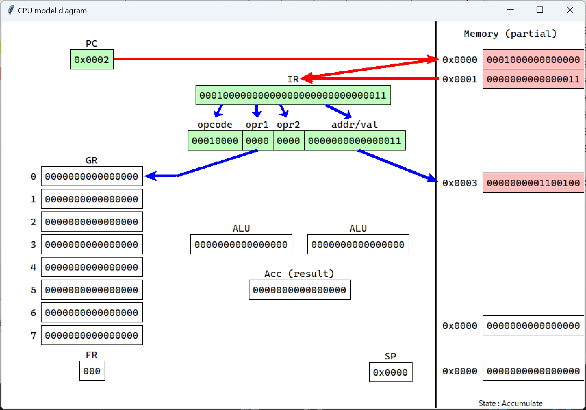

# 説明書

本教材で使用する仮想CPUと、そのGUIアプリケーションについて簡単な説明と仕様を記す。

## 使い方

Pythonを持っていない方は、フォルダに同封されている、`main.exe` を実行します。
起動にめちゃくちゃ時間かかります。ゆっくりお待ちください。

Pythonを入れている方は、GitHub の guiフォルダ にある `main.py` を実行すると良いです。
こっちの方が早く開いてくれます。
とはいえ、pc開いてから初回の起動は時間がかかるかも……。


レジスタの数を縛りプレイしたい！メモリ容量を減らしたい！
といった ~~変態~~ 要望には、`main2` の方を実行すると、カスタマイズが可能です。
少しウィンドウが横長になりますが……。


<div style="page-break-before:always"></div>

## アプリケーション各部の説明

アプリケーションを開くと表示されるウィンドウの各部について説明する。

### ボタンたち

**[ Assemble ] ボタン**
プログラムを機械語に直す。アセンブルを行う。
プログラムを書けたら、このボタンを押すこと。

**[ F ] ボタン**
最初から最後まで、ノンストップで命令を実行する。
途中経過などを飛ばして、最終的な実行結果を見たいときに使うとよい。

**[ ▶ ] ボタン**
最初から最後まで、連続して命令を実行する。
流し見で動きを見たいときに使うとよい。

押すと **[ || ]** に表示が変わる。この状態でボタンを押すと、実行を一時停止できる。
動画サイトの再生ボタンみたいな感じ。

**[ → ] ボタン**
一つの命令を実行する。
fetch, decode, execute までを行って止まる。

**[ ↓ ] ボタン**
処理をもっと小さい単位で行う。
fetchだけ、既にfetchしてたらdecodeだけ、decodeまで終わってたらexecuteだけを実行して止まる。

**[ ■ ] ボタン**
横にある「CPUモデルを表示」にチェックを付けた状態で、[ Assemble ] すると使えるようになる。
処理をハードウェア的な最小単位、さらに見やすくした細かい単位で行い、モデル図に描画する。

- IR_fetch: 命令キャッシュ。IRに命令を読み込む
- Fetch: PCを増加させる。fetch, decode, executeの「fetch」
- Decode: デコーダーに命令を渡して解析する。「decode」
- Data_ready: レジスタやメモリにアクセスする前準備。対象の決定を行う。
- Data_fetch: データキャッシュ。レジスタやメモリからデータを読む。
- Accumulate: 演算を行う。ALUを使うときが基本。本当のMIPSアーキテクチャのCPUは、ここでLD命令の実効アドレスを計算するらしい。
- Write_back: メモリやレジスタへの書き戻し。データを更新する作業。「execute」

<div style="page-break-before:always"></div>

### コードボックス

既に `MAIN    START` など おまじない が書かれている。
ここに、実行したいプログラムをアセンブリ言語で記述する。
必要に応じてマウスホイールで上下にスクロールできるほか、下部のスクロールバーより左右の移動も可能。
実行中は、自動でハイライト部分にスクロールが動く。
<br>

### Input ボックス

`IN` 命令でつかう。キーボードからの入力をここに書く。
一行、256文字までしか入らない。
<u>日本語はバグるかもしれないので、安全のために **英数記号のみ** で記述してください。</u>
<br>

### Output ボックス

`OUT` 命令で出力した内容がここに表示される。
あなたがキーボードで書き込むことはできない。

`Ctrl` + `;` で 拡大、 `Ctrl` + `-` で 縮小 できる。
出力された行数の確認に、縮小を使うと良いかも。
<br>

### メモリ情報ボックス

[ Assemble ] をすると更新される。
プログラムが間違っていなければ、メモリの中身が 2進数 と 16進数 で表示される。
プログラムが間違っている場合は、エラーメッセージが表示される。

実行中にメモリの中身が書き換わるときなどに、アドレスを合わせるとその場で変化を見ることが出来る。
<br>

### 実行ログボックス

fetch, decode, executeの内容が逐次書き込まれていく。
内容のほか、命令のちょっとした説明（算術演算では筆算）などが見られることもある。
<br>

### Register フレーム

それぞれのレジスタが、現在どのような状態にあるかが確認できる。
汎用レジスタについては、符号なし10進数での数値のほか、2進数と16進数での表示もされる。
<br>

### ラベル一覧ボックス

`main2.py` を実行する場合にのみ表示される。
ラベル名と、対応するアドレスの一覧が表示される。

アドレスに格納されている値は表示されないため、値を見たい場合は メモリ情報ボックス を動かしてください。
見たいラベル名をダブルクリックすると、そのアドレスまで メモリ情報ボックス が動いてくれます。

<div style="page-break-before:always"></div>

### タブバー

**ファイル**

クリックすると、メニューが表れる。

[ ソースコードを開く ] ：ファイルを選択して中身を表示する。

[ ソースコードを保存 ] ：書いたコードを保存できる。形式は `.casl2` になるが、txtとかに変えても問題ない。

[ メモリダンプを保存 ] ：メモリをバイナリデータとして保存する。マニア向け


**実行**

[ Assemble ] すると、開けるようになる。

ボタンを押す代わりに、ここを選択しても実行できる。


<div style="page-break-before:always"></div>

## アプリケーションの特徴

プログラムを記述して、[ Assemble ] ボタンを押すと以下のような表示に変化する。
メモリ情報ボックスには、アセンブルした結果の機械語などを反映した、仮想CPUのメモリ情報が表示される。
実行ログボックスには、まだ何も表示されない。


このアプリケーションの特徴として、**動作の可視化** がある。
fetch, decode, execute などの内部処理を確認できるのが売りだ。
実際に [ → ] ボタンを押して、一つの命令を実行したときの表示を見てみよう。


上の画像のように、「実行中の命令」を 黄色 で、「参照するアドレス」を 橙色 で表示してくれる。
アドレス（IRの下位16ビット）を使用する場合には、常に橙色が表示される。
変なところを指し示すこともあるが、ご愛嬌ということで許してほしい……。

<div style="page-break-before:always"></div>

また、実行ログボックスには、以下のような記述が追記される。

```a
フェッチ: 00010000000000000000000000000011

デコード:
  op  : 00010000  (LD)
  r/r1: 0000
  x/r2: 0000
  adr : 0000000000000011  (0x0003)

0x0003の値(100) を GR0 にロードします
```

このように、
fetch により 命令レジスタIR がどのように変化したか、
decode により fetchした内容がどのような命令なのか（レジスタの番号や参照先アドレス）、
execute により どのような処理をしたか、
を表示してくれる。

この命令により GR0 の値が 100 になるので、Registerフレームを見てみると表示の変化に気付けるだろう。


ちなみに、`main2.py` を使用した場合、
ラベル一覧ボックスに `A    0x0003` のようにラベルに対応するアドレスが表示される。

また、CPUモデル図について次ページで詳しく見よう。

<div style="page-break-before:always"></div>

## CPUモデル図 ウィンドウ

「CPUモデルを表示」をチェックして、アセンブルすると表示される。


教科書 第1章 で出てきたCPUの構成図みたいな図を表示する。
アプリケーション側の実行ボタンたちに応じて、処理の様子を可視化してくれる。

基本的に「何を使うか」を矢印で結んで、視覚的にオペランドや処理を表すことを目的にしている。
線の色は教科書 第1章 と同様に、赤色はfetch、青色はdecode、緑色はexecuteでの処理だ。
読み取り read が行われたときには、対象のレジスタやメモリを 赤色 で強調する。
書き込み write が行われたときには、対象のレジスタやメモリを 緑色 で強調する。
ALUでの計算では、対応する記号が表示される。A は算術、L は論理のこと。

次のような感じ。


上の写真では、命令 ADDA (0x24；`00100100`) によって、GR0 + GR1 を行った。
GR0, GR1 の値をALUに参照して、計算結果を GR0 に書き戻す。
GR0 と FR が更新されて緑色になっていることが見て取れる。

<div style="page-break-before:always"></div>

さっきまでの例と同様に `LD GR0, A`, `A DC 100` ではどうなるか。
パラパラ漫画形式で、具体的に描画を見てみよう。

1. **IR_fetch**: PCのアドレスを参照し、IRに書き込む
PCを参照するためPCは赤色に、該当メモリにアクセスするため、右上のメモリも赤色に強調される。
IRに命令が書き込まれるため、IRは緑色に強調される。
IRには `00010000000000000000000000000011` が書き込まれた。


<br><br>

2. **Fetch**: PCのアドレスを更新する
PCが更新されるため、PCは緑色に強調され、次のアドレス `0x0002` に更新される。
ここまでの処理は fetch なので、赤色で結線される。


<br><br>

3. **Decode**: デコーダーに命令が渡される
デコーダーが更新されるため、デコーダー各部は緑色に強調される。
この処理は decode なので、青色で結線される。


<br><br>

4. **Data_ready**: 読み込むデータを準備する
オペランドを解析した結果に応じて、必要になるレジスタ・メモリ番地に結線する。
今回は `GR0, A` だったので、GR0 と Aのアドレス `0x0003` に向けて結線がされた。
ここもデコード段階で結線されるので、青色で強調。


<br><br>

5. **Data_Fetch**: データを読み込む
結線した場所へ、実際にデータを読む。ここからは execute の範疇なので緑色。
`LD` はメモリを読む処理なので、右側のメモリが赤色で強調される。


<br><br>

6. **Accumulate**: 演算する
ALUを使った演算（算術演算やビット演算など）の場合は、ALUの部分が更新される。
今回は特に計算が要らないので変わらない。



<br><br>

7. **Write_back**: レジスタ・メモリに値を書き戻す
値を更新するので、書き込み先は緑色に強調される。
今回は GR0 への書き込み、FR の更新なので、GR0 と FR が緑色に強調された。
また、書き込み元から書き込み先に向けて結線もされる。


<div style="page-break-before:always"></div>

次ページからは仕様と、命令・asciiコード一覧表です。

あんまり気にしなくていい内容なので、読まなくてOK！

<div style="page-break-before:always"></div>

## 仕様

本仮想CPUは、通常は以下の構成で動作する。
`main2.py` による拡張設定により、ビット数やメモリ容量に変更を加えると、この限りではない。

- 汎用レジスタ
  - GR0, GR1, ..., GR7 の 8個 を持つ
  - それぞれ 16bit の領域を持つ（符号付きで $-32768 \leqq n \leqq 32767$、符号なしで $0 \leqq n \leqq 65535$）
  - GR1 ~ GR7 は 指標レジスタ として指定できる。
- フラグレジスタ
  - FR として纏めて管理されている。3bit で、上位ビットから OF, SF, ZF が割り当てられている
  - OF（オーバーフローフラグ）：演算結果が 表現できる値の範囲を超えたときに 1 が立つ
  - SF（サインフラグ）：読み出し・書き込み・演算結果が 負の数（最上位ビットが 1 ）のときに 1 が立つ
  - ZF（ゼロフラグ）：読み出し・書き込み・演算結果が ゼロ のときに 1 が立つ
- プログラムカウンタ
  - PC として記述される。16bit の領域を持つ
  - fetch時に更新され、次に実行される命令のアドレスを保持する
- 命令レジスタ
  - 32bit の領域を持つ
  - fetch時に更新され、これから実行する命令を保持する
- メモリ
  - アドレス空間は 65536個 の領域を持ち、各領域は 16bit を持つ。メモリ全体の容量は 約131KB（128KiB）
  - 番地は 0x0000 ~ 0xFFFF までで指定する
  - 初期値は 0xFFFF である。`DS` 命令により領域を確保すると、値 65535 (符号付きは -32768 ) をロードできる

また、アセンブルについて以下の規定がある。

- プログラムの先頭から `END` が現れるまで、上から順番に機械語に変換していく。
- メモリには、0x0000 を先頭に、以下の順番で格納される。
  - 命令（テキスト領域 に相当）
  - `DC` `DS` 命令による変数（静的領域 に相当）
  - リテラルによる変数（ヒープ領域 に相当）
  - リテラルによる変数は、`END` の前に無名変数として、出現順にまとめて `DC` される。
  
<div style="page-break-before:always"></div>

## 命令一覧

2章に載っているものに書いていない命令も、全て纏めた完全版です。

r: 汎用レジスタ。GR0 ~ GR7
x: 指標レジスタ。GR1 ~ GR7
adr: アドレス。10進数・16進数、ラベル、リテラル
val: 即値。10進数・16進数、ラベル\*、リテラル\*

\* : 中身ではなく、そのアドレス値が対応する。

|オペコード|ニーモニック|オペランド|語数|FRの設定|
|:--:|:---:|:----|:--:|:----|
|0x00|NOP| |1| |
|0x10<br>0x14|LD|r, adr [, x]<br>r1, r2|2<br>1|SF, ZF|
|0x11|ST|r, adr [, x]|2| |
|0x12|LAD|r, val [, x]|2| |
|0x20<br>0x24|ADDA|r, adr [, x]<br>r1, r2|2<br>1|OF, SF, ZF|
|0x21<br>0x25|SUBA|r, adr [, x]<br>r1, r2|2<br>1|OF, SF, ZF|
|0x22<br>0x26|ADDL|r, adr [, x]<br>r1, r2|2<br>1|OF, SF, ZF|
|0x23<br>0x27|SUBL|r, adr [, x]<br>r1, r2|2<br>1|OF, SF, ZF|
|0x30<br>0x34|AND|r, adr [, x]<br>r1, r2|2<br>1|SF, ZF|
|0x31<br>0x35|OR|r, adr [, x]<br>r1, r2|2<br>1|SF, ZF|
|0x32<br>0x36|XOR|r, adr [, x]<br>r1, r2|2<br>1|SF, ZF|
|0x40<br>0x44|CPA|r, adr [, x]<br>r1, r2|2<br>1|SF, ZF|
|0x41<br>0x45|CPL|r, adr [, x]<br>r1, r2|2<br>1|SF, ZF|
|0x50|SLA|r, val [, x]|2|OF, SF, ZF|
|0x51|SRA|r, val [, x]|2|OF, SF, ZF|
|0x52|SLL|r, val [, x]|2|OF, SF, ZF|
|0x53|SRL|r, val [, x]|2|OF, SF, ZF|
|0x60|JUMP|adr [, x]|2| |
|0x61|JPL|adr [, x]|2| |
|0x62|JMI|adr [, x]|2| |
|0x63|JNZ|adr [, x]|2| |
|0x64|JZE|adr [, x]|2| |
|0x65|JOV|adr [, x]|2| |
|0x70|PUSH|val [, x]|2| |
|0x71|POP|r|1| |
|0x80|CALL|adr [, x]|2| |
|0x81|RET| |1| |
|0x90<br>0x94|MUL|r, adr [, x]<br>r1, r2|2<br>1|OF, SF, ZF|
|0x91<br>0x95|DIV|r, adr [, x]<br>r1, r2|2<br>1|SF, ZF|
|0xA0|SETE|r|1| |
|0xA1|SETGE|r|1| |
|0xA2|SETL|r|1| |
|0xF0|SVC|val [, x]|2| |

|ニーモニック|オペランド|
|:---:|:----|
|START|[adr 実行開始番地]|
|END||
|DS|10進数 語数|
|DC|val（リテラル以外）|

|ニーモニック|オペランド|語数|
|:---:|:----|:--:|
|IN|adr 入力領域, adr 入力文字長領域, val 形式|12|
|OUT|adr 出力領域, adr 出力文字長領域, val 形式|12|
|RPUSH||レジスタ数×2|
|RPOP||レジスタ数|
|RANDINT|10進数 下限, 10進数 上限|12|

<div style="page-break-before:always"></div>

## asciiコード一覧

| 行 \ 列 | 0    | 1    | 2    | 3   | 4   | 5   | 6   | 7      |
| :-----: | :--: | :--: | :--: | :-: | :-: | :-: | :-: | :----: |
| **0**   | NUL | DLE | 間隔 | 0   | @   | P   | `   | p      |
| **1**   | SOH | DC1 | !    | 1   | A   | Q   | a   | q      |
| **2**   | STX | DC2 | "    | 2   | B   | R   | b   | r      |
| **3**   | ETX | DC3 | #    | 3   | C   | S   | c   | s      |
| **4**   | EOT | DC4 | $    | 4   | D   | T   | d   | t      |
| **5**   | ENQ | NAK | %    | 5   | E   | U   | e   | u      |
| **6**   | ACK | SYN | &    | 6   | F   | V   | f   | v      |
| **7**   | BEL | ETB | '    | 7   | G   | W   | g   | w      |
| **8**   | 後退 | CAN | (    | 8   | H   | X   | h   | x      |
| **9**   | 水平タブ | EM | )    | 9   | I   | Y   | i   | y      |
| **A**   | 改行 | 置換 | *    | :   | J   | Z   | j   | z      |
| **B**   | 垂直タブ | ESC | +    | ;   | K   | [   | k   | {      |
| **C**   | 改ページ | FS | ,    | <   | L   | \   | l   | &#124; |
| **D**   | 復帰 | GS | -    | =   | M   | ]   | m   | }      |
| **E**   | SO | RS | .    | >   | N   | ^   | n   | ~      |
| **F**   | SI | US | /    | ?   | O   | _   | o   | 削除   |

0x00 ~ 0x1F までは、直接入力はあまりしない。いわゆる 制御文字 と呼ばれるもの。
そのため、1章では必要性が無いと感じたので表示しなかった。
それぞれの意味は気になったら調べてほしい。

改行は `\n`、水平タブは `\t`、復帰は `\r` として記述できる（エスケープシーケンス と呼ばれる）。
これを使用して文字列を格納すると、少し自由な記述が出来る。

```CASL
MAIN    START
        OUT     STR, LEN
        RET
STR     DC      'Hello\nWorld\t!'
LEN     DC      13
        END

; これを実行すると、Helloの次で改行し、dと!の間にタブが入るので、以下のような出力がされる。
; Hello
; World      !
```
